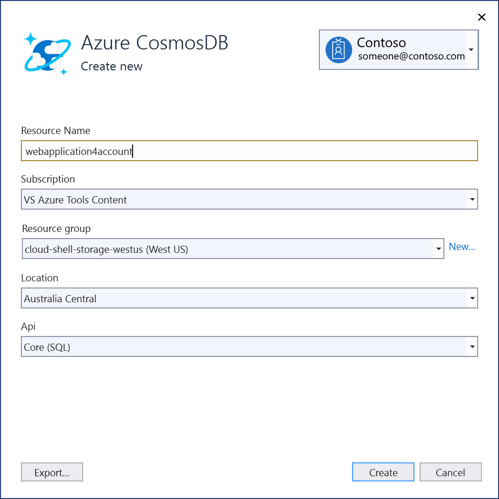
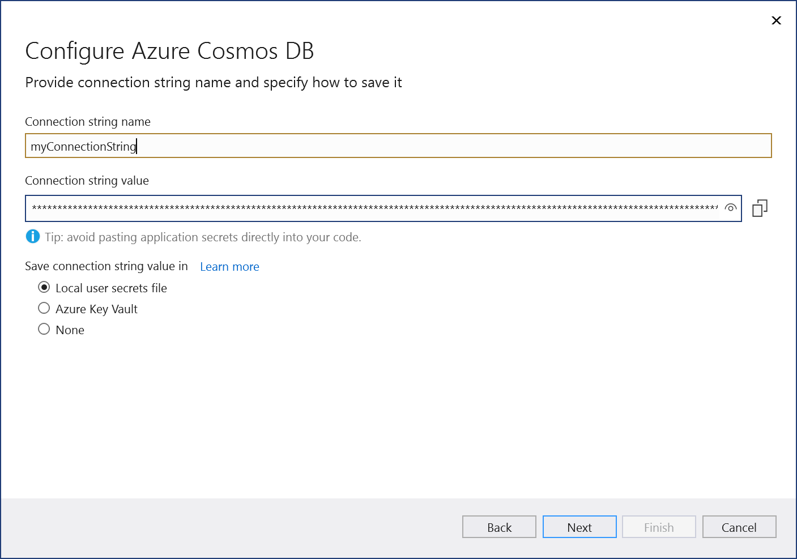

# Add Azure Cosmos DB to your app by using Visual Studio Connected Services

With Visual Studio, you can connect any of the following to Azure Cosmos DB by using the **Connected Services** feature:

- .NET Framework console app
- ASP.NET MVC (.NET Framework) 
- ASP.NET Core
- .NET Core (including console app, WPF, Windows Forms, class Library)
- .NET Core Worker Role
- Azure Functions
- Universal Windows Platform App
- Xamarin
- Cordova

The connected service functionality adds all the needed references and connection code to your project, and modifies your configuration files appropriately.

> [!NOTE]
> This topic applies to Visual Studio on Windows. For Visual Studio for Mac, see [Connected services in Visual Studio for Mac](/visualstudio/mac/connected-services).
## Prerequisites

- Visual Studio with the Azure workload installed.
- A project of one of the supported types

## Connect to Azure Cosmos DB using Connected Services

1. Open your project in Visual Studio.

1. In **Solution Explorer**, right-click the **Connected Services** node, and, from the context menu, select **Add Connected Service**.

    

1. In the **Connected Services** tab, select the + icon for **Service Dependencies**.

    

1. In the **Add Dependency** page, select **Azure Cosmos DB**.

    

    If you aren't signed in already, sign into your Azure account. If you don't have an Azure account, you can sign up for a [free trial](https://azure.microsoft.com/account/free).

1. In the **Azure Cosmos DB** screen, select an existing Azure Cosmos DB, and select **Next**.

    If you need to create a database, go to the next step. Otherwise, skip to step 7.

    

1. To create an Azure Cosmos DB:

   1. Select **Create a new Azure Cosmos DB** at the bottom of the screen.

   1. Fill out the **Azure Cosmos DB: Create new** screen, and select **Create**.

       

   1. When the **Configure Azure Cosmos DB** dialog is displayed, the new database appears in the list. Select the new database in the list, and select **Next**.

1. Enter a connection string name, and choose whether you want the connection string stored in a local secrets file, or in [Azure Key Vault](/azure/key-vault).

   

1. The **Summary of changes** screen shows all the modifications that will be made to your project if you complete the process. If the changes look OK, choose **Finish**.

   

1. The connection appears under the **Service Dependencies** section of the **Connected Services** tab.

   

## See also

- [Azure Cosmos DB product page](https://azure.microsoft.com/services/cosmos-db/)
- [Azure Cosmos DB documentation](/azure/cosmos-db/)
- [Connected services (Visual Studio for Mac)](/visualstudio/mac/connected-services)
