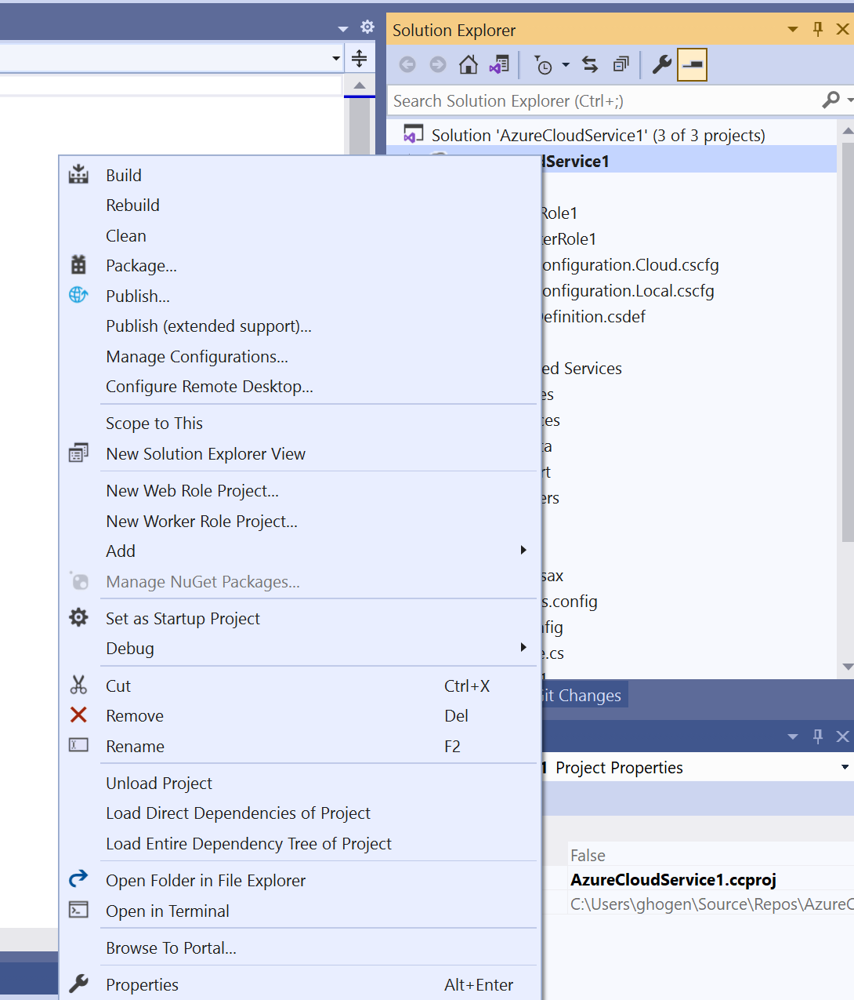
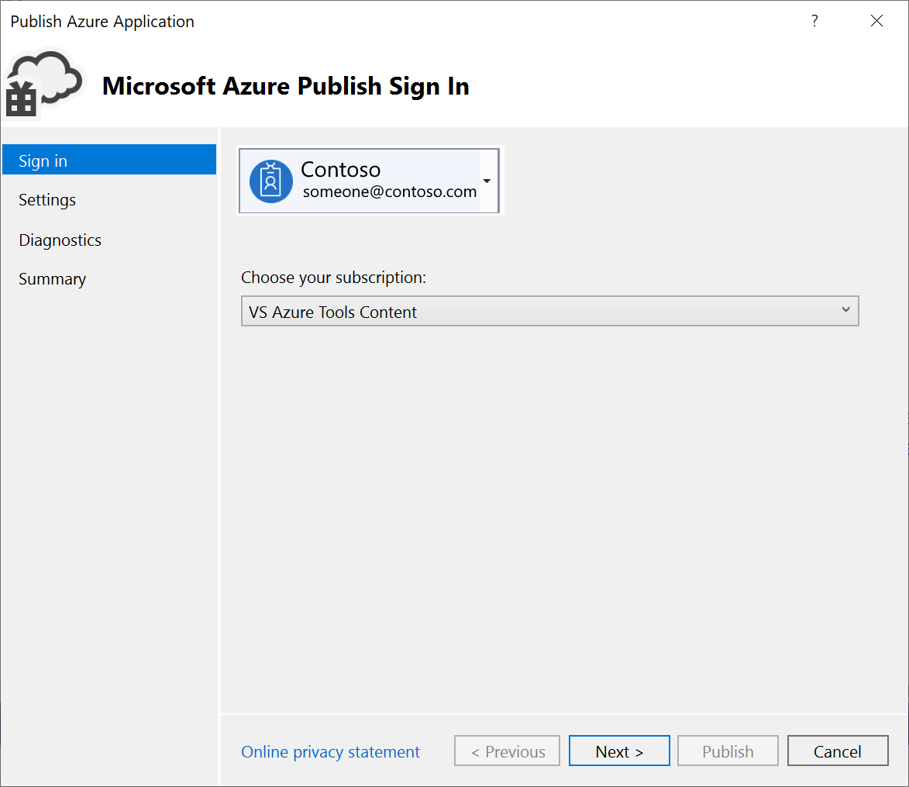
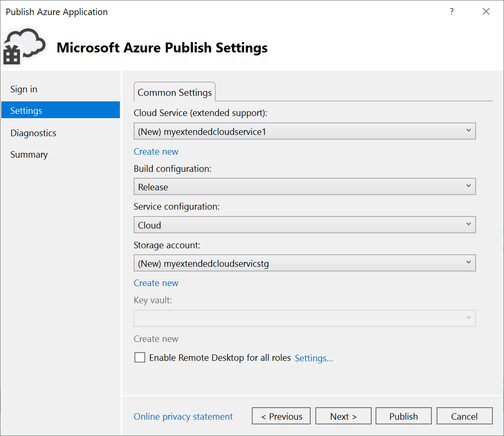
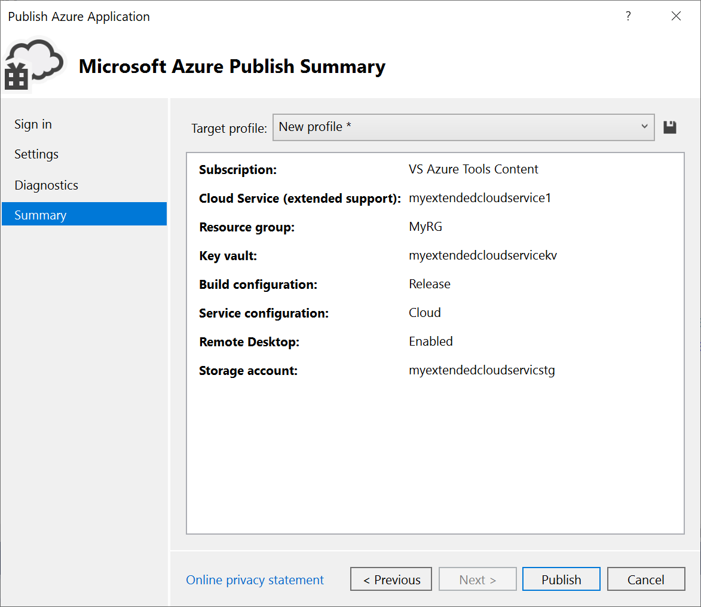

# Create and deploy Cloud Services (extended support) in Visual Studio (Preview)

Starting with Visual Studio 2019 version 16.9 (currently in preview), you can work with cloud services using Azure Resource Manager (ARM), which greatly simplifies and modernizes maintenance and management of Azure resources. This functionality is referred to as *extended support*. You can use extended support to publish an existing cloud service project. For information on this Azure service, see [Azure Cloud Services (extended support) documentation](/azure/cloud-services-extended-support).

## Publish a Azure Cloud Service project using extended support

You can use extended support to publish your existing Azure Cloud Service project using ARM, but you still retain the capability to publish using the classic method, with a few small steps to remove configuration associated with extended support. Before publishing to extended support, you might want to save an old version of the *.cscfg* file associated with your Azure Cloud Service project. See [Remove extended support](#remove-extended-support). In Visual Studio 2019 version 16.9 Preview 2 and later, classic cloud service projects have a special version of the **Publish** command, **Publish (extended support)**. This command appears on the shortcut menu in **Solution Explorer**.

There are some differences when you publish using extended support. For example, you are not asked if you are publishing to **Staging** or **Production**, because these deployment slots are not part of the extended support publishing model. Instead, with extended support services, you can set up multiple deployments, and swap deployments in the Azure Portal.

Before publishing a classic Azure Cloud Service using extended support, check the storage accounts your project uses and make sure they are Storage V1 or Storage V2 accounts. The classic storage account types will fail with an error message at deploy time. Be sure to check the storage account used by diagnostics. To check the diagnostics storage account, see [Set up diagnostics for Azure Cloud Services and virtual machines](vs-azure-tools-diagnostics-for-cloud-services-and-virtual-machines.md). If your service uses a classic storage account, you can upgrade it; see [Upgrade to a general-purpose v2 storage account](/azure/storage/common/storage-account-upgrade?tabs=azure-portal).  For general information on the types of storage accounts, see [Storage account overview](/azure/storage/common/storage-account-overview).

### To publish a classic Azure Cloud Service project using extended support

1. Cloud Services (extended support) is currently in preview. Register the feature for your subscription as follows:

   ```powershell
   Register-AzProviderFeature -FeatureName CloudServices -ProviderNamespace Microsoft.Compute
   ```

1. Right-click on the project node in your Azure Cloud Service (classic) project and choose **Publish (extended support)...**. The **Publish wizard** opens at the first screen.

   

   The **Publish** wizard appears.

   

1. **Account** - Select an account or select **Add an account** in the account dropdown list.

1. **Choose your subscription** - Choose the subscription to use for your deployment. The subscription you use for deploying cloud services (extended support) needs to have Owner or Contributor roles assigned via ARM role-based access control (RBAC). If your subscription does not have any one of these roles, see [Steps to add a role assignment](/azure/role-based-access-control/role-assignments-steps) to add this before proceeding further.

1. Choose **Next** to move to the **Settings** page.

   

1. **Cloud service** - Using the dropdown, either select an existing cloud service (extended support), or select **Create new**, and create a cloud service. The data center displays in parentheses for each cloud service. It is recommended that the data center location for the cloud service be the same as the data center location for the storage account.

   If you choose to create a new cloud service, you'll see the **Create Cloud Service (extended support)** dialog. Specify the location and resource group you want to use for the cloud service.

   

1. **Build configuration** - Select either **Debug** or **Release**.

1. **Service configuration** - Select either **Cloud** or **Local**.

1. **Storage account** - Select the storage account to use for this deployment, or **Create new** to create a storage account. The region displays in parentheses for each storage account. It is recommended that the data center location for the storage account is the same as the data center location for the cloud service (Common Settings).

   The Azure storage account stores the package for the application deployment. After the application is deployed, the package is removed from the storage account.

1. **Key vault** - Specify the key vault that contains the secrets for this cloud service. This is enabled if remote desktop is enabled, or if certificates are added to the configuration.

1. **Enable Remote Desktop for all roles** - Select this option if you want to be able to remotely connect to the service. You'll be asked to specify credentials.

   

1. Choose **Next** to move to the **Diagnostics settings** page.

   

   Diagnostics enables you to troubleshoot an Azure Cloud Service (or Azure virtual machine). For information about diagnostics, see [Configuring Diagnostics for Azure Cloud Services and Virtual Machines](./vs-azure-tools-diagnostics-for-cloud-services-and-virtual-machines.md). For information about Application Insights, see [What is Application Insights?](/azure/application-insights/app-insights-overview).

1. Choose **Next** to move to the **Summary** page.

   

1. **Target profile** - You can choose to create a publishing profile from the settings that you have chosen. For example, you might create one profile for a test environment and another for production. To save this profile, choose the **Save** icon. The wizard creates the profile and saves it in the Visual Studio project. To modify the profile name, open the **Target profile** list, and then choose **Manage…**.

   > [!Note]
   > The publishing profile appears in Solution Explorer in Visual Studio, and the profile settings are written to a file with an *.azurePubxml* extension. Settings are saved as attributes of XML tags.

1. Once you configure all the settings for your project's deployment, select **Publish** at the bottom of the dialog. You can monitor the process status in the **Azure Activity Log** output window in Visual Studio.

Congratulations! You've published your extended support cloud service project to Azure. To publish again with the same settings, you can reuse the publishing profile, or repeat these steps to create a new one. The ARM template and parameters used for deployment are saved in the *bin/\<configuration\>/Publish* folder.

## Clean up Azure resources

To clean up the Azure resources you created by following this tutorial, go to the [Azure portal](https://portal.azure.com), choose **Resource groups**, find and open the resource group you used to create the service, and choose **Delete resource group**.

## Remove extended support

If you publish a classic Azure Cloud Service project using extended support, and then later want to publish again using the classic publishing method, follow these steps to remove any artifacts associated with extended support to return to your previous configuration.

1. In the *.cscfg* file, remove the `NetworkConfiguration` element that was added by extended support.

1. Right-click the Azure Cloud Service project node, and choose **Publish...**.

1. Follow the steps in [Using the Visual Studio Publish Azure Application Wizard](vs-azure-tools-publish-azure-application-wizard.md).

## Troubleshooting

When using Azure Cloud Services (extended support), you might encounter these error messages.

### The resource type could not be found in the namespace 'Microsoft.Compute' for api version '2020-10-01-preview'

If you see this message, it means your Azure subscription has not enabled extended support. To publish an Azure Cloud Service using extended support, your Azure subscription must explicitly enable the preview feature. Follow these instructions to register extended support in your subscription: [Deploy Azure Cloud Services (extended support) using the Azure portal](/azure/cloud-services-extended-support/deploy-portal#register-the-feature-for-your-subscription).

## Next steps

Set up continuous integration (CI) using the **Configure** button on the **Publish** screen. For more information, see [Azure Pipelines documentation](/azure/devops/pipelines/?view=azure-devops&preserve-view=true).
