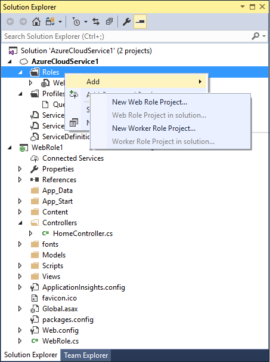
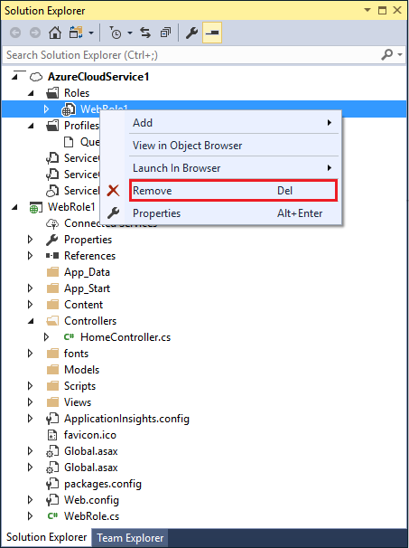

# Managing roles in Azure cloud services with Visual Studio
After you have created your Azure cloud service, you can add new roles to it or remove existing roles from it. You can also import an existing project and convert it to a role. For example, you can import an ASP.NET web application and designate it as a web role.

## Adding a role to an Azure cloud service
The following steps guide you through adding a web or worker role to an Azure cloud service project in Visual Studio.

1. Create or open an Azure cloud service project in Visual Studio.

1. In **Solution Explorer**, expand the project node

1. Right-click the **Roles** node to display the context menu. From the context menu, select **Add**, then select an existing web role or worker role from the current solution, or create a web or worker role project. You can also select an appropriate project, such as an ASP.NET web application project, and associate it with a role project.

   

## Removing a role from an Azure cloud service
The following steps guide you through removing a web or worker role from an Azure cloud service project in Visual Studio.

1. Create or open an Azure cloud service project in Visual Studio.

1. In **Solution Explorer**, expand the project node

1. Expand the **Roles** node.

1. Right-click the node you want to remove, and, from the context menu, select **Remove**.

   

## Readding a role to an Azure cloud service project
If you remove a role from your cloud service project but later decide to add the role back to the project, only the role declaration and basic attributes, such as endpoints and diagnostics information, are added. No additional resources or references are added to the `ServiceDefinition.csdef` file or to the `ServiceConfiguration.cscfg` file. If you want to add this information, you need to manually add it back into these files.

For example, you might remove a web service role and later you decide to add this role back into your solution. If you do this, an error occurs. To prevent this error, you have to add the `<LocalResources>` element shown in the following XML back into the `ServiceDefinition.csdef` file. Use the name of the web service role that you added back into the project as part of the name attribute for the **\<LocalStorage>** element. In this example, the name of the web service role is **WCFServiceWebRole1**.

```xml
<WebRole name="WCFServiceWebRole1">
    <Sites>
      <Site name="Web">
        <Bindings>
          <Binding name="Endpoint1" endpointName="Endpoint1" />
        </Bindings>
      </Site>
    </Sites>
    <Endpoints>
      <InputEndpoint name="Endpoint1" protocol="http" port="80" />
    </Endpoints>
    <Imports>
      <Import moduleName="Diagnostics" />
    </Imports>
    <LocalResources>
      <LocalStorage name="WCFServiceWebRole1.svclog" sizeInMB="1000" cleanOnRoleRecycle="false" />
    </LocalResources>
</WebRole>
```

## Next steps
- [Configure the Roles for an Azure cloud service with Visual Studio](vs-azure-tools-configure-roles-for-cloud-service.md)
