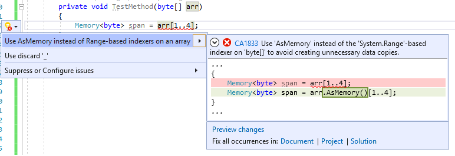

# CA1833: Use AsSpan or AsMemory instead of Range-based indexers for getting Span or Memory portion of an array

|||
|-|-|
|CheckId|CA1833|
|Category|Microsoft.Performance|
|Breaking change|Non-breaking|

## Cause

When using a range-indexer on an array and implicitly assigning the value to <xref:System.Span%601> or <xref:System.Memory%601>.

## Rule description

Using a range-indexer on array and assigning to a memory/span type: The range indexer on a <xref:System.Span%601> is a non-copying <xref:System.Span%601.Slice%2A?#System_Span_1_Slice_System_Int32_System_Int32_> operation, but for the range indexer on array the method <xref:System.Runtime.CompilerServices.RuntimeHelpers.GetSubArray%2A> will be used instead of <xref:System.Span%601.Slice%2A?#System_Span_1_Slice_System_Int32_System_Int32_>, this produces a copy of requested portion of the array. This copy is usually unnecessary when it is implicitly used as a <xref:System.Span%601> or <xref:System.Memory%601> value. If a copy isn't intended, use the <xref:System.MemoryExtensions.AsSpan%2A?#System_MemoryExtensions_AsSpan__1___0___> or <xref:System.MemoryExtensions.AsMemory%2A?#System_MemoryExtensions_AsMemory__1___0___> method to avoid the unnecessary copy. If the copy is intended either assign it to a local variable first or add an explicit cast, the analyzer only reports when an implicit cast is used on the result of the range indexer operation.

### Detects

Implicit conversions:<br>
`Span<SomeT> slice = arr[a..b];`<br>
`Memory<SomeT> slice = arr[a..b];`

### Does not detect

Explicit conversions:<br>
`Span<SomeT> slice = (Span<SomeT>)arr[a..b];`<br>
`Memory<SomeT> slice = (Memory<SomeT>)arr[a..b];`

## How to fix violations

To fix the violation of this rule: use the <xref:System.MemoryExtensions.AsSpan%2A?#System_MemoryExtensions_AsSpan__1___0___> or <xref:System.MemoryExtensions.AsMemory%2A?#System_MemoryExtensions_AsMemory__1___0___> extension method to avoid creating unnecessary data copies.

```csharp
class C
{
    public void TestMethod(byte[] arr)
    {
        // The violation occurs for both statements below
        Span<byte> tmp2 = arr[0..5];
        Memory<byte> tmp4 = arr[5..10];		
        ...
    }
}
```

```csharp
class C
{
    public void TestMethod(byte[] arr)
    {
        // The violations fixed with AsSpan or AsMemory accordingly
        Span<byte> tmp2 = arr.AsSpan()[0..5];
        Memory<byte> tmp4 = arr.AsMemory()[5..10];	
        ...
    }
}
```

> [!TIP]
> A code fix is available for this rule in Visual Studio. To use it, position the cursor on the array violation and press **Ctrl**+**.** (period). Choose **Use 'AsMemory' instead of the 'System.Range'-based indexer on 'byte[]' to avoid creating unnecessary data copies.** from the list of options that is presented.
>
> 

## When to suppress warnings

It's safe to suppress a violation of this rule if creating a copy is intended, to suppress can simply add an explicit cast.

```csharp
class C
{
    public void TestMethod(byte arr[])
    {
        // The violation occurs
        Span<byte> tmp1 = arr[0..5];
        Memory<byte> tmp2 = arr[5..10];	
		...
    }
}
```

```csharp
class C
{
    public void TestMethod(byte arr[])
    {
        // The violation fixed with explicit casting
        Span<byte> tmp1 = (Span<byte>)arr[0..5];
        Memory<byte> tmp2 = (Memory<byte>)arr[5..10];
        ...
    }
}
```

## Related rules

- [CA1831: Use AsSpan instead of Range-based indexers for string when appropriate](ca1831.md)
- [CA1832: Use AsSpan or AsMemory instead of Range-based indexers for getting ReadOnlySpan or ReadOnlyMemory portion of an array](ca1832.md)

## See also

- [Performance warnings](../code-quality/performance-warnings.md)
