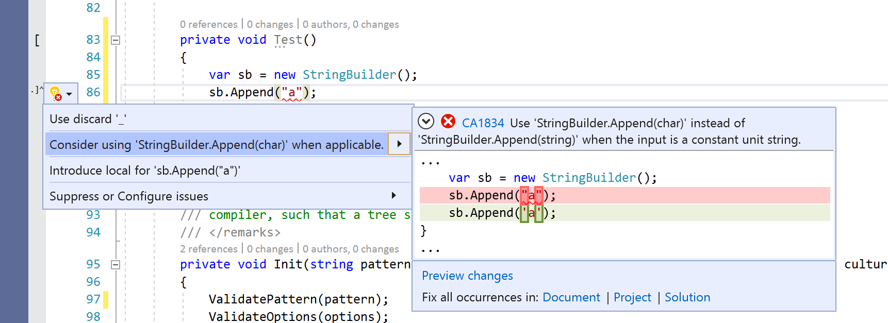

# CA1834: Use StringBuilder.Append(char) for single character strings

|Item|Value|
|-|-|
|CheckId|CA1834|
|Category|Microsoft.Performance|
|Breaking change|Non-breaking|

## Cause

This rule fires when a unit length string is passed to the <xref:System.Text.StringBuilder.Append%2A> method.

## Rule description

When calling `StringBuilder.Append` with a unit length string, consider using a `const char` rather than a unit length `const string` to improve performance.

## How to fix violations

The violation can either be fixed manually, or, in some cases, using Quick Actions to fix code in Visual Studio. Examples:

##### Example 1
Invocations of `StringBuilder.Append` with a string literal of unit length:
```csharp
using System; 
using System.Text;
 
namespace TestNamespace 
{ 
    class TestClass 
    { 
        private void TestMethod() 
        { 
            StringBuilder sb = new StringBuilder();
            sb.Append("a");
        } 
    } 
}
```
> [!TIP]
> A code fix is available for this rule in Visual Studio. To use it, position the cursor on the violation and press **Ctrl**+**.** (period). Choose **Consider using 'StringBuilder.Append(char)' when applicable.** from the list of options that is presented.
>
> 

##### Fix applied by Visual Studio
```csharp
using System; 
using System.Text;
 
namespace TestNamespace 
{ 
    class TestClass 
    { 
        private void TestMethod() 
        { 
            StringBuilder sb = new StringBuilder();
            sb.Append('a');
        } 
    } 
}
```

In some cases, for example when using a unit length `const string` class field, a code-fix is not suggested by Visual Studio (but the analyzer still fires). These instances require a manual fix.

##### Example 2
Invocations of `StringBuilder.Append` with a `const string` class field of unit length:
```cs
using System;
using System.Text;

namespace TestNamespace
{
    public class Program
    {
        public const string unitString = "a";

        static void Main(string[] args)
        {
            StringBuilder sb = new StringBuilder();
            sb.Append(unitString);
        }
    }
}
```
After careful analysis, `unitString` here can be changed to a `char` without causing any build errors. 

##### Fix
```cs
using System;
using System.Text;

namespace TestNamespace
{
    public class Program
    {
        public const char unitString = 'a';

        static void Main(string[] args)
        {
            StringBuilder sb = new StringBuilder();
            sb.Append(unitString);
        }
    }
}
```

## When to suppress warnings

It's safe to suppress a violation of this rule if you're not concerned about improving performance when using `StringBuilder`.

## See also

- [Performance warnings](../code-quality/performance-warnings.md)
