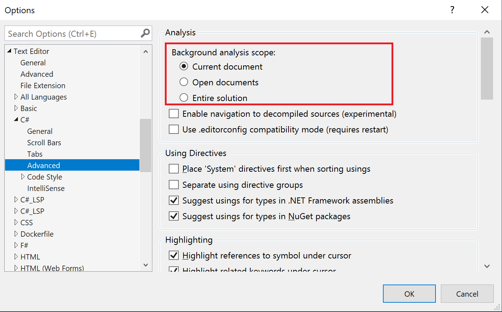

# How to: Configure live code analysis scope for managed code

## What is "Live code analysis" for managed code?
Visual Studio executes a bunch of live code analyses, also referred to as *background analysis*, while you are editing source files in the editor. Some of it is required minimal analysis for an acceptable Visual Studio IDE editing experience. Some of it is for improved responsiveness for IDE features. While some of it is to enable additional IDE functionality, such as diagnostics and code fixes from Roslyn analyzers. Based on the functionality, these analyses can be grouped as follows:

- **Background computation of diagnostics**: Analysis to compute errors, warnings, and suggestions in source files. These diagnostics show up as entries in the error list and as squiggles in the editor. They can be classified into two categories:
    - C# and Visual Basic compiler diagnostics
    - Roslyn analyzer diagnostics, which includes:

        - Built-in IDE analyzers for code style suggestions and
        - Third party analyzer packages [installed](./install-roslyn-analyzers.md) for projects in the current solution.

- **Other background analyses**: Analysis to improve the responsiveness and Visual Studio interaction for IDE features. Some examples of such analyses are:
    - Background parsing of open files.
    - Background compilation of projects with open files to realize symbols for improved responsiveness of certain IDE features.
    - Building syntax and symbol caches.
    - Detecting designer association for source files, such as forms, controls, etc.

## Default analysis scope

By default, live code analysis for background computation of diagnostics executes for all the files that are _opened_ in Visual Studio. Few of the _other background analyses_ mentioned above execute for all the projects, which have at least one open file. While few background analyses execute for the entire solution.

## Custom analysis scope

The default scope of each background analysis has been tuned for the optimal user experience, functionality, and performance for majority of customer scenarios and solutions. However, there are cases where customers may want to customize this scope to decrease or increase the background analysis. For example:

- Power save mode: If users are running on laptop battery, they may want to minimize the power consumption for longer battery life. In this scenario, they would want to minimize background analysis.
- On-demand code analysis: If users prefer turning off live analyzer execution and manually running code analysis on-demand, they would want to minimize background analysis. See [How to: Manually run code analysis on-demand](./how-to-run-code-analysis-manually-for-managed-code.md).
- Full solution analysis: If users want to always see all diagnostics in all files in the solution, regardless of whether they are open in the editor or not. In this scenario, they would want to maximize background analysis scope to entire solution.

Starting in Visual Studio 2019 version 16.5, users can explicitly customize the scope of all live code analysis, including diagnostics computation, for C# and Visual Basic projects. Available analysis scopes are:

- **Current Document**: Minimizes the live code analysis scope to only execute for the current or visible file in the editor.
- **Open Documents and Projects**: Default live code analysis scope, as described in the above section.
- **Entire Solution**: Maximizes the live code analysis scope to execute for all files and projects in the entire solution.

You can choose one of the above custom analysis scopes in Tools Options dialog by following the below steps:

1. To open the **Options** dialog box, on the menu bar in Visual Studio choose **Tools** > **Options**.

2. In the **Options** dialog box, choose **Text Editor** > **C#** or **Basic** > **Advanced**.

3. Select the desired **Background analysis scope** to customize the analysis scope. Choose **OK** when you're done.

> [!NOTE]
> Prior to Visual Studio 2019 version 16.5, users can customize the analysis scope for diagnostics computation to entire solution using the **Enable full solution analysis** check box from **Tools** > **Options** > **Text Editor** > **C#** or **Basic** > **Advanced** tab. There is no support to minimize the background analysis scope in prior Visual Studio versions.

## Automatically minimize live code analysis scope

If Visual Studio detects that 200 MB or less of system memory is available to it, it automatically minimizes the live code analysis scope to "Current Document". If this occurs, an alert appears informing you that Visual Studio has disabled some features. A button lets you switch back to the prior analysis scope if you want.

## See also

- [Automatic feature suspension](./automatic-feature-suspension.md)
- [Power save mode feature request](https://github.com/dotnet/roslyn/issues/38429)
