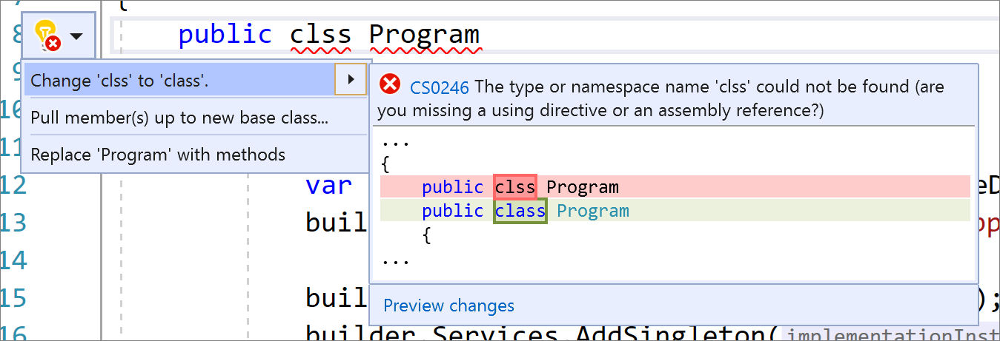
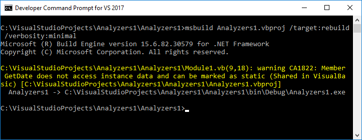

# Overview of source code analyzers

.NET Compiler Platform ("Roslyn") code analyzers inspect your C# or Visual Basic code for style, quality and maintainability, design, and other issues.

- Some analyzers are built in to Visual Studio. The diagnostic ID, or code, for these analyzers is of the format IDExxxx, for example, IDE0067. Most of these built-in analyzers inspect [code style](../ide/code-styles-and-code-cleanup.md), and you can configure preferences on the [text editor options page](../ide/code-styles-and-code-cleanup.md) or in an [EditorConfig file](../ide/editorconfig-code-style-settings-reference.md). A handful of built-in analyzers look at code quality.

- You can install additional analyzers as a NuGet package or a Visual Studio extension. For example:

  - [FxCop analyzers](../code-quality/install-fxcop-analyzers.md), Microsoft's recommended code quality analyzers
  - Third party analyzers, such as [StyleCop](https://www.nuget.org/packages/StyleCop.Analyzers/), [Roslynator](https://www.nuget.org/packages/Roslynator/), [XUnit Analyzers](https://www.nuget.org/packages/xunit.analyzers/), and [Sonar Analyzer](https://www.nuget.org/packages/SonarAnalyzer.CSharp/)

If rule violations are found by an analyzer, they're reported in the code editor (as a *squiggle* under the offending code) and in the Error List window.

Many analyzer rules, or *diagnostics*, have one or more associated *code fixes* that you can apply to correct the problem. The analyzer diagnostics that are built into Visual Studio each have an associated code fix. Code fixes are shown in the light bulb icon menu along with other types of [Quick Actions](../ide/quick-actions.md). For information about these code fixes, see [Common Quick Actions](../ide/common-quick-actions.md).



## Source code analysis versus legacy analysis

Source analysis by Roslyn analyzers replaces [legacy analysis](../code-quality/code-analysis-for-managed-code-overview.md) for managed code. Many of the legacy analysis rules have already been rewritten as Roslyn code analyzers. For newer project templates such as .NET Core and .NET Standard projects, legacy analysis is not even available.

Like legacy analysis rule violations, source code analysis violations appear in the Error List window in Visual Studio. In addition, source code analysis violations also show up in the code editor as *squiggles* under the offending code. The color of the squiggle depends on the [severity setting](../code-quality/use-roslyn-analyzers.md#rule-severity) of the rule. The following image shows three violations&mdash;one red, one green, and one gray:


Code analyzers inspect code at build time, like legacy analysis if it's enabled, but also live as you type. You can [configure the scope of live code analysis](./how-to-configure-live-code-analysis-scope-for-managed-code.md) to execute for current document, all open documents or entire solution.

> [!TIP]
> Build-time errors and warnings from code analyzers are shown only if the analyzers are installed as a NuGet package. The built-in analyzers (for example, IDE0067 and IDE0068) never run during build.

Not only do Roslyn code analyzers report the same types of problems that legacy analysis does, but they make it easy for you to fix one or all occurrences of the violation in your file or project. These actions are called *code fixes*. Code fixes are IDE-specific; in Visual Studio, they're implemented as [Quick Actions](../ide/quick-actions.md). Not all analyzer diagnostics have an associated code fix.

> [!NOTE]
> Prior to Visual Studio 2019 16.5 release, **Analyze** > **Run Code Analysis** menu option executes legacy analysis. Starting Visual Studio 2019 16.5, **Run Code Analysis** menu option executes Roslyn-based analyzers for the selected project or solution.

To differentiate between violations from code analyzers and legacy analysis in the Error List, look at the **Tool** column. If the Tool value matches one of the analyzer assemblies in **Solution Explorer**, for example **Microsoft.CodeQuality.Analyzers**, the violation comes from a code analyzer. Otherwise, the violation originates from legacy analysis.


> [!TIP]
> The **RunCodeAnalysis** MSBuild property in a project file applies only to legacy analysis. If you install analyzers, set **RunCodeAnalysis** to **false** in your project file, to prevent legacy analysis from running after build.
>
> ```xml
> <RunCodeAnalysis>false</RunCodeAnalysis>
> ```

## NuGet package versus VSIX extension

Roslyn code analyzers can be installed per-project via a NuGet package. Some are also available as a Visual Studio extension, in which case they apply to any solution you open in Visual Studio. There are some key behavior differences between these two methods of [installing analyzers](../code-quality/install-roslyn-analyzers.md).

### Scope

If you install analyzers as a Visual Studio extension, they apply at the solution level and to all instances of Visual Studio. If you install the analyzers as a NuGet package, which is the preferred method, they apply only to the project where the NuGet package was installed. In team environments, analyzers installed as NuGet packages are in scope for *all developers* that work on that project.

### Build errors

To have rules enforced at build time, including through the command line or as part of a continuous integration (CI) build, install the analyzers as a NuGet package. Analyzer warnings and errors don't show up in the build report if you install the analyzers as an extension.

The following image shows the command-line build output from building a project that contains an analyzer rule violation:



### Rule severity

You cannot configure the severity of rules from analyzers that were installed as a Visual Studio extension. To configure [rule severity](../code-quality/use-roslyn-analyzers.md#rule-severity), install the analyzers as a NuGet package.

## Next steps

> [!div class="nextstepaction"]
> [Install code analyzers in Visual Studio](../code-quality/install-roslyn-analyzers.md)

> [!div class="nextstepaction"]
> [Use code analyzers in Visual Studio](../code-quality/use-roslyn-analyzers.md)

## See also

- [Analyzers FAQ](analyzers-faq.md)
- [Write your own code analyzer](../extensibility/getting-started-with-roslyn-analyzers.md)
- [.NET Compiler Platform SDK](/dotnet/csharp/roslyn-sdk/)
