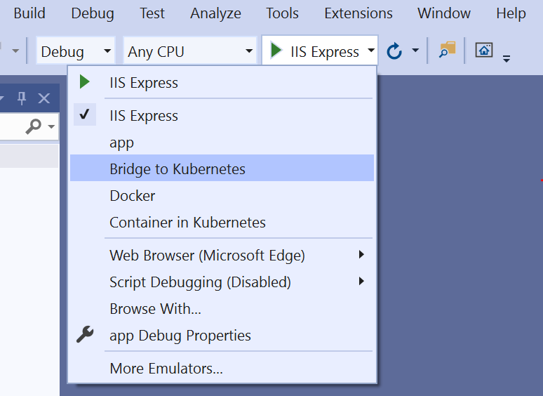
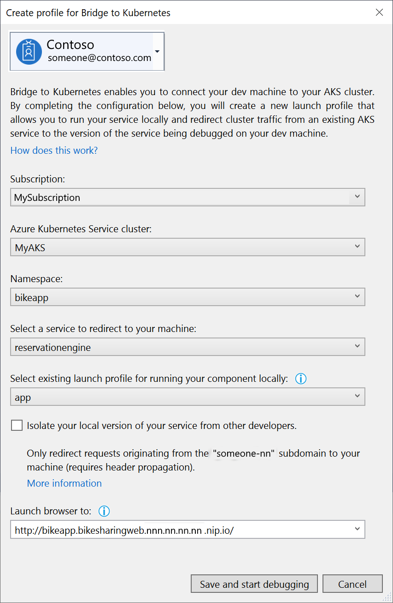

# Use Bridge to Kubernetes

You can use Bridge to Kubernetes to redirect traffic between your Kubernetes cluster and code running on your development computer. This guide also provides a script for deploying a large sample application with multiple microservices on a Kubernetes cluster.

## Before you begin

This guide uses the [Bike Sharing sample application][bike-sharing-github] to demonstrate connecting your development computer to a Kubernetes cluster. If you already have your own application running on a Kubernetes cluster, you can still follow the steps below and use the names of your own services.

### Prerequisites

* An Azure subscription. If you don't have an Azure subscription, you can create a [free account](https://azure.microsoft.com/free).
* [Azure CLI installed][azure-cli].
* [Visual Studio 2019][visual-studio] version 16.7 Preview 4 or greater running on Windows 10 with the *Azure development* workload installed.
* [Bridge to Kubernetes extension installed][btk-extension].

Also, for .NET console applications, install the *Microsoft.VisualStudio.Azure.Kubernetes.Tools.Targets* NuGet Package.

## Create a Kubernetes cluster

Create an AKS cluster in a [supported region][supported-regions]. The below commands create a resource group called *MyResourceGroup* and an AKS cluster called *MyAKS*.

```azurecli-interactive
az group create \
    --name MyResourceGroup \
    --location eastus

az aks create \
    --resource-group MyResourceGroup \
    --name MyAKS \
    --location eastus \
    --node-count 3 \
    --generate-ssh-keys
```

## Install the sample application

Install the sample application on your cluster using the provided script. You can run this script using the [Azure Cloud Shell][azure-cloud-shell].

```azurecli-interactive
git clone https://github.com/Microsoft/mindaro
cd mindaro
chmod +x ./bridge-quickstart.sh
./bridge-quickstart.sh -g MyResourceGroup -n MyAKS
```

Navigate to the sample application running your cluster by opening its public URL, which is displayed in the output of the installation script.

```console
$ ./bridge-quickstart.sh -g MyResourceGroup -n MyAKS
Defaulting Dev spaces repository root to current directory : ~/mindaro
Setting the Kube context
...
To try out the app, open the url:
bikeapp.bikesharingweb.EXTERNAL_IP.nip.io
```

In the above sample, the public URL is `bikeapp.bikesharingweb.EXTERNAL_IP.nip.io`.

## Connect to your cluster and debug a service

On your development computer, download and configure the Kubernetes CLI to connect to your Kubernetes cluster using [az aks get-credentials][az-aks-get-credentials].

```azurecli
az aks get-credentials --resource-group MyResourceGroup --name MyAKS
```

From the [Bike Sharing sample application][bike-sharing-github] repo in GitHub, use the dropdown on the green **Code** button and choose **Open in Visual Studio** to clone the repo locally and open the folder in Visual Studio. Then, use **File** > **Open Project** to open the **app.csproj** project in the *samples/BikeSharingApp/ReservationEngine* folder.

In your project, select **Bridge to Kubernetes** from the launch settings dropdown as shown below.



Click on the start button next to *Bridge to Kubernetes*. In the **Create profile for Bridge to Kubernetes** dialog:

* Select your subscription.
* Select *MyAKS* for your cluster.
* Select *bikeapp* for your namespace.
* Select *reservationengine* for the service to redirect.
* Select *app* for the launch profile.
* Select `http://bikeapp.bikesharingweb.EXTERNAL_IP.nip.io` for the URL to launch your browser.



> [!IMPORTANT]
> You can only redirect services that have a single pod.

Choose whether or not you want to run isolated, meaning that others who are using the cluster won't be affected by your changes. This isolation mode is accomplished by routing your requests to your copy of each affected service, but routing all other traffic normally. More explanation on how this is done can be found at [How Bridge to Kubernetes Works][btk-overview-routing].

Click **Save and start debugging**.

All traffic in the Kubernetes cluster is redirected for the *reservationengine* service to the version of your application running in your development computer. Bridge to Kubernetes also routes all outbound traffic from the application back to your Kubernetes cluster.

> [!NOTE]
> You will be prompted to allow the *EndpointManager* to run elevated and modify your hosts file.

Your development computer is connected when the status bar shows you are connected to the `reservationengine` service.


> [!NOTE]
> On subsequent launches, you will not be prompted with the **Create profile for Bridge to Kubernetes** dialog. You update these settings in the **Debug** in the project properties.

Once your development computer is connected, traffic starts redirecting to your development computer for the service you are replacing.

## Set a break point

Open [BikesHelper.cs][bikeshelper-cs-breakpoint] and click somewhere on line 26 to put your cursor there. Set a breakpoint by hitting *F9* or selecting **Debug** > **Toggle Breakpoint**.

Navigate to the sample application by opening the public URL. Select **Aurelia Briggs (customer)** as the user, then select a bike to rent. Choose **Rent Bike**. Return to Visual Studio and observe line 26 is highlighted. The breakpoint you set has paused the service at line 26. To resume the service, hit **F5** or click **Debug** > **Continue**. Return to your browser and verify the page shows you have rented the bike.

Remove the breakpoint by putting your cursor on line 26 in `BikesHelper.cs` and hitting **F9**.

> [!NOTE]
> By default, stopping the debugging task also disconnects your development computer from your Kubernetes cluster. You can change this behavior by changing **Disconnect after debugging** to `false` in the **Kubernetes Debugging Tools** section of the debugging options. After updating this setting, your development computer will remain connected when you stop and start debugging. To disconnect your development computer from you cluster click on the **Disconnect** button on the toolbar.

## Additional configuration

Bridge to Kubernetes can handle routing traffic and replicating environment variables without any additional configuration. If you need to download any files that are mounted to the container in your Kubernetes cluster, such as a ConfigMap file, you can create a `KubernetesLocalProcessConfig.yaml` to download those files to your development computer. For more information, see [Using KubernetesLocalProcessConfig.yaml for additional configuration with for Bridge to Kubernetes][kubernetesLocalProcessConfig-yaml].

## Using logging and diagnostics

You can find the diagnostic logs in `Bridge to Kubernetes` directory in your development computer's *TEMP* directory. 

## Remove the sample application from your cluster

Use the provided script to remove the sample application from your cluster.

```azurecli-interactive
./bridge-quickstart.sh -c -g MyResourceGroup -n MyAKS
```

## Next steps

Learn how Bridge to Kubernetes works.

> [!div class="nextstepaction"]
> [How Bridge to Kubernetes works](overview-bridge-to-kubernetes.md)

[azds-cli]: /azure/dev-spaces/how-to/install-dev-spaces#install-the-client-side-tools
[azds-vs-code]: https://marketplace.visualstudio.com/items?itemName=azuredevspaces.azds
[azure-cli]: /cli/azure/install-azure-cli?view=azure-cli-lates&preserve-view=true
[azure-cloud-shell]: /azure/cloud-shell/w.md
[az-aks-get-credentials]: /cli/azure/aks?view=azure-cli-latest&preserve-view=true#az-aks-get-credentials
[az-aks-vs-code]: https://marketplace.visualstudio.com/items?itemName=ms-kubernetes-tools.vscode-aks-tools
[bike-sharing-github]: https://github.com/Microsoft/mindaro
[preview-terms]: https://azure.microsoft.com/support/legal/preview-supplemental-terms/
[bikeshelper-cs-breakpoint]: https://github.com/Microsoft/mindaro/blob/master/samples/BikeSharingApp/ReservationEngine/BikesHelper.cs#L26
[supported-regions]: https://azure.microsoft.com/global-infrastructure/services/?products=kubernetes-service
[troubleshooting]: /azure/dev-spaces/troubleshooting#fail-to-restore-original-configuration-of-deployment-on-cluster
[visual-studio]: https://www.visualstudio.com/vs/
[btk-extension]: https://marketplace.visualstudio.com/items?itemName=ms-azuretools.mindaro
[kubernetesLocalProcessConfig-yaml]: configure-bridge-to-kubernetes.md
[btk-overview-routing]: overview-bridge-to-kubernetes.md#using-routing-capabilities-for-developing-in-isolation