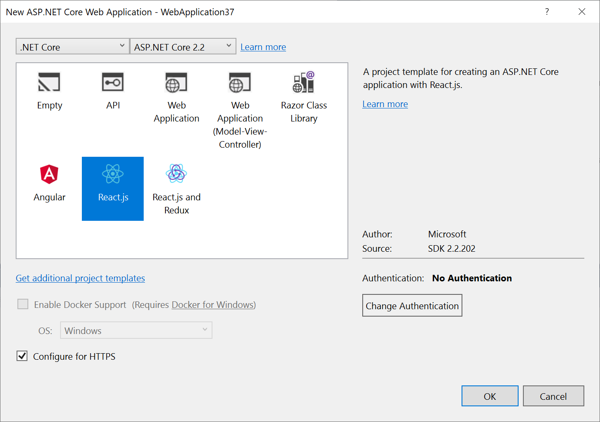
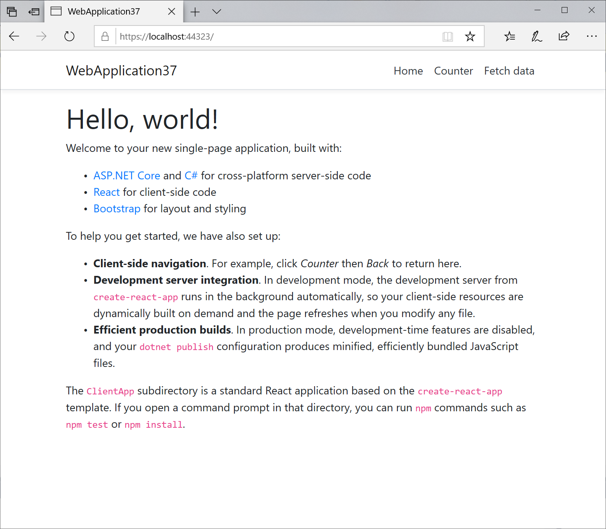

# Quickstart: Use Docker with a React Single-page App in Visual Studio

With Visual Studio, you can easily build, debug, and run containerized ASP.NET Core apps, including those with client-side JavaScript such as React.js single-page app, and publish them to Azure Container Registry (ACR), Docker Hub, Azure App Service, or your own container registry. In this article, we'll publish to ACR.

## Prerequisites

::: moniker range="vs-2017"
* [Docker Desktop](https://hub.docker.com/editions/community/docker-ce-desktop-windows)
* [Visual Studio 2017](https://visualstudio.microsoft.com/vs/older-downloads/?utm_medium=microsoft&utm_source=docs.microsoft.com&utm_campaign=vs+2017+download) with the **Web Development**, **Azure Tools** workload, and/or **.NET Core cross-platform development** workload installed
* To publish to Azure Container Registry, an Azure subscription. [Sign up for a free trial](https://azure.microsoft.com/offers/ms-azr-0044p/).
::: moniker-end
::: moniker range=">=vs-2019"
* [Docker Desktop](https://hub.docker.com/editions/community/docker-ce-desktop-windows)
* [Visual Studio 2019](https://visualstudio.microsoft.com/downloads) with the **Web Development**, **Azure Tools** workload, and/or **.NET Core cross-platform development** workload installed
* [.NET Core 2.2 Development Tools](https://dotnet.microsoft.com/download/dotnet-core/2.2) for development with .NET Core 2.2
* To publish to Azure Container Registry, an Azure subscription. [Sign up for a free trial](https://azure.microsoft.com/offers/ms-azr-0044p/).
* [Node.js](https://nodejs.org/en/download/)
::: moniker-end

## Installation and setup

For Docker installation, first review the information at [Docker Desktop for Windows: What to know before you install](https://docs.docker.com/docker-for-windows/install/#what-to-know-before-you-install). Next, install [Docker Desktop](https://hub.docker.com/editions/community/docker-ce-desktop-windows).

## Create a project and add Docker support

::: moniker range="vs-2017"
1. Create a new project using the **ASP.NET Core Web Application** template.
1. Select **React.js**. You can't select **Enable Docker Support**, but don't worry, you can add that support after you create the project.

   

1. Right-click on the project node, and choose **Add** > **Docker Support** to add a Dockerfile to your project.

   

1. Select the container type, and click **OK**.
::: moniker-end
::: moniker range=">=vs-2019"
1. Create a new project using the **ASP.NET Core Web Application** template.
1. Select **React.js**, and click **Create**. You can't select **Enable Docker Support**, but don't worry, you can add that support later.

   

1. Right-click on the project node, and choose **Add** > **Docker Support** to add a Dockerfile to your project.

   

1. Select the container type.
::: moniker-end

The next step is different depending on whether you're using Linux containers or Windows containers.

## Modify the Dockerfile (Linux containers)

A *Dockerfile*, the recipe for creating a final Docker image, is created in the project. Refer to [Dockerfile reference](https://docs.docker.com/engine/reference/builder/) for an understanding of the commands within it.

Open the *Dockerfile* in the project, and add the following lines to install Node.js 10.x in the container. Be sure to add these lines in the first section, to add the installation of the Node package manager *npm.exe* to the base image that is used in subsequent steps.

```
RUN curl -sL https://deb.nodesource.com/setup_10.x |  bash -
RUN apt-get install -y nodejs
```

The *Dockerfile* should now look something like this:

```
FROM microsoft/dotnet:2.2-aspnetcore-runtime-stretch-slim AS base
WORKDIR /app
EXPOSE 80 
EXPOSE 443
RUN curl -sL https://deb.nodesource.com/setup_10.x |  bash -
RUN apt-get install -y nodejs

FROM microsoft/dotnet:2.2-sdk-stretch AS build
WORKDIR /src
COPY ["WebApplication37/WebApplication37.csproj", "WebApplication37/"]
RUN dotnet restore "WebApplication37/WebApplication37.csproj"
COPY . .
WORKDIR "/src/WebApplication37"
RUN dotnet build "WebApplication37.csproj" -c Release -o /app

FROM build AS publish
RUN dotnet publish "WebApplication37.csproj" -c Release -o /app

FROM base AS final
WORKDIR /app
COPY --from=publish /app .
ENTRYPOINT ["dotnet", "WebApplication37.dll"]
```

The preceding *Dockerfile* is based on the [microsoft/aspnetcore](https://hub.docker.com/r/microsoft/aspnetcore/) image, and includes instructions for modifying the base image by building your project and adding it to the container.

When the new project dialog's **Configure for HTTPS** check box is checked, the *Dockerfile* exposes two ports. One port is used for HTTP traffic; the other port is used for HTTPS. If the check box isn't checked, a single port (80) is exposed for HTTP traffic.

## Modify the Dockerfile (Windows containers)

Open the project file by double-clicking on the project node, and update the project file (*.csproj) by adding the following property as a child of the `<PropertyGroup>` element:

   ```xml
    <DockerfileFastModeStage>base</DockerfileFastModeStage>
   ```

Update the Dockerfile by adding the following lines. This will copy node and npm to the container.

   1. Add ``# escape=` `` to the first line of the Dockerfile
   1. Add the following lines before `FROM … base`

      ```
      FROM mcr.microsoft.com/powershell:nanoserver-1903 AS downloadnodejs
      SHELL ["pwsh", "-Command", "$ErrorActionPreference = 'Stop';$ProgressPreference='silentlyContinue';"]
      RUN Invoke-WebRequest -OutFile nodejs.zip -UseBasicParsing "https://nodejs.org/dist/v10.16.3/node-v10.16.3-win-x64.zip"; `
      Expand-Archive nodejs.zip -DestinationPath C:\; `
      Rename-Item "C:\node-v10.16.3-win-x64" c:\nodejs
      ```

   1. Add the following line before and after `FROM … build`

      ```
      COPY --from=downloadnodejs C:\nodejs\ C:\Windows\system32\
      ```

   1. The complete Dockerfile should now look something like this:

      ```
      # escape=`
      #Depending on the operating system of the host machines(s) that will build or run the containers, the image specified in the FROM statement may need to be changed.
      #For more information, please see https://aka.ms/containercompat
      FROM mcr.microsoft.com/powershell:nanoserver-1903 AS downloadnodejs
      SHELL ["pwsh", "-Command", "$ErrorActionPreference = 'Stop';$ProgressPreference='silentlyContinue';"]
      RUN Invoke-WebRequest -OutFile nodejs.zip -UseBasicParsing "https://nodejs.org/dist/v10.16.3/node-v10.16.3-win-x64.zip"; `
      RUN Expand-Archive nodejs.zip -DestinationPath C:\; `
      RUN Rename-Item "C:\node-v10.16.3-win-x64" c:\nodejs

      FROM mcr.microsoft.com/dotnet/core/aspnet:2.2-nanoserver-1903 AS base
      WORKDIR /app
      EXPOSE 80
      EXPOSE 443
      COPY --from=downloadnodejs C:\nodejs\ C:\Windows\system32\

      FROM mcr.microsoft.com/dotnet/core/sdk:2.2-nanoserver-1903 AS build
      COPY --from=downloadnodejs C:\nodejs\ C:\Windows\system32\
      WORKDIR /src
      COPY ["WebApplication7/WebApplication37.csproj", "WebApplication37/"]
      RUN dotnet restore "WebApplication7/WebApplication7.csproj"
      COPY . .
      WORKDIR "/src/WebApplication37"
      RUN dotnet build "WebApplication37.csproj" -c Release -o /app/build

      FROM build AS publish
      RUN dotnet publish "WebApplication37.csproj" -c Release -o /app/publish

      FROM base AS final
      WORKDIR /app
      COPY --from=publish /app/publish .
      ENTRYPOINT ["dotnet", "WebApplication37.dll"]
      ```

1. Update the .dockerignore file by removing the `**/bin`.

## Debug

Select **Docker** from the debug drop-down in the toolbar, and start debugging the app. You might see a message with a prompt about trusting a certificate; choose to trust the certificate to continue.  The first time you build, docker downloads the base images, so it might take a bit longer.

The **Container Tools** option in the **Output** window shows what actions are taking place. You should see the installation steps associated with *npm.exe*.

The browser shows the app's home page.

::: moniker range="vs-2017"
   
::: moniker-end
::: moniker range=">=vs-2019"
   
::: moniker-end

Try navigating to the *Counter* page and test the client-side code for the counter by clicking the **Increment** button.

Open the **Package Manager Console** (PMC) from the menu **Tools**> NuGet Package Manager, **Package Manager Console**.

The resulting Docker image of the app is tagged as *dev*. The image is based on the *2.2-aspnetcore-runtime* tag of the *microsoft/dotnet* base image. Run the `docker images` command in the **Package Manager Console** (PMC) window. The images on the machine are displayed:

```console
REPOSITORY        TAG                     IMAGE ID      CREATED         SIZE
webapplication37  dev                     d72ce0f1dfe7  30 seconds ago  255MB
microsoft/dotnet  2.2-aspnetcore-runtime  fcc3887985bb  6 days ago      255MB
```

> [!NOTE]
> The **dev** image does not contain the app binaries and other content, as **Debug** configurations use volume mounting to provide the iterative edit and debug experience. To create a production image containing all contents, use the **Release** configuration.

Run the `docker ps` command in PMC. Notice the app is running using the container:

```console
CONTAINER ID        IMAGE                  COMMAND               CREATED             STATUS              PORTS                                           NAMES
cf5d2ef5f19a        webapplication37:dev   "tail -f /dev/null"   2 minutes ago       Up 2 minutes        0.0.0.0:52036->80/tcp, 0.0.0.0:44342->443/tcp   priceless_cartwright
```

## Publish Docker images

Once the develop and debug cycle of the app is completed, you can create a production image of the app.

1. Change the configuration drop-down to **Release** and build the app.
1. Right-click your project in **Solution Explorer** and choose **Publish**.
1. On the publish target dialog, select the **Container Registry** tab.
1. Choose **Create New Azure Container Registry** and click **Publish**.
1. Fill in your desired values in the **Create a new Azure Container Registry**.

    | Setting      | Suggested value  | Description                                |
    | ------------ |  ------- | -------------------------------------------------- |
    | **DNS Prefix** | Globally unique name | Name that uniquely identifies your container registry. |
    | **Subscription** | Choose your subscription | The Azure subscription to use. |
    | **[Resource Group](/azure/azure-resource-manager/resource-group-overview)** | myResourceGroup |  Name of the resource group in which to create your container registry. Choose **New** to create a new resource group.|
    | **[SKU](https://docs.microsoft.com/azure/container-registry/container-registry-skus)** | Standard | Service tier of the container registry  |
    | **Registry Location** | A location close to you | Choose a Location in a [region](https://azure.microsoft.com/regions/) near you or near other services that will use your container registry. |

    ![Visual Studio's create Azure Container Registry dialog][0]

1. Click **Create**.

   

## Next steps

You can now pull the container from the registry to any host capable of running Docker images, for example [Azure Container Instances](/azure/container-instances/container-instances-tutorial-deploy-app).

## Additional resources

* [Container development with Visual Studio](/visualstudio/containers)
* [Troubleshoot Visual Studio development with Docker](troubleshooting-docker-errors.md)
* [Visual Studio Container Tools GitHub repository](https://github.com/Microsoft/DockerTools)

::: moniker range="vs-2017"
[0]:media/hosting-web-apps-in-docker/vs-acr-provisioning-dialog.png
::: moniker-end
::: moniker range=">=vs-2019"
[0]:media/hosting-web-apps-in-docker/vs-acr-provisioning-dialog-2019.png
::: moniker-end