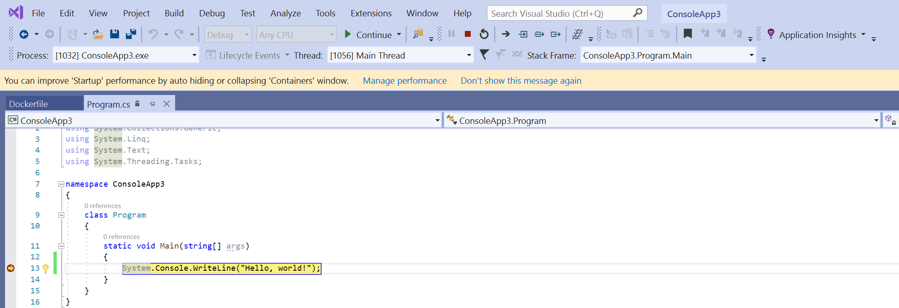

# Debug apps in a local Docker container

Visual Studio provides a consistent way to develop in a Docker container and validate your application locally. You don't have to restart the container each time you make a code change.

This article illustrates how to use the Edit and Refresh feature in Visual Studio to start an ASP.NET Core Web app in a local Docker container, make changes, and then refresh the browser to see the changes. This article also shows you how to set breakpoints for debugging.

## Prerequisites

To debug apps in a local Docker container, the following tools must be installed:

::: moniker range="vs-2017"

* [Visual Studio 2017](https://visualstudio.microsoft.com/vs/older-downloads/?utm_medium=microsoft&utm_source=docs.microsoft.com&utm_campaign=vs+2017+download) with the Web Development workload installed

::: moniker-end

::: moniker range="vs-2019"

* [Visual Studio 2019](https://visualstudio.microsoft.com/downloads/?utm_medium=microsoft&utm_source=docs.microsoft.com&utm_campaign=inline+link&utm_content=download+vs2019) with the Web Development workload installed

::: moniker-end

To run Docker containers locally, you must have a local Docker client. You can use the [Docker Toolbox](https://www.docker.com/products/docker-toolbox), which requires Hyper-V to be disabled. You also can use [Docker for Windows](https://www.docker.com/get-docker), which uses Hyper-V and requires Windows 10. If you use Docker Toolbox, you must configure the Docker client.

Docker containers are available for .NET Framework and .NET Core projects. Let's look at two examples: first, we look at a .NET Core web app, and then, we look at a .NET Framework console app.

## Create a web app

::: moniker range="vs-2017"
[!INCLUDE [create-aspnet5-app](../azure/includes/create-aspnet5-app.md)]
::: moniker-end
::: moniker range=">= vs-2019"
[!INCLUDE [create-aspnet5-app-2019](../azure/includes/vs-2019/create-aspnet5-app-2019.md)
::: moniker-end

### Edit your code and refresh

To quickly iterate changes, you can start your application in a container. Then, continue to make changes, viewing them as you would with IIS Express.

1. Set **Solution Configuration** to **Debug**. Then, press Ctrl+F5 to build your Docker image and run it locally.

    When the container image is built and running in a Docker container, Visual Studio launches the web app in your default browser.

2. Go to the *Index* page. We'll make changes on this page.
3. Return to Visual Studio and open *Index.cshtml*.
4. Add the following HTML content to the end of the file, and then save the changes.

    ```html
    <h1>Hello from a Docker container!</h1>
    ```

5. In the output window, when the .NET build is finished and you see the following lines, switch back to your browser and refresh the page:

   ```output
   Now listening on: http://*:80
   Application started. Press Ctrl+C to shut down.
   ```

Your changes have been applied!

### Debug with breakpoints

Often, changes require further inspection. You can use the debugging features of Visual Studio for this task.

1. In Visual Studio, open *Index.cshtml.cs*.
2. Replace the contents of the `OnGet` method with the following code:

   ```csharp
       ViewData["Message"] = "Your application description page from within a container";
   ```

3. To the left of the code line, set a breakpoint.
4. To start debugging and hit the breakpoint, press F5.
5. Switch to Visual Studio to view the breakpoint. Inspect values.

   

## Create a .NET Framework console app

When you use .NET Framework console app projects, the option to add Docker support without orchestration isn't supported. You can still use the following procedure, even if you're using only a single Docker project.

1. Create a new .NET Framework Console app project.
1. In Solution Explorer, right-click the project node, and then select **Add** > **Container Orchestration Support**.  In the dialog box that appears, select **Docker Compose**. A Dockerfile is added to your project and a Docker Compose project with associated support files is added.

### Debug with breakpoints

1. In Solution Explorer, open *Program.cs*.
2. Replace the contents of the `Main` method with the following code:

   ```csharp
       System.Console.WriteLine("Hello, world!");
   ```

3. Set a breakpoint to the left of the code line.
4. Press F5 to start debugging and hit the breakpoint.
5. Switch to Visual Studio to view the breakpoint and inspect values.

   

## Container reuse

During the development cycle, Visual Studio rebuilds only your container images and the container itself when you change the Dockerfile. If you don't change the Dockerfile, Visual Studio reuses the container from an earlier run.

If you manually modified your container and want to restart with a clean container image, use the **Build** > **Clean** command in Visual Studio, and then build as normal.

## Troubleshoot

Learn how to [troubleshoot Visual Studio Docker development](troubleshooting-docker-errors.md).

## More about Docker with Visual Studio, Windows, and Azure

* Learn more about [container development with Visual Studio](/visualstudio/containers).
* To build and deploy a Docker container, see [Docker integration for Azure Pipelines](https://aka.ms/dockertoolsforvsts).
* For an index of Windows Server and Nano Server articles, see [Windows container information](https://aka.ms/containers).
* Learn about the [Azure Kubernetes Service](https://azure.microsoft.com/services/kubernetes-service/) and review the [Azure Kubernetes Service documentation](/azure/aks).

