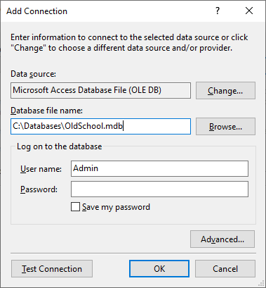

# Connect to data in an Access database

You can connect to an Access database (either an *.mdb* file or an *.accdb* file) by using Visual Studio. After you define the connection, the data appears in the **Data Sources** window. From there, you can drag tables or views onto your design surface.

## Prerequisites

To use these procedures, you need a Windows Forms or WPF project and either an Access database (*.accdb* file) or an Access 2000-2003 database (*.mdb* file). Follow the procedure that corresponds to your file type.

## Create a dataset for an .accdb file

Connect to databases created with Office 365, Access 2013, Access 2010, or Access 2007 by using the following procedure.

1. Open a Windows Forms or WPF application project in Visual Studio.

2. To open the **Data Sources** window, on the **View** menu, select **Other Windows** > **Data Sources**.

   

3. In the **Data Sources** window, click **Add New Data Source**.

   The **Data Source Configuration Wizard** opens.

4. Select **Database** on the **Choose a Data Source Type** page, and then select **Next**.

5. Select **Dataset** on the **Choose a Database Model** page, and then select **Next**.

6. On the **Choose your Data Connection** page, select **New Connection** to configure a new data connection.

   The **Add Connection** dialog box opens.

7. If **Data source** is not set to **Microsoft Access Database File (OLE DB)**, select the **Change** button.

   The **Change Data Source** dialog box opens. In the list of data sources, choose **Microsoft Access Database File**. In the **Data provider** drop-down, select **.NET Framework Data Provider for OLE DB**, and then choose **OK**.

8. Choose **Browse** next to **Database file name**, and then navigate to your *.accdb* file and choose **Open**.

9. Enter a user name and password (if necessary), and then choose **OK**.

10. Select **Next** on the **Choose your Data Connection** page.

    You may get a dialog box telling you the data file is not in your current project. Select **Yes** or **No**.

11. Select **Next** on the **Save connection string to the Application Configuration file** page.

12. Expand the **Tables** node on the **Choose your Database Objects** page.

13. Select the tables or views you want to include in your dataset, and then select **Finish**.

    The dataset is added to your project, and the tables and views appear in the **Data Sources** window.

## Create a dataset for an .mdb file

Connect to databases created with Access 2000-2003 by using the following procedure.

1. Open a Windows Forms or WPF application project in Visual Studio.

2. On the **View** menu, select **Other Windows** > **Data Sources**.

   

3. In the **Data Sources** window, click **Add New Data Source**.

    The **Data Source Configuration Wizard** opens.

4. Select **Database** on the **Choose a Data Source Type** page, and then select **Next**.

5. Select **Dataset** on the **Choose a Database Model** page, and then select **Next**.

6. On the **Choose your Data Connection** page, select **New Connection** to configure a new data connection.

7. If the data source is not **Microsoft Access Database File (OLE DB)**, select **Change** to open the **Change Data Source** dialog box and select **Microsoft Access Database File**, and then select **OK**.

8. In the **Database file name**, specify the path and name of the *.mdb* file you want to connect to, and then select **OK**.

   

9. Select **Next** on the **Choose your Data Connection** page.

10. Select **Next** on the **Save connection string to the Application Configuration file** page.

11. Expand the **Tables** node on the **Choose your Database Objects** page.

12. Select whatever tables or views you want in your dataset, and then select **Finish**.

    The dataset is added to your project, and the tables and views appear in the **Data Sources** window.

## Next steps

The dataset that you just created is available in the **Data Sources** window. You can now perform any of the following tasks:

- Select items in the **Data Sources** window and drag them onto your form or design surface (see [Bind Windows Forms controls to data in Visual Studio](../data-tools/bind-windows-forms-controls-to-data-in-visual-studio.md) or [WPF data binding overview](/dotnet/desktop-wpf/data/data-binding-overview)).

- Open the data source in the **Dataset Designer** to add or edit the objects that make up the dataset.

- Add validation logic to the <xref:System.Data.DataTable.ColumnChanging> or <xref:System.Data.DataTable.RowChanging> event of the data tables in the dataset (see [Validate data in datasets](../data-tools/validate-data-in-datasets.md)).

## See also

- [Add connections](../data-tools/add-new-connections.md)
- [WPF data binding overview](/dotnet/framework/wpf/data/data-binding-overview)
- [Windows Forms data binding](/dotnet/framework/winforms/data-binding-and-windows-forms)
