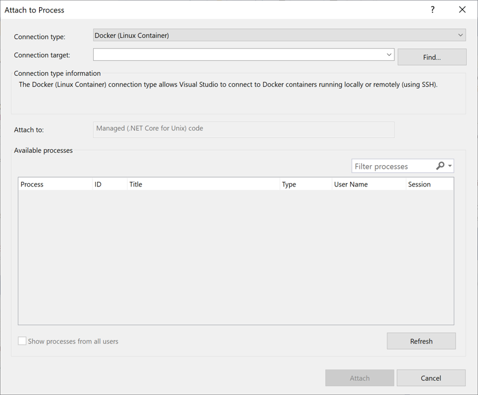
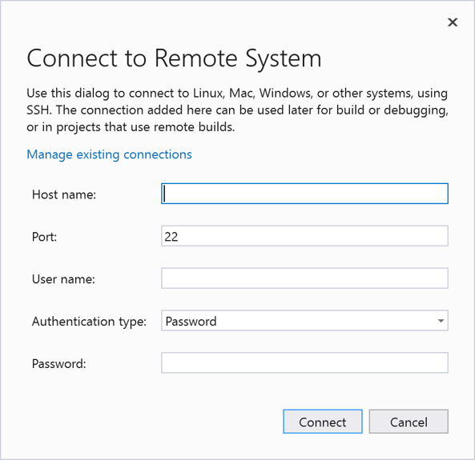
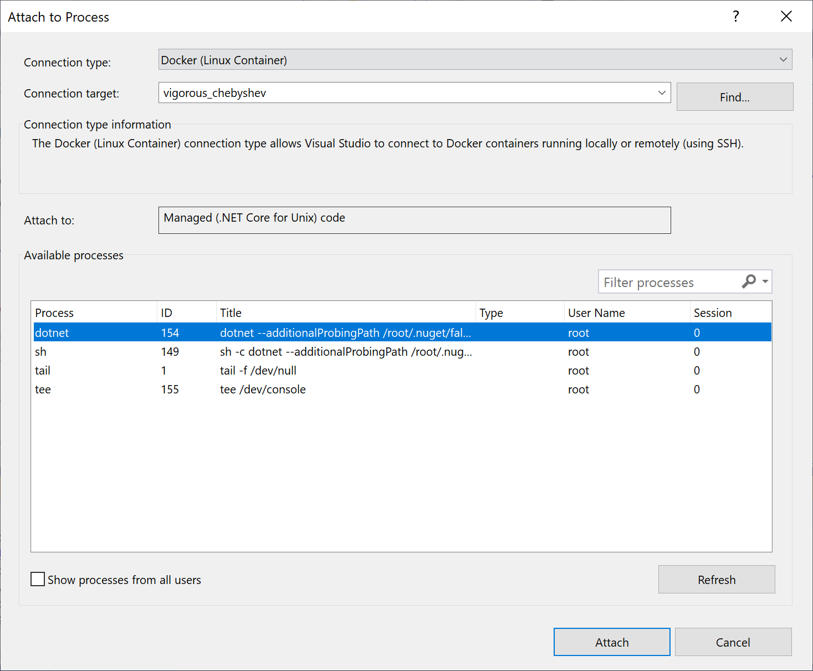
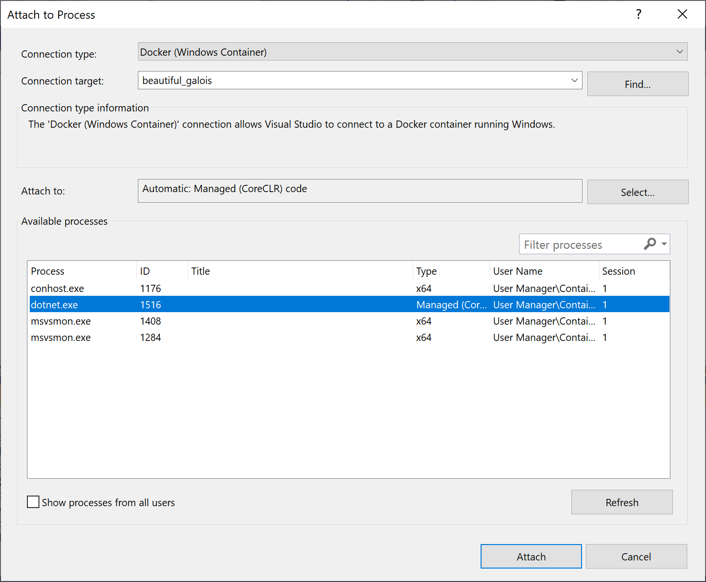

# Attach to running processes with the Visual Studio debugger
You can attach the Visual Studio debugger to a running process on a local or remote computer. After the process is running, select **Debug** > **Attach to Process** or press **Ctrl**+**Alt**+**P** in Visual Studio, and use the **Attach to Process** dialog to attach the debugger to the process.

You can use **Attach to Process** to debug running apps on local or remote computers, debug multiple processes simultaneously, debug apps that weren't created in Visual Studio, or debug any app you didn't start from Visual Studio with the debugger attached. For example, if you're running an app without the debugger and hit an exception, you can then attach the debugger to the process running the app and begin debugging.

> [!TIP]
> Not sure whether to use **Attach to Process** for your debugging scenario? See [Common debugging scenarios](#BKMK_Scenarios).

##  Attach to a running process on your local machine

To quickly reattach to a process you attached to previously, see [Reattach to a process](#BKMK_reattach).

To debug a process on a remote computer, see [Attach to a process on a remote computer](#BKMK_Attach_to_a_process_on_a_remote_computer).

::: moniker range=">= vs-2019"
To debug a .NET Core process on a Linux Docker container, see [Attach to a Linux Docker container](#BKMK_Linux_Docker_Attach).
::: moniker-end

**To attach to a process on your local computer:**

1. In Visual Studio, select **Debug** > **Attach to Process** (or press **Ctrl**+**Alt**+**P**) to open the **Attach to Process** dialog box.

   **Connection type** should be set to **Default**. **Connection target** should be your local machine name.

   

2. In the **Available processes** list, find and select the process or processes you want to attach to.

   - To quickly select a process, type its name or first letter in the **Filter processes** box.

   - If you don't know the process name, browse through the list, or see [Common debugging scenarios](#BKMK_Scenarios) for some common process names.

   >[!TIP]
   >Processes can start and stop in the background while the **Attach to Process** dialog box is open, so the list of running processes may not always be current. You can select **Refresh** at any time to see the current list.

3. In the **Attach to** field, make sure the type of code you plan to debug is listed. The default **Automatic** setting works for most app types.

   To select code types manually:
   1. Click **Select**.
   1. In the **Select Code Type** dialog box, select **Debug these code types**.
   1. Select the code types you want to debug.
   1. Select **OK**.

4. Select **Attach**.

>[!NOTE]
>You can be attached to multiple apps for debugging, but only one app is active in the debugger at a time. You can set the active app in the Visual Studio **Debug Location** toolbar or **Processes** window.

##  Attach to a process on a remote computer

You can also select a remote computer in the **Attach to Process** dialog box, view a list of available processes running on that computer, and attach to one or more of the processes for debugging. The remote debugger (*msvsmon.exe*) must be running on the remote computer. For more information, see [Remote debugging](../debugger/remote-debugging.md).

For more complete instructions for debugging ASP.NET applications that have been deployed to IIS, see [Remote debugging ASP.NET on a remote IIS computer](../debugger/remote-debugging-aspnet-on-a-remote-iis-7-5-computer.md).

**To attach to a running process on a remote computer:**

1. In Visual Studio, select **Debug** > **Attach to Process** (or press **Ctrl**+**Alt**+**P**) to open the **Attach to Process** dialog box.

2. **Connection type** should be **Default** for most cases. In the **Connection target** box, select the remote computer, using one of the following methods:

   - Select the drop-down arrow next to **Connection target**, and select the computer name from the drop-down list.
   - Type the computer name in the **Connection target** box and press **Enter**.

     Verify that Visual Studio adds the required port to the computer name, which appears in the format: **\<remote computer name>:port**

     ::: moniker range=">= vs-2019"

     > [!NOTE]
     > If you can't connect using the remote computer name, try using the IP and port address (for example, `123.45.678.9:4022`). 4024 is the default port for the Visual Studio 2019 x64 remote debugger. For other remote debugger port assignments, see [Remote debugger port assignments](remote-debugger-port-assignments.md).

     ::: moniker-end
     ::: moniker range="vs-2017"

     > [!NOTE]
     > If you can't connect using the remote computer name, try using the IP and port address (for example, `123.45.678.9:4022`). 4022 is the default port for the Visual Studio 2017 x64 remote debugger. For other remote debugger port assignments, see [Remote debugger port assignments](remote-debugger-port-assignments.md).

     ::: moniker-end

   - Select the **Find** button next to the **Connection target** box to open the **Remote Connections** dialog box. The **Remote Connections** dialog box lists all the devices that are on your local subnet or directly attached to your computer. You may need to [open UDP port 3702](../debugger/remote-debugger-port-assignments.md) on the server to discover remote devices. Select the computer or device you want, and then click **Select**.

   > [!NOTE]
   > The **Connection type** setting persists between debugging sessions. The **Connection target** setting persists between debugging sessions only if a successful debugging connection occurred with that target.

3. Click **Refresh** to populate the **Available processes** list.

    >[!TIP]
    >Processes can start and stop in the background while the **Attach to Process** dialog box is open, so the list of running processes may not always be current. You can select **Refresh** at any time to see the current list.

4. In the **Available processes** list, find and select the process or processes you want to attach to.

   - To quickly select a process, type its name or first letter in the **Filter processes** box.

   - If you don't know the process name, browse through the list, or see [Common debugging scenarios](#BKMK_Scenarios) for some common process names.

   - To find processes running under all user accounts, select the **Show processes from all users** check box.

     >[!NOTE]
     >If you try to attach to a process owned by an untrusted user account, a security warning dialog box confirmation will appear. For more information see [Security Warning: Attaching to a process owned by an untrusted user can be dangerous. If the following information looks suspicious or you are unsure, do not attach to this process](../debugger/security-warning-attaching-to-a-process-owned-by-an-untrusted-user.md).

5. In the **Attach to** field, make sure the type of code you plan to debug is listed. The default **Automatic** setting works for most app types.

   To select code types manually:
   1. Click **Select**.
   1. In the **Select Code Type** dialog box, select **Debug these code types**.
   1. Select the code types you want to debug.
   1. Select **OK**.

6. Select **Attach**.

>[!NOTE]
>You can be attached to multiple apps for debugging, but only one app is active in the debugger at a time. You can set the active app in the Visual Studio **Debug Location** toolbar or **Processes** window.

In some cases, when you debug in a Remote Desktop (Terminal Services) session, the **Available processes** list won't display all available processes. If you are running Visual Studio as a user who has a limited user account, the **Available processes** list won't show processes that are running in Session 0. Session 0 is used for services and other server processes, including *w3wp.exe*. You can solve the problem by running [!INCLUDE[vsprvs](../code-quality/includes/vsprvs_md.md)] under an administrator account or by running [!INCLUDE[vsprvs](../code-quality/includes/vsprvs_md.md)] from the server console instead of a Terminal Services session.

If neither of those workarounds is possible, a third option is to attach to the process by running `vsjitdebugger.exe -p <ProcessId>` from the Windows command line. You can determine the process ID using *tlist.exe*. To obtain *tlist.exe*, download and install Debugging Tools for Windows, available at  [WDK and WinDbg downloads](/windows-hardware/drivers/download-the-wdk).

::: moniker range=">= vs-2019"

## Attach to a .NET Core process running on Linux using SSH

For more information, see [Remote debug .NET Core running on Linux using SSH](../debugger/remote-debugging-dotnet-core-linux-with-ssh.md).

##  Attach to a process running on a Linux Docker container

You can attach the Visual Studio debugger to a process running in a Linux .NET Core Docker container on your local or remote machine using the **Attach to Process** dialog box.

> [!IMPORTANT]
> To use this feature, you must install the .NET Core Cross-Platform Development workload and have local access to the source code.

**To attach to a running process in a Linux Docker container:**

1. In Visual Studio, select **Debug > Attach to Process (CTRL+ALT+P)** to open the **Attach to Process** dialog box.

2. Set the **Connection type** to **Docker (Linux Container)**.
3. Select **Find...** to set the **Connection target** via the **Select Docker Container** dialog box.

    You can debug a Docker container process either locally or remotely.
    
    **To debug a Docker container process locally:**
    1. Set **Docker CLI host** to **Local Machine**.
    1. Select a running container to attach to from the list and hit **OK**.
    
    
 
    **B. To debug a Docker container process remotely:**
    
    > [!NOTE] 
    > There are two options for connecting remotely to a running process in a Docker container. The first option, to use SSH, is ideal if you don't have Docker tools installed on your local machine.  If you do have Docker tools installed locally and you have a Docker daemon that's configured to accept remote requests, try the second option, using a Docker daemon.

    1. ***To connect to a remote machine via SSH:***
        1. Select **Add...** to connect to a remote system. 
        
        1. Select a running container to attach to after connecting to the SSH or daemon successfully and hit **OK**.

    
    1. ***To set the target to a remote container running a process via a [Docker daemon](https://docs.docker.com/engine/reference/commandline/dockerd/)***
        1. Specify the daemon address (i.e. via TCP, IP, etc.) under **Docker host (Optional)** and click the refresh link.
        1. Select a running container to attach to after connecting to the daemon successfully and hit **OK**.

4. Choose the corresponding container process from the list of **Available processes** and select **Attach** to start debugging your C# container process in Visual Studio!

    
    

##  Attach to a process running on a Windows Docker container

You can attach the Visual Studio debugger to a process running in a Windows Docker container on your local machine using the **Attach to Process** dialog box.

> [!IMPORTANT]
> To use this feature with a .NET Core process, you must install the .NET Core Cross-Platform Development workload and have local access to the source code.

**To attach to a running process in a Windows Docker container:**

1. In Visual Studio, select **Debug > Attach to Process** (or **CTRL+ALT+P**) to open the **Attach to Process** dialog box.

2. Set the **Connection type** to **Docker (Windows Container)**.
3. Select **Find...** to set the **Connection target** using the **Select Docker Container** dialog box.

    > [!IMPORTANT]
    > The target process must have the same processor architecture as the Docker Windows container it is running on.
    
   Setting the target to a remote container via SSH is currently unavailable and can only be done using a Docker daemon.
    
    ***To set the target to a remote container running a process via a [Docker daemon](https://docs.docker.com/engine/reference/commandline/dockerd/)***
    1. Specify the daemon address (i.e. via TCP, IP, etc.) under Docker host (Optional) and click the refresh link. 

    1. Select a running container to attach to after connecting to the daemon successfully and hit OK.
    
4. Choose the corresponding container process from the list of **Available processes** and select **Attach** to start debugging your C# container process.

    
    

5.	Choose the corresponding container process from the list of Available processes and select Attach to start debugging your C# container process.

::: moniker-end

##  Reattach to a process

You can quickly reattach to processes that you were previously attached to by choosing **Debug** > **Reattach to Process** (**Shift**+**Alt**+**P**). When you choose this command, the debugger will immediately try to attach to the last processes you attached to by first attempting to match the previous process ID and if that fails, by matching to the previous process name. If no matches are found, or if several processes have the same name, the **Attach to Process** dialog box will open so you can select the correct process.

> [!NOTE]
> The **Reattach to Process** command is available starting in Visual Studio 2017.

##  Common debugging scenarios

To help you determine whether to use **Attach to Process** and what process to attach to, the following table shows a few common debugging scenarios, with links to more instructions where available. (The list is not exhaustive.)

For some app types, like Universal Windows App (UWP) apps, you don't attach directly to a process name, but use the **Debug Installed App Package** menu option in Visual Studio instead (see table).

For the debugger to attach to code written in C++, the code needs to emit `DebuggableAttribute`. You can add this to your code automatically by linking with the [/ASSEMBLYDEBUG](/cpp/build/reference/assemblydebug-add-debuggableattribute) linker option.

For client-side script debugging, script debugging must be enabled in the browser. For debugging client-side script on Chrome, choose **Web kit** as the code type, and depending on your app type, you may need to close all Chrome instances and start the  browser in debugging mode (type `chrome.exe --remote-debugging-port=9222` from a command line).

To quickly select a running process to attach to, in Visual Studio, type **Ctrl**+**Alt**+**P**, and then type the first letter of the process name.

|Scenario|Debug method|Process name|Notes and links|
|-|-|-|-|
|Remote debug ASP.NET 4 or 4.5 on an IIS server|Use remote tools and **Attach to Process**|*w3wp.exe*|See [Remote debugging ASP.NET on a remote IIS computer](../debugger/remote-debugging-aspnet-on-a-remote-iis-7-5-computer.md)|
|Remote debug ASP.NET Core on an IIS server|Use remote tools and **Attach to Process**|*dotnet.exe* or *appname.exe*|For app deployment, see [Publish to IIS](https://docs.asp.net/en/latest/publishing/iis.html). For debugging, see [Remote debugging ASP.NET Core on a remote IIS computer](../debugger/remote-debugging-aspnet-on-a-remote-iis-computer.md)|
|Debug client-side script on a local IIS server, for supported app types |Use **Attach to Process**|*chrome.exe*, *MicrosoftEdgeCP.exe*, or *iexplore.exe*|Script debugging must be enabled. For Chrome, you must also run Chrome in debug mode and select **Webkit code** in the **Attach to** field.|
|Debug a C#, Visual Basic, or C++ app on the local machine|Use either standard debugging (**F5**) or **Attach to Process**|*\<appname>.exe*|In most scenarios, use standard debugging and not **Attach to Process**.|
|Remote debug a Windows desktop app|Remote tools|N/A| See [Remote debug a C# or Visual Basic app](../debugger/remote-debugging-csharp.md) or [Remote debug a C++ app](../debugger/remote-debugging-cpp.md)|
|Debug .NET Core on Linux|Use **Attach to Process**|*dotnet.exe*|To use SSH, see [Remote debug .NET Core running on Linux using SSH](../debugger/remote-debugging-dotnet-core-linux-with-ssh.md). To use a Linux Docker container, see [Attach to a process running on a Linux Docker container](#BKMK_Docker_Attach).|
|Debug an ASP.NET app on the local machine after you start the app without the debugger|Use **Attach to Process**|*iiexpress.exe*|This may be helpful to make your app load faster, such as (for example) when profiling. |
|Debug other supported app types on a server process|If server is remote, use remote tools, and **Attach to Process**|*chrome.exe*, *iexplore.exe*, or other processes|If necessary, use Resource Monitor to help identify the process. See [Remote debugging](../debugger/remote-debugging.md).|
|Remote debug a Universal Windows App (UWP), OneCore, HoloLens, or IoT app|Debug installed app package|N/A|See [Debug an installed app package](debug-installed-app-package.md) instead of using **Attach to Process**|
|Debug a Universal Windows App (UWP), OneCore, HoloLens, or IoT app that you didn't start from Visual Studio|Debug installed app package|N/A|See [Debug an installed app package](debug-installed-app-package.md) instead of using **Attach to Process**|

## Use debugger features

To use the full features of the Visual Studio debugger (like hitting breakpoints) when attaching to a process, the app must exactly match your local source and symbols. That is, the debugger must be able to load the correct [symbol (.pdb) files](../debugger/specify-symbol-dot-pdb-and-source-files-in-the-visual-studio-debugger.md). By default, this requires a debug build.

For remote debugging scenarios, you must have the source code (or a copy of the source code) already open in Visual Studio. The compiled app binaries on the remote machine must come from the same build as on the local machine.

In some local debugging scenarios, you can debug in Visual Studio with no access to the source if the correct symbol files are present with the app. By default, this requires a debug build. For more information, see [Specify symbol and source files](../debugger/specify-symbol-dot-pdb-and-source-files-in-the-visual-studio-debugger.md).

##  Troubleshoot attach errors
 When the debugger attaches to a running process, the process can contain one or more types of code. The code types the debugger can attach to are displayed and selected in the **Select Code Type** dialog box.

 Sometimes, the debugger can successfully attach to one code type, but not to another code type. This might occur if you are trying to attach to a process that is running on a remote computer. The remote computer might have remote debugging components installed for some code types but not for others. It can also occur if you try to attach to two or more processes for direct database debugging. SQL debugging supports attaching to a single process only.

 If the debugger is able to attach to some, but not all, code types, you see a message identifying which types failed to attach.

 If the debugger successfully attaches to at least one code type, you can proceed to debug the process. You will be able to debug only the code types that were successfully attached. The unattached code in the process will still run, but you won't be able to set breakpoints, view data, or perform other debugging operations on that code.

 If you want more specific information about why the debugger failed to attach to a code type, try to reattach to only that code type.

 **To obtain specific information about why a code type failed to attach:**

1. Detach from the process. On the **Debug** menu, select **Detach All**.

1. Reattach to the process, selecting only the code type that failed to attach.

    1. In the **Attach to Process** dialog box, select the process in the **Available processes** list.

    2. Select **Select**.

    3. In the **Select Code Type** dialog box, select **Debug these code types** and the code type that failed to attach. Deselect the other code types.

    4. Select **OK**.

    5. In the **Attach to Process** dialog box, select **Attach**.

    This time, the attach will fail completely, and you will get a specific error message.

## See also

- [Debug multiple processes](../debugger/debug-multiple-processes.md)
- [Just-In-Time debugging](../debugger/just-in-time-debugging-in-visual-studio.md)
- [Remote debugging](../debugger/remote-debugging.md)
