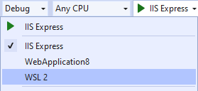
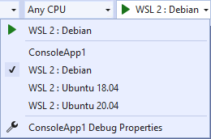

# Debug .NET Core Apps in WSL 2 with Visual Studio

Are you a .NET Core developer who loves working in Windows and Visual Studio, but needs to test your app in Linux? Are you a cross-platform developer that needs an easy way to test more of your target environments? Have you already discovered the benefits of WSL 2, but need a way to integrate it into your inner loop? Have I got an extension for you! The [.NET Core Debugging with WSL 2 – Preview extension](https://marketplace.visualstudio.com/items?itemName=ms-azuretools.Dot-Net-Core-Debugging-With-Wsl2) gives you the ability to run and debug your .NET Core apps in WSL 2 without leaving Visual Studio.

## When would I want to debug in WSL 2?

For a Windows .NET user targeting Linux, WSL 2 lives in a sweet spot between production realism and productivity. In Visual Studio you can already debug in a remote Linux environment using the Remote Debugger, or with containers using the Container Tools. When production realism is your main concern, you should use one of those. When an easy and fast inner-loop is more important, WSL 2 is a great option.

You don’t have to choose just one! You can have a launch profile for Docker and WSL 2 in the same project and pick whichever is appropriate for a particular run. And once your app is deployed, you can always use the Remote Debugger to attach to it if there is an issue.

## Getting Started with .NET Core Debugging with WSL 2 – Preview

Before using the extension, be sure to install WSL 2 and the distribution of your choice. After you have installed the extension, when you open an ASP.NET Core web app or .NET Core console app in Visual Studio, you’ll see a new Launch Profile named WSL 2:



Selecting this profile will add it to your launchSettings.json, and will look something like:

```json
"WSL 2": {
    "commandName": "WSL2",
    "launchBrowser": true,
    "launchUrl": "https://localhost:5001",
    "environmentVariables": {
        "ASPNETCORE_URLS": "https://localhost:5001;http://localhost:5000",
        "ASPNETCORE_ENVIRONMENT": "Development"
    },
    "distributionName": ""
}
```

Once the new profile is selected, the extension checks that your WSL 2 distribution is configured to run .NET Core apps, and helps you install any missing dependencies. Once all the dependencies are installed, you are ready to debug in WSL 2. Simply start Debugging as normal, and your app will now be running in your default WSL 2 distribution. An easy way to verify that you are running in Linux is to check the value of Environment.OSVersion.

>[!NOTE]
> Only Ubuntu and Debian have been tested and are supported. Other distributions supported by .NET Core should work but require manually installing the .NET Core Runtime and Curl.

## Using a specific distribution

By default, the WSL 2 launch profile will use the default distribution as set in wsl.exe. If you want your launch profile to target a specific distribution, regardless of that default, you can modify your launch profile. For example, if you are debugging a web app and want to test it on Ubuntu 20.04, your launch profile would look like:

```json
"WSL 2": {
    "commandName": "WSL2",
    "launchBrowser": true,
    "launchUrl": "https://localhost:5001",
    "environmentVariables": {
        "ASPNETCORE_URLS": "https://localhost:5001;http://localhost:5000",
        "ASPNETCORE_ENVIRONMENT": "Development"
    },
    "distributionName": "Ubuntu-20.04"
}
```

## Targeting multiple distributions

Going one step further, if you are working on an application that needs to run in multiple distributions and you want a quick way to test on each of them, you can have multiple launch profiles. For instance, if you need to test your console app on Debian, Ubuntu 18.04, and Ubuntu 20.04, you could use the following launch profiles:

```json
"WSL 2 : Debian": {
    "commandName": "WSL2",
    "distributionName": "Debian"
},
"WSL 2 : Ubuntu 18.04": {
    "commandName": "WSL2",
    "distributionName": "Ubuntu-18.04"
},
"WSL 2 : Ubuntu 20.04": {
    "commandName": "WSL2",
    "distributionName": "Ubuntu-20.04"
}
```

With these launch profiles, you can easily switch back and forth between your target distributions, all without leaving the comfort of Visual Studio:



## Give it a try today!

So, if you love working in Visual Studio, but need to test your app in Linux, go to the Visual Studio Marketplace to install the extension today. Please use the marketplace to ask any questions and give us your feedback to let us know how useful this extension is.


**SETTINGS**