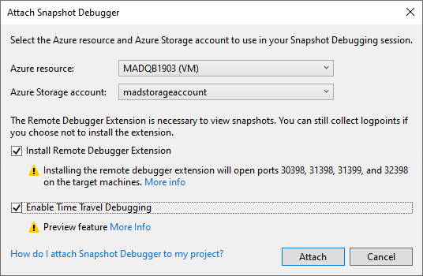
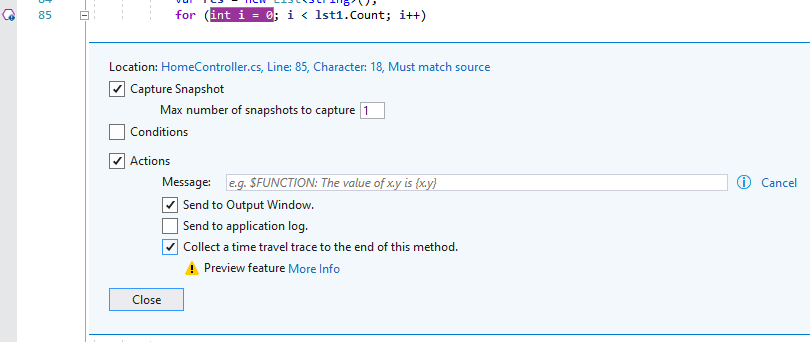
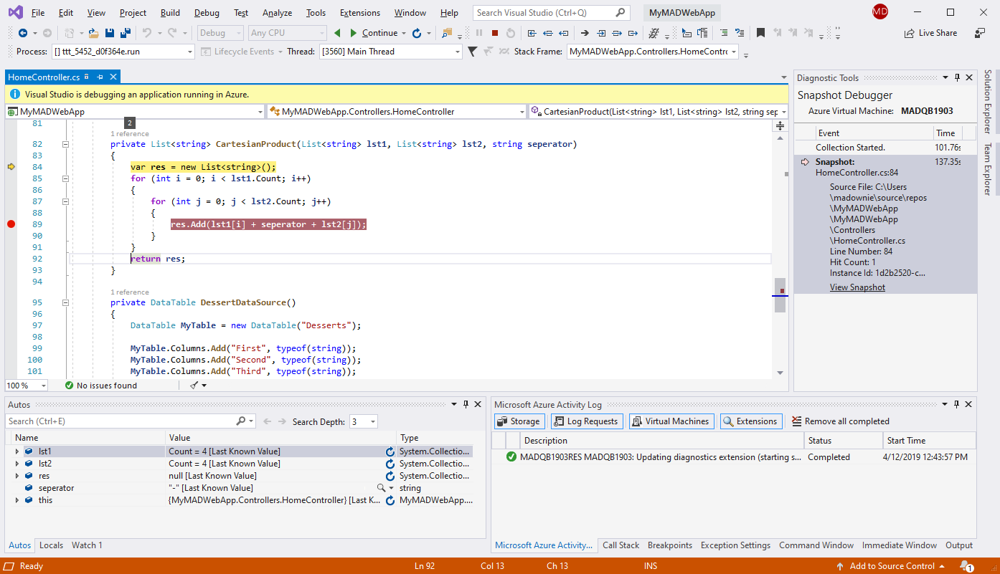

# Record and replay live ASP.NET apps on Azure virtual machines using the Snapshot Debugger

The Time Travel Debugging (TTD) preview in Visual Studio Enterprise provides the ability to record a Web app running on a Azure Virtual Machine (VM) and then accurately reconstruct and replay the execution path. TTD integrates with our Snapshot Debugger offering and allows you to rewind and replay each line of code however many times you want, helping you isolate and identify problems that might only occur in production environments.

Capturing a TTD recording will not halt the application, however, recording will add significant overhead to your running process, slowing it down based on factors that include the process size and the number of active threads.

This feature will be in preview for the release of Visual Studio 2019 with a go live license. We plan to add more TTD scenarios in future updates.

In this tutorial, you will:

> [!div class="checklist"]
> * Start the Snapshot Debugger with Time Travel Debugging enabled
> * Set a snappoint and Collect a Time Travel recording
> * Start Debugging a Time Travel recording

## Prerequisites

* Time Travel Debugging for Azure Virtual Machines (VM)  is only available for Visual Studio 2019 Enterprise or higher with the **Azure development workload**. (Under the **Individual components** tab, you find it under **Debugging and testing** > **Snapshot debugger**.)

    If it's not already installed, install [Visual Studio 2019 Enterprise](https://visualstudio.microsoft.com/vs/).

* Time Travel Debugging is available for the following Azure VM web apps:
  * ASP.NET applications (AMD64) running on .NET Framework 4.8 or later.

## Open your project and start the Snapshot Debugger with Time Travel Debugging enabled

1. Open the project that you would like to Collect a Time Travel recording.

    > [!IMPORTANT]
    > To start TTD, you need to open the *same version of source code* that is published to your Azure VM service.

1. Choose **Debug > Attach Snapshot Debugger...**. Select the Azure VM your web app is deployed to and an Azure storage account. Select the **Enable the Time Travel Debugging** preview option and then click **Attach**.

      

    > [!IMPORTANT]
    > The first time you select **Attach Snapshot Debugger** for your VM, IIS is automatically restarted.

    The metadata for the **Modules** will not initially be activated, navigate to the web app and the **Start Collection** button will become active. Visual Studio is now in snapshot debugging mode.

   

    > [!NOTE]
    > The Application Insights site extension also supports Snapshot Debugging. If you encounter a "site extension out of date" error message, see [troubleshooting tips and known issues for snapshot debugging](../debugger/debug-live-azure-apps-troubleshooting.md) for upgrading details.

   The **Modules** window shows you when all the modules have loaded for the Azure VM (choose **Debug > Windows > Modules** to open this window).

   

## Set a snappoint and Collect a Time Travel recording

1. In the code editor, click the left gutter in a method you are interested in to set a snappoint. Make sure it is code that you know will execute.

   

1. Right-click the snappoint icon (the hollow ball) and choose **Actions**. In the Snapshot Settings window click the **Action** check box. Then click the **Collect a time travel trace to the end of this method** check box.

   

1. Click **Start Collection** to turn on the snappoint.

   

## Take a snapshot

When a snappoint is turned on, it will capture a snapshot whenever the line of code where the snappoint is placed executes. This execution can be caused by a real request on your server. To force your snappoint to hit, go to the browser view of your web site and take any actions required that cause your snappoint to be hit.

## Start Debugging a Time Travel recording

1. When the snappoint is hit, a snapshot appears in the Diagnostic Tools window. To open this window, choose **Debug > Windows > Show Diagnostic Tools**.

   

1. Click the View Snapshot link to open the Time Travel recording in the code editor.
  
   You can execute every line of code recorded by the TTD by using the **Continue** and **Reverse Continue** buttons. Additionally the the Debug toolbar can be used to **Show Next Statment**, **Step Into**, **Step Over**, **Step Out**, **Step Back Into**, **Step Back Over**, **Step Back Out**.

   

   You can also use the **Locals**, **Watches**, and **Call Stack** windows, and also evaluate expressions.

   

    The website itself is still live and end users aren't impacted by any subsequent TTD activity. Only one snapshot is captured per snappoint by default: after a snapshot is captured the snappoint turns off. If you want to capture another snapshot at the snappoint, you can turn the snappoint back on by clicking **Update Collection**.

**Need help?** See the [Troubleshooting and known issues](../debugger/debug-live-azure-apps-troubleshooting.md) and [FAQ for snapshot debugging](../debugger/debug-live-azure-apps-faq.md) pages.

## Set a conditional snappoint

If it is difficult to recreate a particular state in your app, consider whether the use of a conditional snappoint can help. Conditional snappoints help you avoid collecting a Time Travel recording until the app enters a desired state, such as when a variable has a particular value that you want to inspect. [You can set conditions using expressions, filters, or hit counts](../debugger/debug-live-azure-apps-troubleshooting.md#to-create-a-conditional-snappoint).

## Next steps

In this tutorial, you've learned how to collect a Time Travel recording for Azure Virtual Machines. You may want to read more details about Snapshot Debugger.

> [!div class="nextstepaction"]
> [FAQ for snapshot debugging](../debugger/debug-live-azure-apps-faq.md)