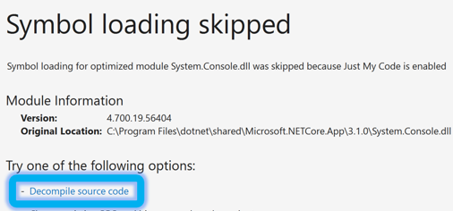
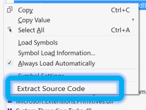
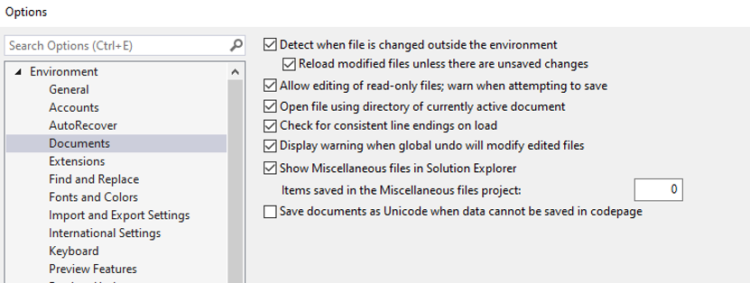

# Generating Source Code from .NET Assemblies while Debugging

> [!NOTE]
> * Source code generation (decompilation) is only available for .NET applications and is based on the open source [ILSpy](https://github.com/icsharpcode/ILSpy) project.
> * Decompilation is only available in Visual Studio 2019 16.5 and later.

## Generating Source Code

When debugging a .NET application, you may find that you want to view source code that you don't have. For example, breaking on an exception or using the call stack to navigate to a source location. When no source code is available, Visual Studio will show the **Source Not Found** document, or if you don’t have symbols for the assembly the **No Symbols Loaded** document. Both documents have a **Decompile source code** option that will generate a C# code for the current location. The generated C# code can then be used just like any other source code. You can, view the code, inspect variables,  set breakpoints and so on.

### No Symbols Loaded

### Source Not Found

## Generating and Embedding Sources for an Assembly

In addition to generating source code for a specific location, you can generate all the source code for a given .Net assembly. To do this, go to the **Modules** window and from the context menu of a .NET assembly select the **Decompile source code** command. Visual Studio will then generate a symbol file for the assembly and then embeds the source in to. In a later step, you can then [extract](#extracting-and-viewing-the-embedded-source-code) the embedded source code.

## Extracting and Viewing the Embedded Source Code

Source files that are embedded in a symbol file can be extracted from the symbol file using the **Extract Source Code** command in the context menu of the **Modules** window.

The extracted source files are added to the solution as [miscellaneous files](../ide/reference/miscellaneous-files). The Miscellaneous Files feature is off by default in Visual Studio, and needs to be enabled from the **Tools** > **Options** > **Environment** > **Documents** > **Show Miscellaneous files in Solution Explorer** checkbox. Without enabling this feature, you won't be able to open the extracted source code.

Extracted source files will then appear in the miscellaneous files in **Solution Explorer**.

## Known Limitations

### Requires Break Mode

Generating source code via decompilation is only possible when the debugger is in break mode and the application is paused. For example, Visual Studio has hit a breakpoint or an exception. You can easily trigger Visual Studio to break the next time code runs in your application by using the **Break All** command ().

### Decompilation Limitations

Generating source code from the intermediate format (IL) that is used in .NET assemblies has some inherent limitations. As such, the generated source code won't look like the original source code. Most of the differences will be in places where the information in the original source code isn't needed at runtime. For example, information such as whitespace, comments and, the names of local variables. As such, generated source is best used to understand how the program is executing and not as a replacement for the original source code.

### Debugging Optimized or Release Assemblies

When debugging code that was decompiled from an assembly that was compiled using compiler optimizations, you may come across the following issues:
1. Breakpoints may not always bind to the matching sourcing location.
1. Stepping may not always step to the correct location.
1. Local variables may not have accurate names.

More details can be found in the GitHub issue: [IChsarpCompiler.Decompiler integration into VS Debugger](https://github.com/icsharpcode/ILSpy/issues/1901).

### Extracted Sources

Source code that was extracted from an assembly has the following limitations:
1. The name and location of the generated files isn't configurable.
1. The files temporary and will be deleted by Visual Studio.
1. The files are placed in a single folder and any folder hierarchy that the original sources had isn't used.
1. The file name for each file contains a checksum hash of the file.

### Generated Code is C# Only
Decompilation will only generate source code files in C#, there is no option to generate files in any other language.