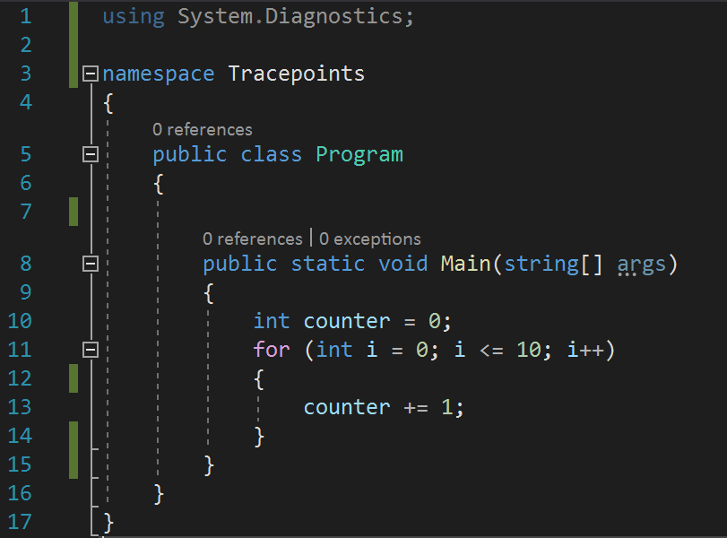
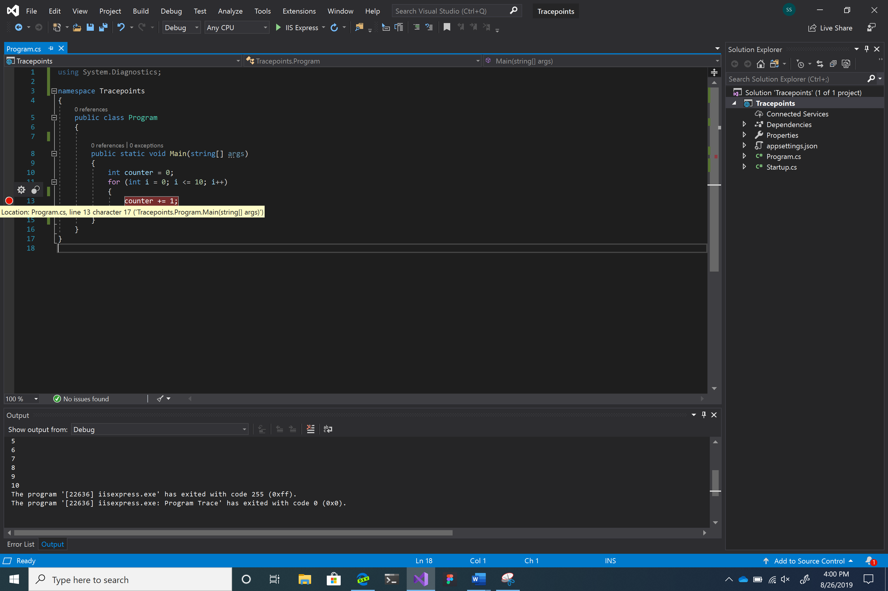
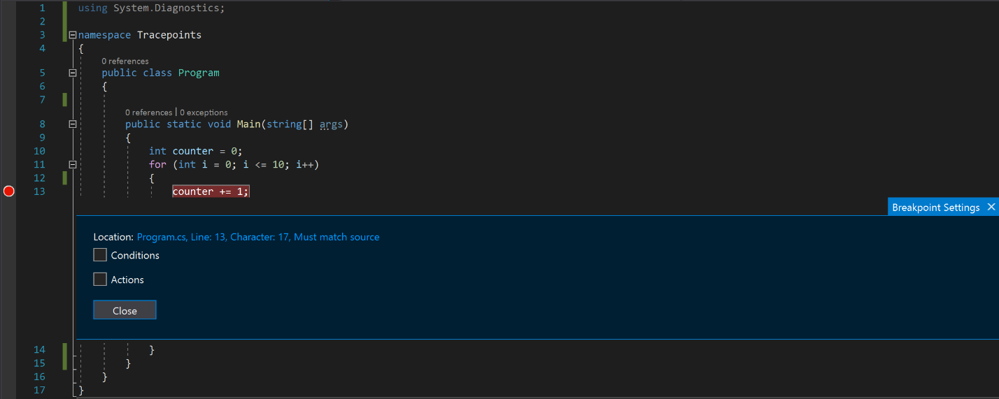
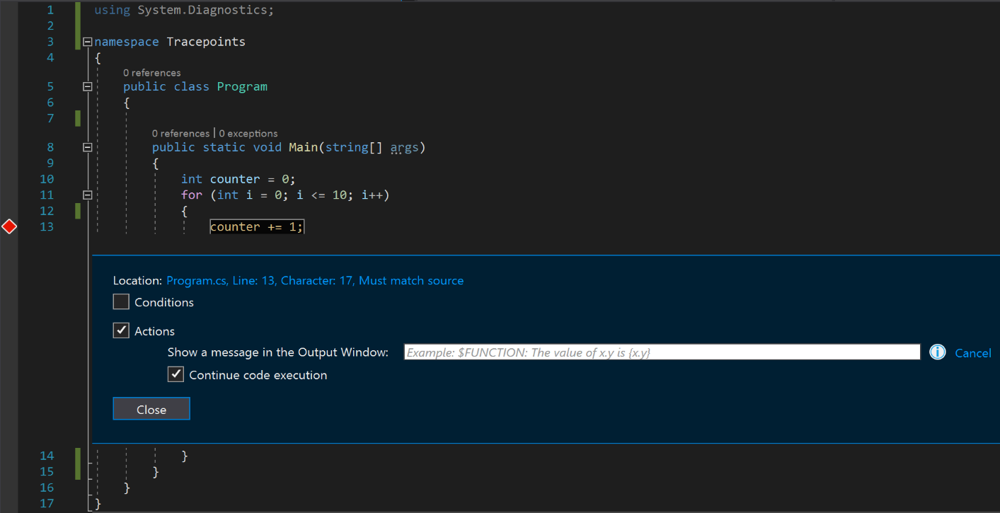
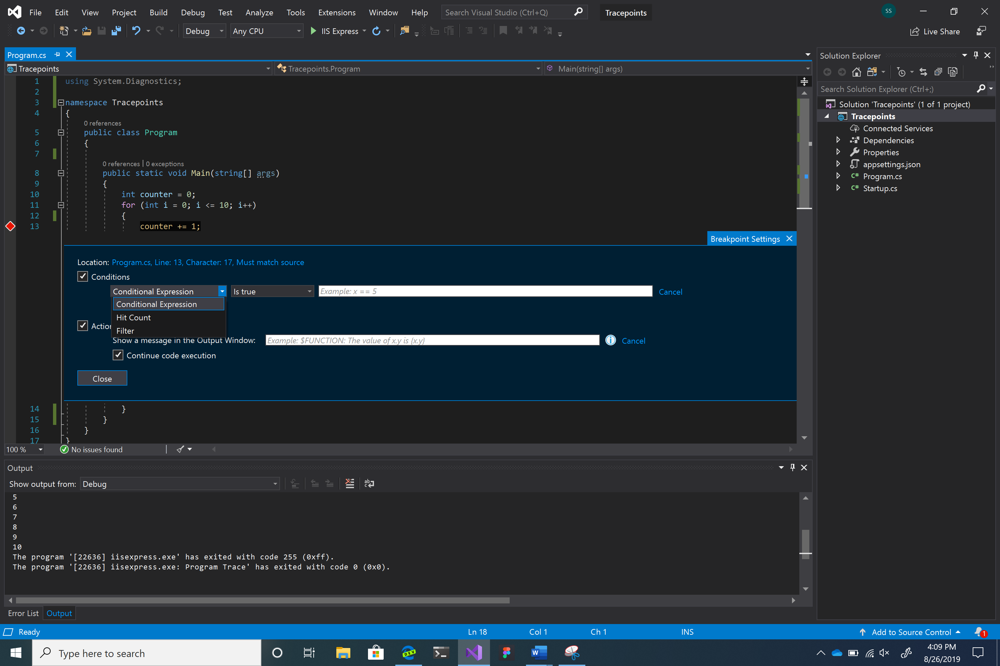
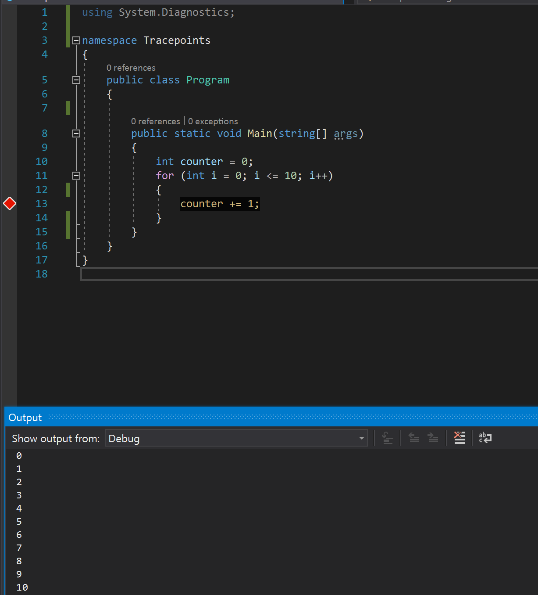

# Use tracepoints in the Visual Studio debugger

Tracepoints allow you to log information to the Output window under configurable conditions without modifying or stopping your
code. This feature is supported for both managed and native code as well as several languages such as JavaScript and C#.

## Let&#39;s take an example

The following example program is a simple `for` loop with a counter variable that increases by one every time the loop runs another iteration.

## Set tracepoints in source code

You can set tracepoints by specifying an output string under the **Action** checkbox in the **Breakpoint Settings** window.

1. To initialize a tracepoint, first click on the gutter to the left of the line number where you want to set the tracepoint.

   

2. Hover over the red circle and then click the gear icon.
3. This opens the **Breakpoint Settings** window.

   

4. Select the **Action** checkbox.

   

   Notice how the red circle changes to a diamond indicating that you have switched from a breakpoint to tracepoint.

5. Enter the message you want to log into the **Show a message in the Output Window** text box (for details, see later sections in this article).

   Your tracepoint is now set. Hit the &quot;Close&quot; button if all you want to do is log some information to the Output Window.

6. If you want to add conditions that determine whether your message is displayed, select the **Conditions** checkbox.

   

   You have three choices for conditions: **Conditional Expression**, **Filter**, and **Hit Count**.

## Actions menu

This menu allows you to log a message to the Output window. Type the strings you want to output into the message box (no quotes necessary). If you want to display values of variables, make sure you enclose it in curly braces.

For example, if you want to display the value of the `counter` variable in the output console, type {counter} in the message text box.

If you click **Close** and then debug the program (**F5**), you see the following output in the Output window.

You can also use special keywords to display more specific information. Enter the keyword exactly as shown below (use a "$" in front of each keyword and all caps for the keyword itself).

| Keyword | What is Displayed |
| --- | --- |
| $ADDRESS | Current instruction |
| $CALLER | Calling function name |
| $CALLSTACK | Call stack |
| $FUNCTION | Current function name |
| $PID | Process id |
| $PNAME | Process name |
| $TID | Thread id |
| $TNAME   | Thread name |
| $TICK | Tick count (from Windows GetTickCount) |

## Conditions menu

Conditions allow you to filter your output messages, so they display only under certain scenarios. There are three main kinds of conditions available to you.

### Conditional expression
For a conditional expression, an output message displays only when certain conditions are met.

For conditional expressions, you can either set the tracepoint to output a message when a certain condition is true or when it has changed. For example, if you only want to display the value of counter during even iterations of the `for` loop, you could select the **Is true** option and then type `i%2 == 0` in the message text box.

If you want to print the value of counter when the iteration of the `for` loop changes, select the **When changed** option and type `i` in the message text box.

The behavior of the  **When changed**  option is different for different programming languages.

- For native code, the debugger doesn't consider the first evaluation of the condition to be a change, so doesn't hit the tracepoint on the first evaluation.
- For managed code, the debugger hits the tracepoint on the first evaluation after **When changed**  is selected.

For a more comprehensive look at valid expressions you can use while setting conditions, see [Expressions in the debugger](expressions-in-the-debugger.md).

### Hit count
A hit count condition allows you to send output only after the line of code where the tracepoint is set has executed a specified number of times.

For hit count, you can choose to output a message when the line of code where the tracepoint is set has executed a number of times that is equal to, is a multiple of, or is greater than or equal to the specified hit count value. Choose the option that best suits your needs and type an integer value in the field (for example, 5) that represents that iteration of interest.

### Filter
For a filter condition, specify which devices, processes or threads output is shown for.

List of filter expressions:

- MachineName = "name"
- ProcessId = value
- ProcessName = "name"
- ThreadId = value
- ThreadName = "name"

Enclose strings (such as names) in double quotes. Values can be entered without quotes. You can combine clauses using `&` (`AND`), `||` (`OR`), `!` (`NOT`), and parentheses.

## Considerations

While tracepoints are intended to make debugging a cleaner and smoother experience, there are some considerations you should be aware of when it comes to using them.

Sometimes when you inspect a property or attribute of an object, its value can change. This is not a bug caused by the tracepoint feature itself, but it is worth mentioning that using tracepoints to inspect objects does not avoid these accidental modifications.

The way that expressions are evaluated in the **Action** message box may be different than the language you are currently using for development. For example, to output a string you do not need to wrap a message in quotes even if you normally would while using `Debug.WriteLine()` or `console.log()`. Also, the curly brace syntax (`{ }`) to output expressions may also be different than the convention for outputting values in your development language. (However, the contents within the curly braces (`{ }`) should still be written using your development language’s syntax).

If you are trying to debug a live application and looking for a similar feature, check out our logpoint feature in the Snapshot Debugger. The snapshot debugger is a tool used to investigate issues in production applications. Logpoints also allow you to send messages to the Output Window without having to modify source code and do not impact your running application. For more information, see [Debug live Azure application](../debugger/debug-live-azure-applications.md).

## See also

- [What is debugging?](../debugger/what-is-debugging.md)
- [Write better C# code using Visual Studio](../debugger/write-better-code-with-visual-studio.md)
- [First look at debugging](../debugger/debugger-feature-tour.md)
- [Expressions in the debugger](expressions-in-the-debugger.md)
- [Use breakpoints](../debugger/using-breakpoints.md)
- [Debug live Azure applications](../debugger/debug-live-azure-applications.md)
