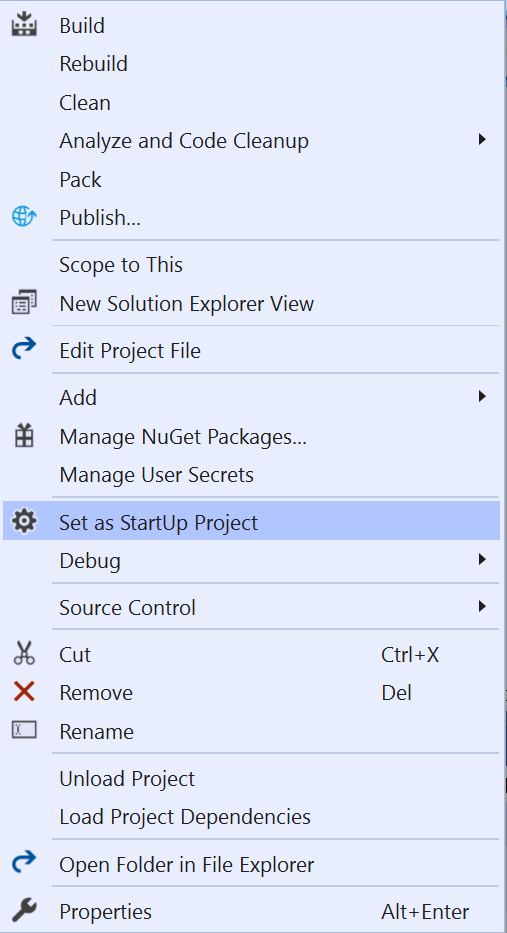
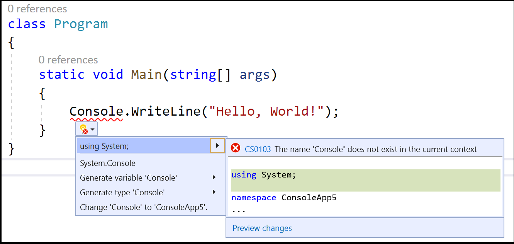
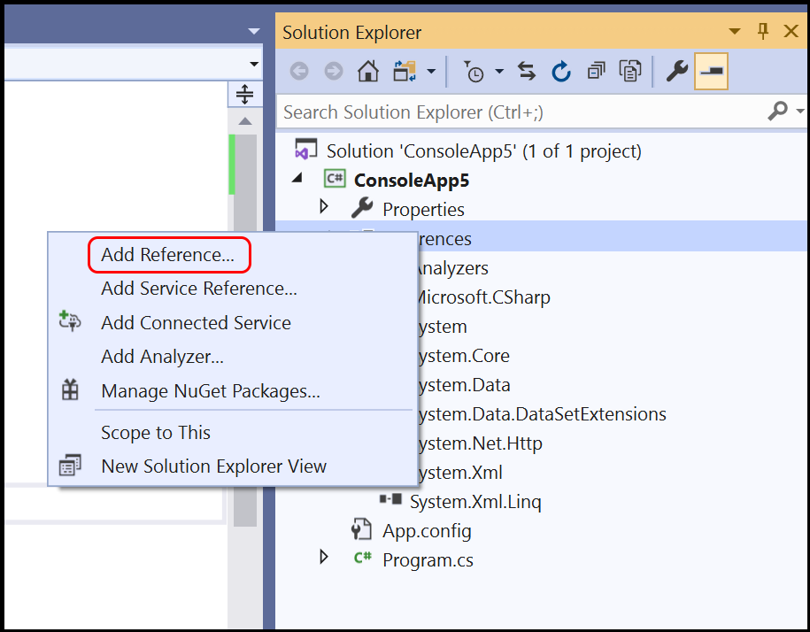
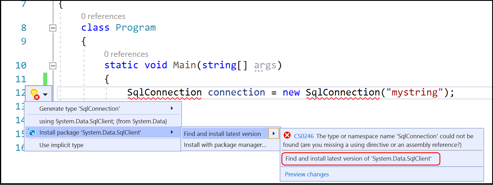

# How to: Run a C# program in Visual Studio

What you need to do to run a program depends on what you're starting from, what type of program, app, or service it is, and whether you want to run it under the debugger or not. In the simplest case, when you have a project open in Visual Studio, build and run it by pressing **Ctrl**+**F5** (**Start without debugging**) or **F5** (**Start with debugging**), or press the green arrow (**Start Button**) on the main Visual Studio toolbar.

If there are multiple ways of starting a project, choose by opening the dropdown and selecting an option. For most simple programs, the Console App project template is used, so there's usually only one option there. There could be multiple options in other cases, such as if the project is set up to run in a Docker container, or for web apps, there's a choice of web server (for example, IIS Express) and browser to use when launching. For mobile apps, you can choose from a variety of available device emulators.

## Starting from a project

If you have a C# project (.csproj file), then you can run it, if it is a runnable program. If a project contains a C# file with a `Main` method, and its output is an executable (EXE), then it is most likely will run if it builds successfully.

If you already have the code for your program in a project in Visual Studio, open the project. To open the project, double-click or tap on the .csproj from the Windows File Explorer, or from Visual Studio, choose **Open a project**, browse to find the project (.csproj) file, and choose the project file.

After the projects loads in Visual Studio, press **Ctrl**+**F5** (**Start without debugging**) or use the green **Start** button on the Visual Studio toolbar to run the program.  If there are multiple projects, the one with the `Main` method must be set as the startup project. To set the startup project, right-click on a project node, and choose **Set as startup project**.

Visual Studio attempts to build and run your project.  If there are build errors, you see the build output in the **Output** window and the errors in the **Error List** window.

If the build succeeds, the app runs in a way that's appropriate for the type of project. Console apps run in a terminal window, Windows desktop apps start in a new window, web apps start in the browser (hosted by IIS Express), and so on.

## Starting from code

If you're starting from a code listing, code file, or a small number of loose C# source code files, first make sure the code you want to run is from a trusted source and is a runnable program. If it has a `Main` method, it is likely intended as a runnable program that you can use the Console App template to create a project to work with it in Visual Studio.

### Code listing for a single file

Start Visual Studio, open an empty C# console project, select all the code in the .cs file that's in the project already, and delete it. Then, paste the contents of your code into the .cs file. When you paste the code, overwrite or delete the code that was there before. Rename the file to match the original code.

### Code listings for a few files

Start Visual Studio, open an empty C# console project, select all the code in the .cs file that's in the project already, and delete it. Then, paste the contents of the first code file into the .cs file. Rename the file to match the original code. 

For a second file, right-click on the project node in **Solution Explorer** to open the shortcut menu for the project, and choose **Add > Existing Item** (or use the key combination **Shift**+**Alt**+**A**), and select the code files.

### Multiple files on disk

1. Create a new project of the appropriate type (use C# **Console App** if you're not sure).

2. Right-click on the project node, se **Add** > **Existing Item** to select the files and import them into your project.  

### Starting from a folder

When you are working with a folder of many files, first see if there's a project or solution.  If the program was created with Visual Studio, you should find a project file or a solution file. Look for files with the .csproj extension or .sln extension and in the Windows File Explorer, double-click on one of them to open them in Visual Studio. See [Starting from a Visual Studio solution or project](#starting-from-a-project).

If you don't have a project file, such as if the code was developed in another development environment, then open the top-level folder by using the **Open folder** method in Visual Studio. See [Develop code without projects or solutions](../../ide/develop-code-in-visual-studio-without-projects-or-solutions.md).

## Starting from a GitHub or Azure DevOps repo

If the code you want to run is in GitHub or in an Azure DevOps repo, you can use Visual Studio to open the project directly from the repo. See [Open a project from a repo](../tutorial-open-project-from-repo.md).

## Run the program

Once you have all the files in the project, or an open folder, press the green arrow (**Start** button) on the main Visual Studio toolbar, or press **F5** or **Ctrl**+**F5** to run the program. When you use the **Start** button, it runs under the debugger.  Visual Studio attempts to build the code in your project and run it.  If that succeeds, great! But if not, continue reading for some ideas on how get it to build successfully.

## Troubleshooting

Your code might have errors, but it could be that it depends on some other assemblies or NuGet packages, or was writen to target a different version of .NET.

### Add references

To build properly, the code must be correct and have the right references set up to libraries or other dependencies. You can look at the red squiggly lines and at the **Error List** to see if the program has any errors, even before you compile and run it. If you are seeing errors related to unresolved names, you probably need to add a reference or a using directive, or both. If the code references any assemblies or NuGet packages, you need to add those references in the project.

Visual Studio tries to help you identify missing references. If it finds an unresolved name, it shows a light bulb icon in the editor. If you expand this, you can see some suggestions on how to fix the issue. One of the possible fixes might be to:

- add a using directive
- add a reference to an assembly
- install a NuGet package.

#### Missing using directive

For example, in the following screen, you can choose to add `using System;` to the start of the code file to resolve the unresolved name `Console`:

#### Missing assembly reference

.NET references can be in the form of assemblies or NuGet packages. Usually, if you find source code, the publisher or author will explain what assemblies are required and what packages the code depends on. To add a reference to a project manually, right-click on the **References** node in the **Solution Explorer**, choose **Add Reference**, and locate the required assembly.

You can find assemblies and add references by following the instructions in [Add or remove references by using the reference manager](../../ide/how-to-add-or-remove-references-by-using-the-reference-manager.md).

#### Missing NuGet package

If Visual Studio detects a missing NuGet package, a light bulb appears and gives you the option to install it:

If that doesn't solve the issue and Visual Studio can't locate the package, try searching for it online. See [Install and use a NuGet package in Visual Studio](/nuget/quickstart/install-and-use-a-package-in-visual-studio).

## Use the right version of .NET

If there is any information available on the version that the author or publisher of the code was using, you can change the target framework to match that. You might need to install a specific version of the .NET Framework or .NET Core, if it's not already installed. See [Modify Visual Studio](../../install/modify-visual-studio).

To change the target framework, see [Change the target framework](../../ide/visual-studio-multi-targeting-overview#change-the-target-framework.md). For more information, see [Troubleshooting .NET Framework targeting errors](../../msbuild/troubleshooting-dotnet-framework-targeting-errors.md).

## Next steps

Explore the Visual Studio development environment by reading [Welcome to the Visual Studio IDE](../visual-studio-ide.md).

## See also

[Create your first C# app](tutorial-console.md)
