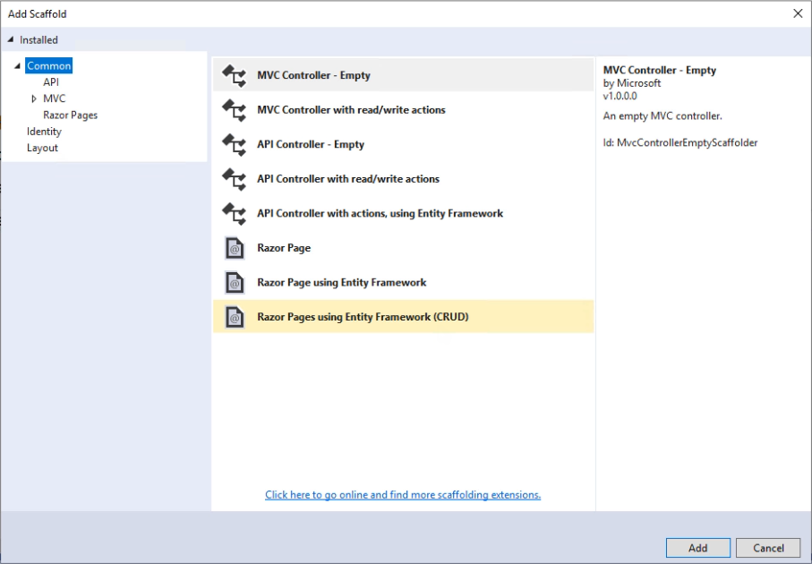
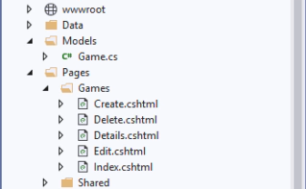

# Step 3: Work with data using Entity Framework

Follow these steps to start working with data using Entity Framework Core in your ASP.NET Core Web App.

_Watch this video and follow along to add data to your first ASP.NET Core app._

> [!VIDEO https://www.youtube.com/embed/dulJCwNrqhM]

## Open your project

If you're following along with these videos, open the Web Application project you created in the previous section. If you're starting here, you need to create a new project and choose **ASP.NET Web Application** and then **Web Application**. Leave the rest of the options as defaults.

## Add your model

The first thing you need to do to work with data in your ASP.NET Core application is to describe what the data should look like. We call that creating a *model* of the things involved in the problem we're trying to solve. In real world applications, we'll add custom business logic to these models so they can behave in certain ways and automate tasks for us. For this sample, we're going to create a simple system for tracking boardgames. We need a class that represents a game, and includes some properties that we might want to record about that game, like how many players it can support. This class will go into a new folder we'll create in the root of the web project, called *Models*.

```csharp
public class Game
{
    public int Id { get; set; }
    public string Title { get; set; }
    public int PublicationYear { get; set; }
    public int MinimumPlayers { get; set; }
    public int MaximumPlayers { get; set; }
}
```

## Create the pages to manage your game library

Now we're ready to create the pages we'll use to manage our library of games. This might sound daunting but it's actually amazingly easy. First we need to decide where in our app this functionality should live. Open the Pages folder in the web project and add a new folder there. Call it *Games*.

Now right click on Games and choose **Add** > **New Scaffolded Item**. Choose the Razor Pages using **Entity Framework (CRUD)** option. CRUD stands for "Create, Read, Update, Delete" and this template will create pages for each of these operations (including a "list all" page and a "view details of one item" page).



Select your Game model class and use the '+' icon to add a new Data context class. Name it `AppDbContext`. Leave the rest as defaults and click **Add**.

You will see the following Razor Pages added to your Games folder:

- Create.cshtml
- Delete.cshtml
- Details.cshtml
- Edit.cshtml
- Index.cshtml



In addition to adding pages in the *Games* folder, the scaffolding operation added code to my *Startup.cs* class. Looking in the `ConfigureServices` method in this class you will see this code has been added:

```csharp
services.AddDbContext<AppDbContext>(options =>
    options.UseSqlServer(Configuration.GetConnectionString("AppDbContext")));
```

You'll also find the `AppDbContext` connection string has been added to the project's *appsettings.json* file.

If you run the app now, it may fail because no database has been created, yet. You can configure the app to automatically create the database if needed by [adding some code to Program.cs](/aspnet/core/data/ef-rp/intro?view=aspnetcore-2.1&tabs=visual-studio#update-main):

```csharp
public static void Main(string[] args)
{
    var host = CreateWebHostBuilder(args).Build();

    using (var scope = host.Services.CreateScope())
    {
        var services = scope.ServiceProvider;

        try
        {
            var context = services.GetRequiredService<SchoolContext>();
            context.Database.EnsureCreated();
        }
        catch (Exception ex)
        {
            var logger = services.GetRequiredService<ILogger<Program>>();
            logger.LogError(ex, "An error occurred creating the DB.");
        }
    }

    host.Run();
}
```

Most of the code is just for error handling and to provide access to the EF Core `AppDbContext` before the app is running. The important line is the one that says `context.Database.EnsureCreated()`, which will create the database if it doesn't already exist. Now the app is ready to run.

## Test it out

Run the application and navigate to `/Games` in the address bar. You will see an empty list page. Click **Create New** to add a new `Game` to the collection. Fill in the form and click **Create**. You should see it in the list view. Click on **Details** to see the details of a single record.

Add another record. You can click *Edit* to change the details of a record, or **Delete** to remove it, which will prompt you to confirm before it actually deletes the record.


That's all it took to start working with data in an ASP.NET Core app using EF Core and Visual Studio 2019.

## Next steps

In the next video, you'll learn how to add web API support to your app.

[Step 4: Exposing a Web API From Your ASP.NET Core App](tutorial-aspnet-core-ef-step-04.md)

## See also

- [Razor Pages with Entity Framework Core in ASP.NET Core](https://docs.microsoft.com/en-us/aspnet/core/data/ef-rp/intro?view=aspnetcore-2.1&tabs=visual-studio)
- [ASP.NET Core Razor Pages with EF Core](https://docs.microsoft.com/en-us/aspnet/core/data/?view=aspnetcore-2.1)
