# Tutorial: Get started with C# and ASP.NET Core in Visual Studio

In this tutorial for C# development with ASP.NET Core using Visual Studio, you'll create a C# ASP.NET Core web app, make changes to it, explore some features of the IDE, and then run the app.

## Before you begin

### Install Visual Studio

::: moniker range="vs-2017"

If you haven't already installed Visual Studio, go to the [Visual Studio downloads](https://visualstudio.microsoft.com/vs/older-downloads/?utm_medium=microsoft&utm_source=docs.microsoft.com&utm_campaign=vs+2017+download) page to install it for free.

::: moniker-end

::: moniker range="vs-2019"

If you haven't already installed Visual Studio, go to the [Visual Studio downloads](https://visualstudio.microsoft.com/downloads) page to install it for free.

::: moniker-end

### Update Visual Studio

If you've already installed Visual Studio, make sure that you're running the most recent release. For more information about how to update your installation, see the [Update Visual Studio to the most recent release](../../install/update-visual-studio.md) page.

### Choose your theme (optional)

This tutorial includes screenshots that use the dark theme. If you aren't using the dark theme but would like to, see the [Personalize the Visual Studio IDE and Editor](../../ide/quickstart-personalize-the-ide.md) page to learn how.

## Create a project

First, you'll create a ASP.NET Core project. The project type comes with all the template files you'll need for a fully functional website, before you've even added anything!

::: moniker range="vs-2017"

1. Open Visual Studio 2017.

2. From the top menu bar, choose **File** > **New** > **Project**.

3. In the **New Project** dialog box in the left pane, expand **Visual C#**, expand **Web**, and then choose **.NET Core**. In the middle pane, choose **ASP.NET Core Web Application**. Then, name the file *MyCoreApp* and choose **OK**.

   

### Add a workload (optional)

If you don't see the **ASP.NET Core Web Application** project template, you can get it by adding the **ASP.NET and web development** workload. You can add this workload in one of the two following ways, depending on which Visual Studio 2017 updates are installed on your machine.

#### Option 1: Use the New Project dialog box

1. Select the **Open Visual Studio Installer** link in the left pane of the **New Project** dialog box. (Depending on your display settings, you might have to scroll to see it.)

   

1. The Visual Studio Installer launches. Choose the **ASP.NET and web development** workload, and then choose **Modify**.

   

   (You might have to close Visual Studio before you can continue installing the new workload.)

#### Option 2: Use the Tools menu bar

1. Cancel out of the **New Project** dialog box. Then, from the top menu bar, choose **Tools** > **Get Tools and Features**.

1. The Visual Studio Installer launches. Choose the **ASP.NET and web development** workload, and then choose **Modify**.

   (You might have to close Visual Studio before you can continue installing the new workload.)

### Add a project template

1. In the **New ASP.NET Core Web Application** dialog box, choose the **Web Application** project template.

1. Verify that **ASP.NET Core 2.1** appears in the top drop-down menu. Then, choose **OK**.

   

   > [!NOTE]
   > If you don't see **ASP.NET Core 2.1** from the top drop-down menu, make sure that you are running the most recent release of Visual Studio. For more information about how to update your installation, see the [Update Visual Studio to the most recent release](../../install/update-visual-studio.md) page.

::: moniker-end

::: moniker range="vs-2019"

1. On the start window, choose **Create a new project**.

   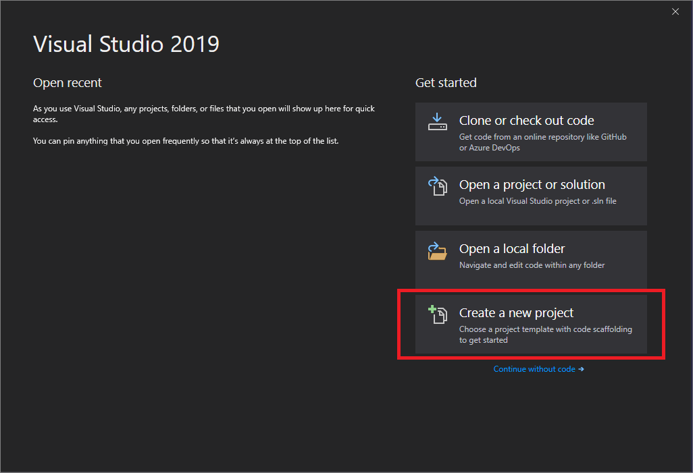

1. On the **Create a new project** window, enter or type *ASP.NET* in the search box. Next, choose **C#** from the Language list, and then choose **Windows** from the Platform list.

   After you apply the language and platform filters, choose the **ASP.NET Core Web Application** template, and then choose **Next**.

   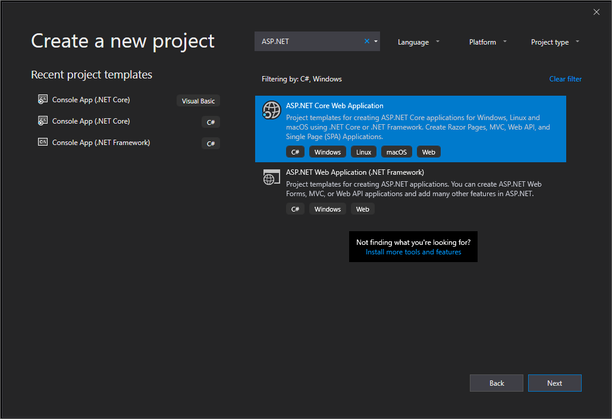

   > [!NOTE]
   > If you don't see the **ASP.NET Core Web Application** template, you can install it from the **Create a new project** window. In the **Not finding what you're looking for?** message, choose the **Install more tools and features** link.
   >
   > 
   >
   > Then, in the Visual Studio Installer, choose the **ASP.NET and web development** workload.
   >
   > 
   >
   > After that, choose the **Modify** button in the Visual Studio Installer. If you're prompted to save your work, do so. Next, choose **Continue** to install the workload. Then, return to step 2 in this "[Create a project](#create-a-project)" procedure.

1. In the **Configure your new project** window, type or enter *MyCoreApp* in the **Project name** box. Then, choose **Create**.

   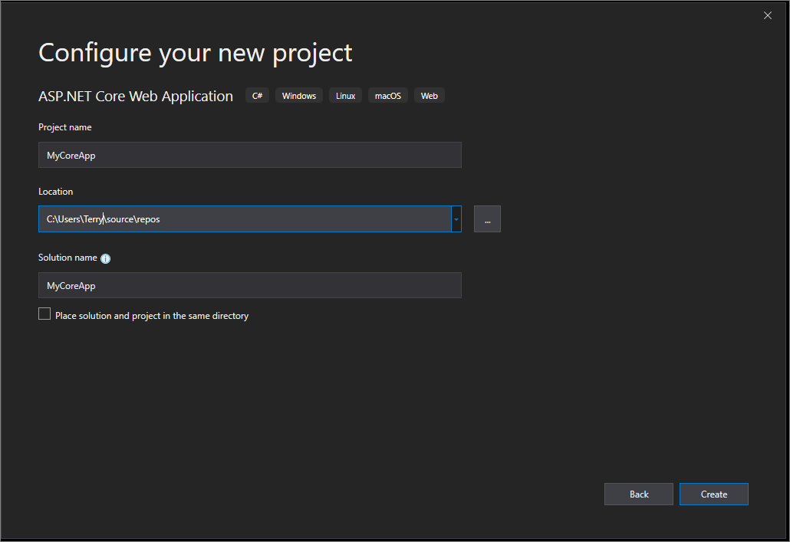

1. In the **Create a new ASP.NET Core Web Application** window, verify that **ASP.NET Core 3.0** appears in the top drop-down menu. Then, choose **Web Application**, which includes example Razor Pages. Next, choose  **Create**.

   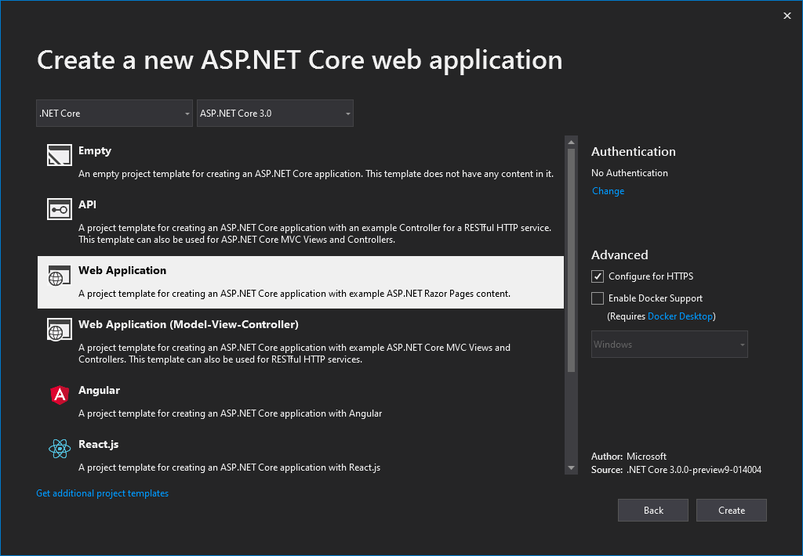

   Visual Studio opens your new project.

::: moniker-end

### About your solution

This solution follows the **Razor Page** design pattern. It's different than the [Model-View-Controller (MVC)](/aspnet/core/tutorials/first-mvc-app/start-mvc?view=aspnetcore-2.1&preserve-view=true&tabs=aspnetcore2x) design pattern in that it's streamlined to include the model and controller code within the Razor Page itself.

::: moniker range="vs-2017"
## Tour your solution

 1. The project template creates a solution with a single ASP.NET Core project that is named _MyCoreApp_. Choose the **Solution Explorer** tab to view its contents.

    

 1. Expand the **Pages** folder, and then expand *About.cshtml*.

     

 1. View the **About.cshtml** file in the code editor.

     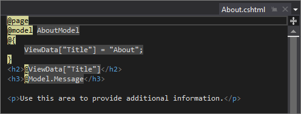

 1. Choose the **About.cshtml.cs** file.

     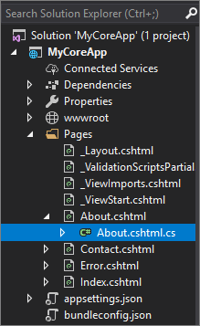

 1. View the **About.cshtml.cs** file in the code editor.

     

 1. The project contains a **wwwroot** folder that is the root for your website. Expand the folder to view its contents.

     

    You can put static site content&mdash;such as CSS, images, and JavaScript libraries&mdash;directly in the paths where you want them.

 1. The project also contains configuration files that manage the web app at run time. The default application [configuration](/aspnet/core/fundamentals/configuration) is stored in *appsettings.json*. However, you can override these settings by using *appsettings.Development.json*. Expand the **appsettings.json** file to view the **appsettings.Development.json** file.

     

## Run, debug, and make changes

1. Choose the **IIS Express** button in the IDE to build and run the app in Debug mode. (Alternatively, press **F5**, or choose **Debug** > **Start Debugging** from the menu bar.)

     

     > [!NOTE]
     > If you get an error message that says **Unable to connect to web server 'IIS Express'**, close Visual Studio and then open it by using the **Run as administrator** option from the right-click or context menu. Then, run the application again.
     >
     > You might also get a message that asks if you want to accept an IIS SSL Express certificate. To view the code in a web browser, choose **Yes**, and then choose **Yes** if you receive a follow-up security warning message.

1. Visual Studio launches a browser window. You should then see **Home**, **About**, and **Contact** pages in the menu bar. (If you don't, choose the "hamburger" menu item to view them.)

    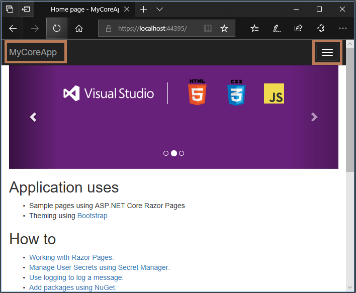

1. Choose **About** from the menu bar.

   

   Among other things, the **About** page in the browser renders the text that is set in the *About.cshtml* file.

   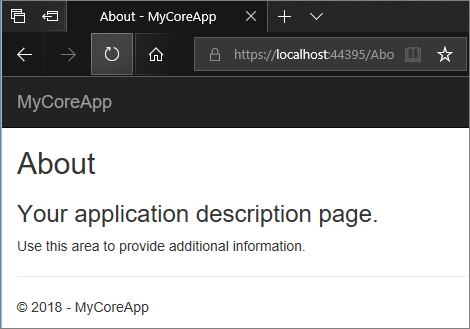

1. Return to Visual Studio, and then press **Shift+F5** to stop Debug mode. This also closes the project in the browser window.

1. In Visual Studio, choose **About.cshtml**. Then, delete the word _additional_ and in its place, add the words _file and directory_.

    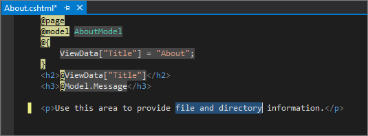

1. Choose **About.cshtml.cs**. Then, clean up the `using` directives at the top of the file by using the following shortcut:

   Choose any of the grayed-out `using` directives and a [Quick Actions](../../ide/quick-actions.md) light bulb will appear just below the caret or in the left margin. Choose the light bulb, and then choose **Remove Unnecessary Usings**.

   

     Visual Studio deletes the unnecessary `using` directives from the file.

1. Next, in the `OnGet()` method, change the body to the following code:

     ```csharp
     public void OnGet()
     {
         string directory = Environment.CurrentDirectory;
         Message = String.Format("Your directory is {0}.", directory);
     }
    ```

1. Notice that two wavy underlines appear under **Environment** and **String**. The wavy underlines appear because these types aren't in scope.

   

    Open the **Error List** toolbar to see the same errors listed there. (If you don't see the **Error List** toolbar, choose **View** > **Error List** from the top menu bar.)

   

1. Let's fix this. In the code editor, place your cursor on either line that contains the error, and then choose the Quick Actions light bulb in the left margin. Then, from the drop-down menu, choose **using System;** to add this directive to the top of your file and resolve the errors.

   

1. Press **Ctrl**+**S** to save your changes, and then press **F5** to open your project in the web browser.

1. At the top of the web site, choose **About** to view your changes.

   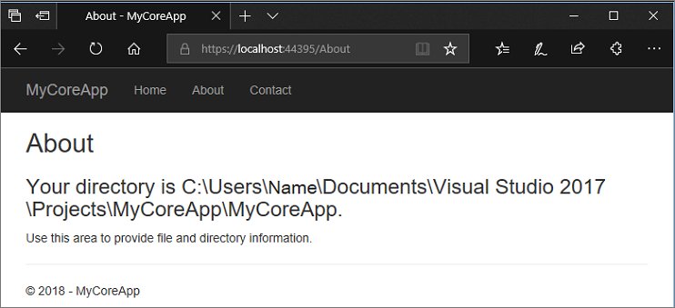

1. Close the web browser, press **Shift**+**F5** to stop Debug mode, and then close Visual Studio.

::: moniker-end

::: moniker range=">=vs-2019"

## Tour your solution

 1. The project template creates a solution with a single ASP.NET Core project that is named _MyCoreApp_. Choose the **Solution Explorer** tab to view its contents.

    

 1. Expand the **Pages** folder.

     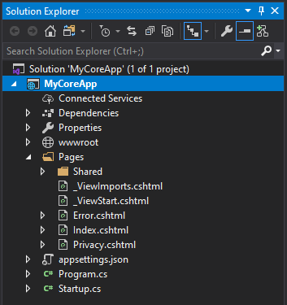

 1. View the **Index.cshtml** file in the code editor.

     

 1. Each .cshtml file has an associated code file. To open the code file in the editor, expand the **Index.cshtml** node in Solution Explorer, and choose the **Index.cshtml.cs** file.

     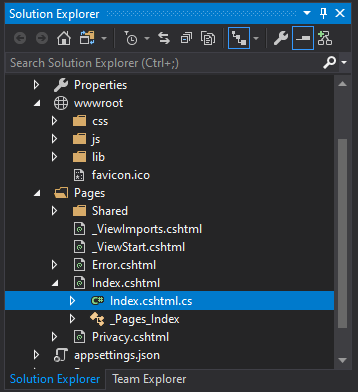

 1. View the **Index.cshtml.cs** file in the code editor.

     

 1. The project contains a **wwwroot** folder that is the root for your website. Expand the folder to view its contents.

     

    You can put static site content&mdash;such as CSS, images, and JavaScript libraries&mdash;directly in the paths where you want them.

 1. The project also contains configuration files that manage the web app at run time. The default application [configuration](/aspnet/core/fundamentals/configuration) is stored in *appsettings.json*. However, you can override these settings by using *appsettings.Development.json*. Expand the **appsettings.json** file to view the **appsettings.Development.json** file.

     

## Run, debug, and make changes

1. Choose the **IIS Express** button in the IDE to build and run the app in Debug mode. (Alternatively, press **F5**, or choose **Debug** > **Start Debugging** from the menu bar.)

     

     > [!NOTE]
     > If you get an error message that says **Unable to connect to web server 'IIS Express'**, close Visual Studio and then open it by using the **Run as administrator** option from the right-click or context menu. Then, run the application again.
     >
     > You might also get a message that asks if you want to accept an IIS SSL Express certificate. To view the code in a web browser, choose **Yes**, and then choose **Yes** if you receive a follow-up security warning message.

1. Visual Studio launches a browser window. You should then see **Home**, and **Privacy** pages in the menu bar.

1. Choose **Privacy** from the menu bar.

   The **Privacy** page in the browser renders the text that is set in the *Privacy.cshtml* file.

   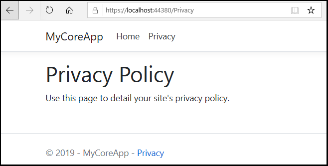

1. Return to Visual Studio, and then press **Shift+F5** to stop Debug mode. This also closes the project in the browser window.

1. In Visual Studio, open **Privacy.cshtml** for editing. Then, delete the words _Use this page to detail your site's privacy policy_ and in its place, add the words _This page is under construction as of @ViewData["TimeStamp"]_.

    

1. Now, let's make a code change. Choose **Privacy.cshtml.cs**. Then, clean up the `using` directives at the top of the file by using the following shortcut:

   Choose any of the grayed-out `using` directives and a [Quick Actions](../../ide/quick-actions.md) light bulb will appear just below the caret or in the left margin. Choose the light bulb, and then hover over **Remove unnecessary usings**.

   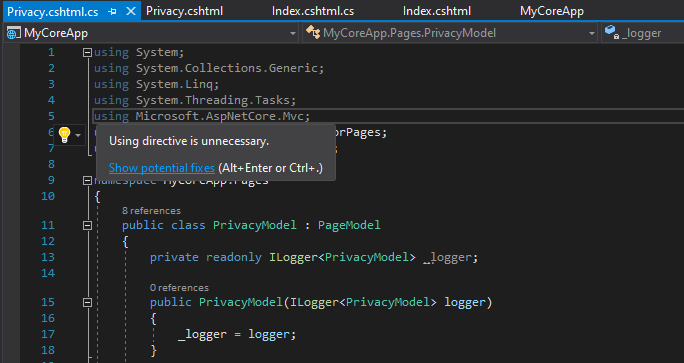

   Now choose **Preview changes** to see what will change.

   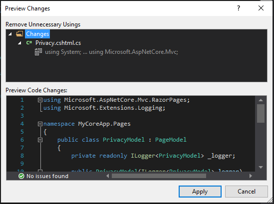

   Choose **Apply**. Visual Studio deletes the unnecessary `using` directives from the file.

1. Next, in the `OnGet()` method, change the body to the following code:

     ```csharp
     public void OnGet()
     {
        string dateTime = DateTime.Now.ToShortDateString();
        ViewData["TimeStamp"] = dateTime;
     }
    ```

1. Notice that two wavy underlines appear under **DateTime**. The wavy underlines appear because these type isn't in scope.

   

    Open the **Error List** toolbar to see the same errors listed there. (If you don't see the **Error List** toolbar, choose **View** > **Error List** from the top menu bar.)

   

1. Let's fix this. In the code editor, place your cursor on either line that contains the error, and then choose the Quick Actions light bulb in the left margin. Then, from the drop-down menu, choose **using System;** to add this directive to the top of your file and resolve the errors.

   

1. Press **F5** to open your project in the web browser.

1. At the top of the web site, choose **Privacy** to view your changes.

   

1. Close the web browser, press **Shift**+**F5** to stop Debug mode, and then close Visual Studio.
::: moniker-end

## Quick answers FAQ

Here's a quick FAQ to highlight some key concepts.

### What is C#?

[C#](/dotnet/csharp/getting-started/introduction-to-the-csharp-language-and-the-net-framework) is a type-safe and object-oriented programming language that's designed to be both robust and easy to learn.

### What is ASP.NET Core?

ASP.NET Core is an open-source and cross-platform framework for building internet-connected applications, such as web apps and services. ASP.NET Core apps can run on either .NET Core or the .NET Framework. You can develop and run your ASP.NET Core apps cross-platform on Windows, Mac, and Linux. ASP.NET Core is open source at [GitHub](https://github.com/aspnet/home).

### What is Visual Studio?

Visual Studio is an integrated development suite of productivity tools for developers. Think of it as a program you can use to create programs and applications.

## Next steps

Congratulations on completing this tutorial! We hope you learned a little bit about C#, ASP.NET Core, and the Visual Studio IDE. To learn more about creating a web app or website with C# and ASP.NET, continue with the following tutorials:

> [!div class="nextstepaction"]
> [Create a Razor Pages web app with ASP.NET Core](/aspnet/core/tutorials/razor-pages/?view=aspnetcore-2.1&preserve-view=true)

## See also

[Publish your web app to Azure App Service by using Visual Studio](../../deployment/quickstart-deploy-to-azure.md)
