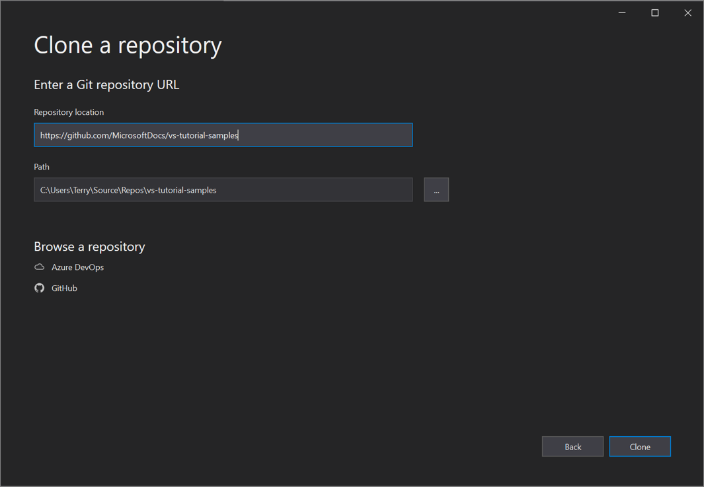
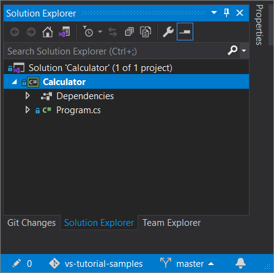
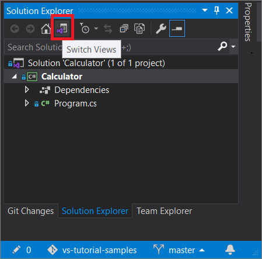
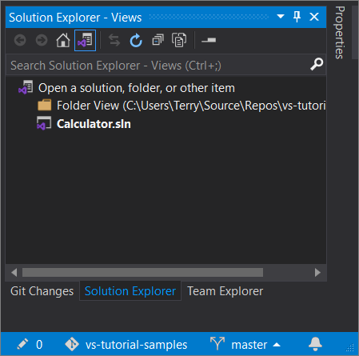
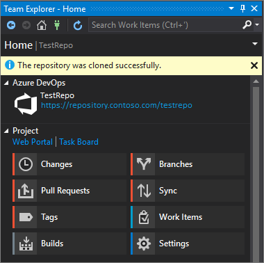
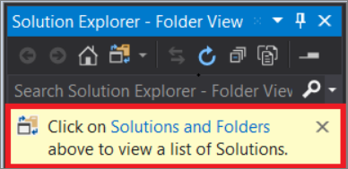

# Tutorial: Open a project from a repo

In this tutorial, you'll use Visual Studio to connect to a repository for the first time and then open a project from it.

If you haven't already installed Visual Studio, go to the [Visual Studio downloads](https://visualstudio.microsoft.com/downloads) page to install it for free.

## Open a project from a GitHub repo

How you open a project from a GitHub repo by using Visual Studio 2019 depends on what version you have. Specifically, if you've installed version [**version 16.8**](/visualstudio/releases/2019/release-notes/) or later, there's a new, more fully integrated [Git experience in Visual Studio](../ide/git-with-visual-studio.md) available to you.

But no matter which version you have installed, you can always open a project from a GitHub repo with Visual Studio.

#### [16.8 and later](#tab/vs168)

#### Clone a GitHub repo and then open a project

If you haven't yet cloned a repo where your project is located, you can do so by using the following procedure.

1. Open Visual Studio 2019.

1. On the start window, select **Clone a repository**.

   

1. Enter or type the repository location, and then select **Clone**.

   

1. You might be asked for your user sign-in information in the **Git User Information** dialog box.

   

    You can either add your information or edit the default information it provides. Then, select **Save** to add the info to your global .gitconfig file. (You can also choose to do this later by selecting **Cancel**.)

1. Next, Visual Studio opens the project from the repo.

   

1. If you have a solution file available, you can view it specifically by selecting the **Switch Views** button in Solution Explorer.

   

   The Solution Explorer in Visual Studio switches to the solution view.

   

#### Open a project locally from a previously cloned GitHub repo

If you've already cloned the GitHub repo where your project is located, here's how to open it:

1. Step One

1. Step Two

1. Etc.

#### [16.7 and earlier](#tab/vs167-)

#### Clone a GitHub repo and then open a project

If you haven't yet cloned a repo where your project is located, you can do so by using the following procedure.

1. Open Visual Studio 2019.

1. On the start window, select **Clone or check out code**.

   

1. Enter or type the repository location, and then select **Clone**.

   

   Visual Studio opens the project from the repo.

1. If you have a solution file available, it will appear in the "Solutions and Folders" fly-out menu. Choose it, and Visual Studio opens your solution.

   

   If you do not have a solution file (specifically, an .sln file) in your repo, the fly-out menu will say "No Solutions Found." However, you can double-click any file from the folder menu to open it in the Visual Studio code editor.

---

## Open a project from an Azure DevOps repo

The user interface (UI) that you see when you open an Azure DevOps project by using Visual Studio 2019 depends on what version you have. Specifically, if you've installed version [**version 16.8**](/visualstudio/releases/2019/release-notes/) or later, we've changed the UI to accommodate a new, more fully integrated [Git experience in Visual Studio](../ide/git-with-visual-studio.md) in Visual Studio.

But no matter which version you have installed, you can always open a project from an Azure DevOps repo with Visual Studio.

#### [16.8 and later](#tab/vs168)

You can either clone an Azure DevOps repo and open a project, or open a project locally from a previously cloned repo. Here's how.

#### Clone an Azure DevOps repo and then open a project

1. Open Visual Studio 2019.

1. On the start window, select **Clone a repository**.

#### Open a project locally from a previously cloned Azure DevOps repo

1. Open Visual Studio 2019.

1. On the start window, select **Open a Project or Solution**.

#### [16.7 and earlier](#tab/vs167-)

1. Open Visual Studio 2019.

1. On the start window, select **Clone or check out code**.

   

1. In the **Browse a repository** section, select **Azure DevOps**.

   

   If you see a sign-in window, sign in to your account.

1. In the **Connect to a Project** dialog box, choose the repo that you want to connect to, and then select **Clone**.

      

    > [!NOTE]
    > What you see in the list box depends on the Azure DevOps repositories that you have access to.

   Visual Studio opens **Team Explorer** and a notification appears when the clone is complete.

     

1. To view your folders and files, select the **Show Folder View** link.

     

     Visual Studio opens **Solution Explorer**.

1. Choose the **Solutions and Folders** link to search for a solution file  (specifically, a .sln file) to open.

      

   If you do not have a solution file in your repo, a "No Solutions Found" message appears. However, you can double-click any file from the folder menu to open it in the Visual Studio code editor.

---

## Next steps

If you're ready to code with Visual Studio, dive into any of the following language-specific tutorials:

- [Visual Studio tutorials | **C#**](./csharp/index.yml)
- [Visual Studio tutorials | **Visual Basic**](./visual-basic/index.yml)
- [Visual Studio tutorials | **C++**](/cpp/get-started/tutorial-console-cpp)
- [Visual Studio tutorials | **Python**](../python/index.yml)
- [Visual Studio tutorials | **JavaScript**, **TypeScript**, and **Node.js**](../javascript/index.yml)

## See also

- [New Git experience in Visual Studio](../ide/git-with-visual-studio.md)
- [Azure DevOps Services: Get started with Azure Repos and Visual Studio](/azure/devops/repos/git/gitquickstart/)
- [Microsoft Learn: Get started with Azure DevOps](/learn/modules/get-started-with-devops/)