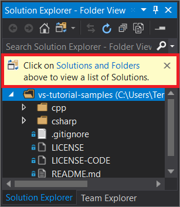
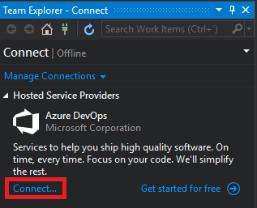
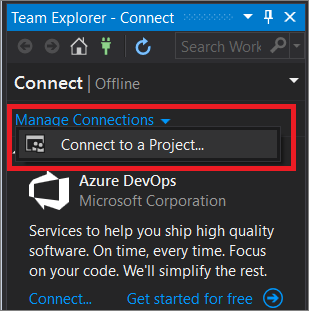

# Tutorial: Open a project from a repo

In this tutorial, you'll use Visual Studio to connect to a repository for the first time and then open a project from it.

::: moniker range="vs-2017"

If you haven't already installed Visual Studio, go to the [Visual Studio downloads](https://visualstudio.microsoft.com/vs/older-downloads/?utm_medium=microsoft&utm_source=docs.microsoft.com&utm_campaign=vs+2017+download) page to install it for free.

::: moniker-end

::: moniker range="vs-2019"

If you haven't already installed Visual Studio, go to the [Visual Studio downloads](https://visualstudio.microsoft.com/downloads) page to install it for free.

::: moniker-end

## Open a project from a GitHub repo

::: moniker range="vs-2017"

1. Open Visual Studio 2017.

1. From the top menu bar, choose **File** > **Open** > **Open from Source Control**.

   The **Team Explorer - Connect** pane opens.

    

1. In the **Local Git Repositories** section, choose **Clone**.

    

1. In the box that says ***Enter the URL of a Git repo to clone***, type or paste the URL for your repo, and then press **Enter**. (You might receive a prompt to sign in to GitHub; if so, do so.)

   After Visual Studio clones your repo, Team Explorer closes and Solution Explorer opens. A message appears that says *Click on Solutions and Folders above to view a list of Solutions*. Choose **Solutions and Folders**.

   

1. If you have a solution file available, it will appear in the "Solutions and Folders" fly-out menu. Choose it, and Visual Studio opens your solution.

   

   If you do not have a solution file (specifically, a .sln file) in your repo, the fly-out menu will say "No Solutions Found." However, you can double-click any file from the folder menu to open it in the Visual Studio code editor.

### Review your work

View the following animation to check the work that you completed in the previous section.

   

::: moniker-end

::: moniker range="vs-2019"

How you use Visual Studio 2019 to open a project from a GitHub repo depends on what version you use. Specifically, if you've installed version [**version 16.8**](/visualstudio/releases/2019/release-notes/) or later, there's a new [Git experience in Visual Studio](../ide/git-with-visual-studio.md) available that's more fully integrated than before.

But no matter which version you have installed, you can always open a project from a GitHub repo by using Visual Studio.

### In Visual Studio 2019 version 16.8 or later

1. Open Visual Studio 2019.

1. On the start window, choose **Clone a repository**.

   

1. Enter or type the repository location, and then choose **Clone**.

   <!--   -->

   Visual Studio opens the project from the repo.

<!-- 1. If you have a solution file available, it will appear in the "Solutions and Folders" fly-out menu. Choose it, and Visual Studio opens your solution.

   

   If you do not have a solution file (specifically, a .sln file) in your repo, the fly-out menu will say "No Solutions Found." However, you can double-click any file from the folder menu to open it in the Visual Studio code editor.-->

### In Visual Studio 2019 version 16.7 or earlier

1. Open Visual Studio 2019.

1. On the start window, choose **Clone or check out code**.

   

1. Enter or type the repository location, and then choose **Clone**.

   

   Visual Studio opens the project from the repo.

1. If you have a solution file available, it will appear in the "Solutions and Folders" fly-out menu. Choose it, and Visual Studio opens your solution.

   

   If you do not have a solution file (specifically, a .sln file) in your repo, the fly-out menu will say "No Solutions Found." However, you can double-click any file from the folder menu to open it in the Visual Studio code editor.

::: moniker-end

## Open a project from an Azure DevOps repo

::: moniker range="vs-2017"

1. Open Visual Studio 2017.

1. From the top menu bar, choose **File** > **Open** > **Open from Source Control**.

   The **Team Explorer - Connect** pane opens.

    

1. Here are two ways to connect to your Azure DevOps repo:

      - In the **Hosted Service Providers** section, choose **Connect...**.

        

      - In the **Manage Connections** drop-down list, choose **Connect to a Project...**.

        

1. In the **Connect to a Project** dialog box, choose the repo that you want to connect to, and then choose **Clone**.

      

    > [!NOTE]
    > What you see in the list box depends on the Azure DevOps repositories that you have access to.

1. After Visual Studio clones your repo, Team Explorer closes and Solution Explorer opens. A message appears that says *Click on Solutions and Folders above to view a list of Solutions*. Choose **Solutions and Folders**.

      

   A solution file (specifically, a .sln file), will appear in the "Solutions and Folders" fly-out menu. Choose it, and Visual Studio opens your solution.

   If you do not have a solution file in your repo, the fly-out menu will say "No Solutions Found". However, you can double-click any file from the folder menu to open it in the Visual Studio code editor.

::: moniker-end

::: moniker range="vs-2019"

1. Open Visual Studio 2019.

1. On the start window, choose **Clone or check out code**.

   

1. In the **Browse a repository** section, choose **Azure DevOps**.

   

   If you see a sign-in window, sign in to your account.

1. In the **Connect to a Project** dialog box, choose the repo that you want to connect to, and then choose **Clone**.

      

    > [!NOTE]
    > What you see in the list box depends on the Azure DevOps repositories that you have access to.

   Visual Studio opens **Team Explorer** and a notification appears when the clone is complete.

     

1. To view your folders and files, choose the **Show Folder View** link.

     

     Visual Studio opens **Solution Explorer**.

1. Choose the **Solutions and Folders** link to search for a solution file  (specifically, a .sln file) to open.

      

   If you do not have a solution file in your repo, a "No Solutions Found" message appears. However, you can double-click any file from the folder menu to open it in the Visual Studio code editor.

::: moniker-end

## Next steps

If you're ready to code with Visual Studio, dive into any of the following language-specific tutorials:

- [Visual Studio tutorials | **C#**](./csharp/index.yml)
- [Visual Studio tutorials | **Visual Basic**](./visual-basic/index.yml)
- [Visual Studio tutorials | **C++**](/cpp/get-started/tutorial-console-cpp)
- [Visual Studio tutorials | **Python**](../python/index.yml)
- [Visual Studio tutorials | **JavaScript**, **TypeScript**, and **Node.js**](../javascript/index.yml)

## See also

::: moniker range="vs-2017"

- [Azure DevOps Services: Get started with Azure Repos and Visual Studio](/azure/devops/repos/git/gitquickstart/)
- [Microsoft Learn: Get started with Azure DevOps](/learn/modules/get-started-with-devops/)
- [New Git experience in Visual Studio 2019](../ide/git-with-visual-studio.md?view=vs-2019&preserve-view=true)

::: moniker-end

::: moniker range="vs-2019"

- [New Git experience in Visual Studio](../ide/git-with-visual-studio.md)
- [Azure DevOps Services: Get started with Azure Repos and Visual Studio](/azure/devops/repos/git/gitquickstart/)
- [Microsoft Learn: Get started with Azure DevOps](/learn/modules/get-started-with-devops/)

::: moniker-end
