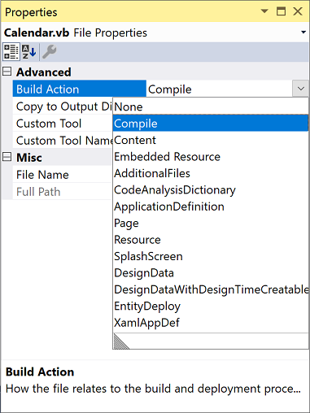

# Build actions

All files in a Visual Studio project have a build action. The build action controls what happens to the file when the project is compiled.

> [!NOTE]
> This topic applies to Visual Studio on Windows. For Visual Studio for Mac, see [Build actions in Visual Studio for Mac](/visualstudio/mac/build-actions).

## Set a build action

To set the build action for a file, open the file's properties in the **Properties** window by selecting the file in **Solution Explorer** and pressing **Alt**+**Enter**. Or, right-click on the file in **Solution Explorer** and choose **Properties**. In the **Properties** window, under the **Advanced** section, use the drop-down list next to **Build Action** to set a build action for the file.

## Build action values

Some of the more common build actions for C# and Visual Basic project files are:

|Build Action | Project types | Description |
|-|-|
| **AdditionalFiles** | C#, Visual Basic | A non-source text file that's passed to the C# or Visual Basic compiler as input. This build action is mainly used to provide inputs to [analyzers](../code-quality/roslyn-analyzers-overview.md) that are referenced by a project to verify code quality. For more information, see [Use additional files](https://github.com/dotnet/roslyn/blob/master/docs/analyzers/Using%20Additional%20Files.md).|
| **ApplicationDefinition** | WPF | The file that defines your application. When you first create a project, this is *App.xaml*. |
| **CodeAnalysisDictionary** | .NET | A custom word dictionary, used by Code Analysis for spell checking. See [How to: Customize the Code Analysis Dictionary](../code-quality/how-to-customize-the-code-analysis-dictionary.md)|
| **Compile** | any | The file is passed to the compiler as a source file.|
| **Content** | .NET | A file marked as **Content** can be retrieved as a stream by calling <xref:System.Windows.Application.GetContentStream%2A?displayProperty=nameWithType>. For ASP.NET projects, these files are included as part of the site when it's deployed.|
| **DesignData** | WPF | Used for XAML view model files, to enable user controls to be viewed at design time, with dummy types and sample data. |
| **DesignDataWithDesignTimeCreateable** | WPF | Like **DesignData**, but with actual types.  |
| **Embedded Resource** | .NET | The file is passed to the compiler as a resource to be embedded in the assembly. You can call <xref:System.Reflection.Assembly.GetManifestResourceStream%2A?displayProperty=fullName> to read the file from the assembly.|
| **EntityDeploy** | .NET | For Entity Framework (EF) .edmx files that specify deployment of EF artifacts. |
| **Fakes** | .NET | Used for the Microsoft Fakes testing framework. See [Isolate code under test using Microsoft Fakes](../test/isolating-code-under-test-with-microsoft-fakes.md) |
| **None** | any | The file isn't part of the build in any way. This value can be used for documentation files such as "ReadMe" files, for example.|
| **Page** | WPF | Compile a XAML file to a binary .baml file for faster loading at runtime. |
| **Resource** | WPF | Specifies to embed the file in an assembly manifest resource file with the extension *.g.resources*. |
| **Shadow** | .NET | Used for an .accessor file that contains a list of built assembly filenames, one per line. For each assembly on the list, generate public classes with the names `ClassName_Accessor` that are just like the originals, but with public methods instead of private methods. Used for unit testing. |
| **Splash Screen** | WPF | Specifies an image file to be displayed at runtime when the app is starting up. |
| **XamlAppDef** | Windows Workflow Foundation | Instructs the build to build a workflow XAML file into an assembly with an embedded workflow. |

> [!NOTE]
> Additional build actions may be defined by for specific project types, so the list of build actions depends on the project type and values might appear that are not in this list.

## See also

- [C# compiler options](/dotnet/csharp/language-reference/compiler-options/listed-alphabetically)
- [Visual Basic compiler options](/dotnet/visual-basic/reference/command-line-compiler/compiler-options-listed-alphabetically)
- [Build actions (Visual Studio for Mac)](/visualstudio/mac/build-actions)