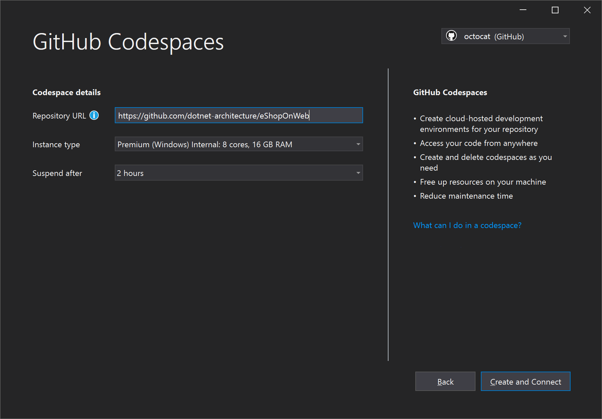
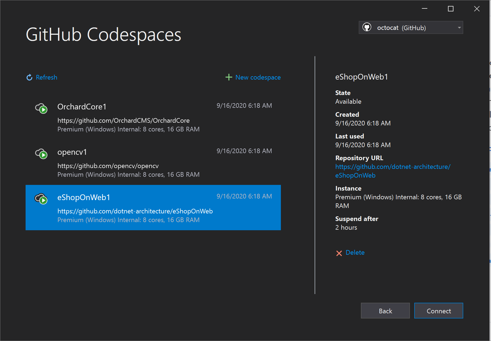

# How to use Visual Studio with a codespace (Preview)

Visual Studio has great support for developing in GitHub Codespaces. You can create and connect to a codespace and have the full power of Visual Studio to work on your projects on a remote, hosted environment. Even though your source code and tools are in a codespace and your compilation and debugging is happening in the cloud, your development experience will feel as fast and friction-free as if you were working locally.

> [!NOTE]
> This article specifically describes using Visual Studio to connect to GitHub Codespaces. You can learn about connecting to a codespace with other clients in the [Visual Studio Code](https://docs.github.com/github/developing-online-with-codespaces/connecting-to-your-codespace-from-visual-studio-code) or [in-browser editor](https://docs.github.com/github/developing-online-with-codespaces/developing-in-a-codespace) documentation.

> [!NOTE]
> If you don't have [Visual Studio 2019 Preview](https://aka.ms/vspreview) installed already, you can [download it from visualstudio.microsoft.com](https://aka.ms/vspreview).

## Creating a codespace

If you don't already have a codespace, you can create one from Visual Studio.

1. When you launch Visual Studio, the Start Window will show a **Connect to a codespace** button under "Get started".

   

2. Select **Connect to a codespace** and you will be prompted to sign in to GitHub. You can also create a GitHub account, if you don't already have one.

   

   Once you select **Sign in to GitHub**, follow the online GitHub sign in workflow.

3. If you've never created a codespace, you will be prompted to create one.

   Under "Codespace details", you need to provide a **Repository URL**. GitHub Codespaces will clone the specified repository into your codespace when it is created.

   You can also modify the **Instance Type** and **Suspend after** timeout via their dropdowns. Once you have set the codespace details, select the **Create and Connect** button.

   

   GitHub Codespaces will begin preparing the codespace and open Visual Studio, once the codespace is ready.

   The codespace name will appear in the remote indicator in the menu bar.

   

4. Start using Visual Studio, just as you would working locally. Things to try:

   * Browse source code.
   * Select a solution file, and build the solution (**Ctrl+Shift+B**).
   * Set a breakpoint in a source file and press **F5** to launch the application in the debugger.
   * Make changes and commit them to your repository.   

> [!NOTE]
> At this time, you can not create GitHub Codespaces for Visual Studio through the GitHub [Codespaces portal](https://github.com/codespaces). You can only create them using Visual Studio.

## Connecting to a codespace

After you've created your codespace, you can open your codespace directly from Visual Studio.

1. When you launch Visual Studio, the Start Window will show a **Connect to a codespace** button under "Get started".

   

   If you are already in Visual Studio, you can use the **File** > **Connect to a Codespace** menu item.

   

2. Select **Connect to a codespace**. You will be prompted to sign in to GitHub, if you haven't already.

3. You will then see all of your GitHub codespaces, along with their details presented in the right panel.

   

   Any codespaces that cloned an Azure DevOps repository will only be visible here in Visual Studio and not on GitHub's Codespaces page.

4. Choose a codespace and select the **Connect** button. If the codespace has been suspended, it will be restarted and Visual Studio will open connected to that codespace.

   The codespace name will appear in the remote indicator in the menu bar.

   

5. Start using Visual Studio, just as you would working locally. Things to try:

   * Browse source code.
   * Select a solution file, and build the solution (**Ctrl+Shift+B**).
   * Set a breakpoint in a source file and press **F5** to launch the application in the debugger.
   * Make changes and commit them to your repository.

<!-- TBD ## Suspend a codespace -->

<!-- TBD ## Disconnect from a codespace -->

## See also

* [What is GitHub Codespaces?](codespaces-overview.md)
* [How to customize a codespace](customize-codespaces.md)
* [Supported Visual Studio features](supported-features-codespaces.md)
