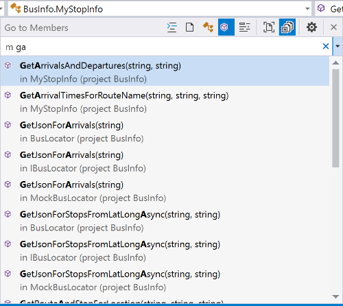
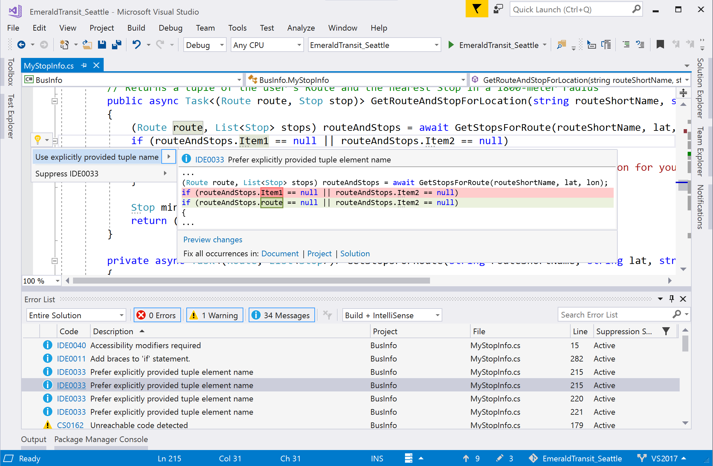
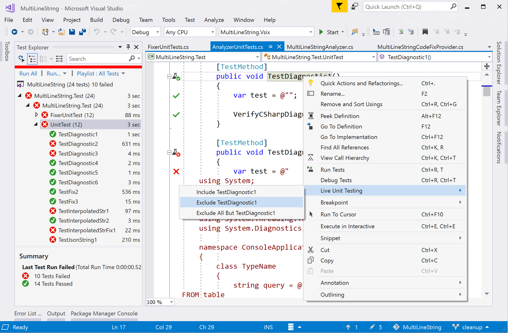

# Visual Studio productivity guide for C# developers

Learn how Visual Studio makes developers more productive than ever. Take advantage of our performance and productivity improvements like navigation to decompiled assemblies, variable name suggestions as you type, a hierarchy-view in **Test Explorer**, Go To All (**Ctrl**+**T**) to navigate to file/type/member/symbol declarations, an intelligent **Exception Helper**, code style configuration and enforcement, and many refactorings and code fixes.

## I'm used to keyboard shortcuts from a different editor

::: moniker range="vs-2017"

**New in Visual Studio 2017 version 15.8**

::: moniker-end

If you're coming from another IDE or coding environment, you can change your keyboard scheme to *Visual Studio Code* or *ReSharper (Visual Studio)*:

Some extensions also offer keyboard schemes:

- [HotKeys for Visual Studio (ReSharper/IntelliJ)](https://marketplace.visualstudio.com/items?itemName=JustinClareburtMSFT.HotKeys)
- [Emacs Emulation](https://marketplace.visualstudio.com/items?itemName=JustinClareburtMSFT.EmacsEmulation)
- [VSVim](https://marketplace.visualstudio.com/items?itemName=JaredParMSFT.VsVim)

The following are popular Visual Studio shortcuts:

| Shortcut (All Profiles) | Command | Description |
|-|-|-|
| **Ctrl**+**T** | Go To All | Navigate to any file, type, member, or symbol declaration |
| **F12** (also **Ctrl**+**Click**) | Go To Definition | Navigate to where a symbol is defined |
| **Ctrl**+**F12** | Go To Implementation | Navigate from a base type or member to its various implementations |
| **Shift**+**F12** | Find All References | See all symbol or literal references |
| **Ctrl**+**.** (also **Alt**+**Enter** in C# Profile) | Quick Actions and Refactorings | See what code fixes, code generation actions, refactorings, or other quick actions are available at your cursor position or code selection |
| **Ctrl**+**D** | Duplicate line | Duplicates the line of code that the cursor is in (available in **Visual Studio 2017 version 15.6** and later) |
| **Shift**+**Alt**+**+**/**-** | Expand/Contract selection | Expands or contracts the current selection in the editor (available in **Visual Studio 2017 version 15.5** and later) |
| **Shift** + **Alt** + **.** | Insert Next Matching Caret | Adds a selection and caret at the next location that matches the current selection (available in **Visual Studio 2017 version 15.8** and later) |
| **Ctrl**+**Q** | Search | Search all Visual Studio settings |
| **F5** | Start Debugging | Start debugging your application |
| **Ctrl**+**F5** | Run without Debug | Run your application locally without debugging |
| **Ctrl**+**K**,**D** (Default Profile) or **Ctrl**+**E**,**D** (C# Profile) | Format Document | Cleans up formatting violations in your file based on your newline, spacing, and indentation settings |
| **Ctrl**+**\\**,**Ctrl**+**E** (Default Profile) or **Ctrl**+**W**,**E** (C# Profile) | View Error List | See all errors in your document, project, or solution |
| **Alt** + **PgUp/PgDn** | Go to Next/Previous Issue | Jump to the previous/next error, warning, suggestion in your document (available in **Visual Studio 2017 version 15.8** and later) |

> [!NOTE]
> Some extensions unbind the default Visual Studio keybindings. To use the above commands, restore your keybindings to Visual Studio's defaults by going to **Tools** > **Import and Export Settings** > **Reset all settings** or **Tools** > **Options** > **Keyboard** > **Reset**.

For more information about keyboard shortcuts and commands, see [Productivity shortcuts](../ide/productivity-shortcuts.md) and [Popular keyboard shortcuts](default-keyboard-shortcuts-for-frequently-used-commands-in-visual-studio.md).

## Navigate quickly to files or types

Visual Studio 2017 has a feature called **Go To All** (**Ctrl**+**T**). **Go To All** enables you to quickly jump to any file, type, member, or symbol declaration.

- Change the location of this search bar or turn off the live navigation preview by using the **gear** icon.
- Filter results using syntax such as `t mytype`.
- Scope your search to just the current document.
- Camel case matching is supported.

## Enforce code style rules

You can use an *.editorconfig* file to codify coding conventions and have them travel with your source.

::: moniker range="vs-2017"

- You can install the [EditorConfig language services extension](https://aka.ms/editorconfig), which makes it easy to add and edit an *.editorconfig* file in Visual Studio.

::: moniker-end

::: moniker range=">=vs-2019"

- Automatically create an *.editorconfig* file from your code style settings in **Tools** > **Options** > **Text Editor** > **C#** > **Code Style**.

   

::: moniker-end

- Try out the [IntelliCode extension for Visual Studio](/visualstudio/intellicode/intellicode-visual-studio). IntelliCode infers your code styles from existing code, and then creates a non-empty *.editorconfig* file with your code style preferences already defined.

- Check out the [.NET coding convention options](editorconfig-code-style-settings-reference.md) documentation.

- See [this gist](https://gist.github.com/kuhlenh/5471666a7a2c57fea427e81cf0a41da8) for an example *.editorconfig* file.

::: moniker range="vs-2019"

## Code Cleanup

Visual Studio provides on-demand formatting of your code file, including code style preferences, through the **Code Cleanup** feature. To run Code Cleanup, click the broom icon at the bottom of the editor or press **Ctrl**+**K**, **Ctrl**+**E**.

In addition to formatting your file for spaces, indents, et cetera, **Code Cleanup** also applies selected code styles. Your preferences for each code style are read from the [EditorConfig file](code-styles-and-code-cleanup.md#code-styles-in-editorconfig-files), if you have one for the project, or from the [code style settings](code-styles-and-code-cleanup.md#code-styles-in-the-options-dialog-box) in the **Options** dialog box.

::: moniker-end

## Refactorings and code fixes

Visual Studio comes with numerous refactorings, code generation actions, and code fixes. Red squiggles represent errors, green squiggles represent warnings, and three gray dots represent code suggestions. You can access code fixes by clicking the light bulb or screwdriver icon, or by pressing **Ctrl**+**.** or **Alt**+**Enter**. Each fix comes with a preview window that shows a live code diff of how the fix works.

Popular quick fixes and refactorings include:

- *Rename*
- *Extract Method*
- *Change Method Signature*
- *Generate Constructor*
- *Generate Method*
- *Move Type to File*
- *Add Null-Check*
- *Add Parameter*
- *Remove Unnecessary Usings*
- *Foreach Loop to LINQ Query or to LINQ method*
- *Pull Members Up*
- For more information, see [code generation features](code-generation-in-visual-studio.md)

You can [install FxCop analyzers](../code-quality/install-fxcop-analyzers.md) to flag code issues. Or, write your own refactoring or code fix with [Roslyn analyzers](https://github.com/dotnet/roslyn/wiki/Getting-Started-Writing-a-Custom-Analyzer-&-Code-Fix).

Several community members have written free extensions that add additional code inspections:

- [Roslynator](https://marketplace.visualstudio.com/items?itemName=josefpihrt.Roslynator2017)
- [SonarLint for Visual Studio](https://marketplace.visualstudio.com/items?itemName=SonarSource.SonarLintforVisualStudio2017)
- [StyleCopAnalyzers](https://www.nuget.org/packages/stylecop.analyzers/)
- [CodeCracker](https://www.nuget.org/packages/codecracker.CSharp/)

## Find Usages, Go To Implementation, and Navigate To Decompiled Assemblies

Visual Studio has many features to help you search and [navigate your code](../ide/navigating-code.md).

| Feature | Shortcut | Details/Improvements |
|- | - | -|
| Find All References | **Shift**+**F12**| Results are colorized and can be grouped by project, definition, and reference type, such as read or write. You can also "lock" results. |
| Go To Implementation | **Ctrl**+**F12** | You can use Go To Definition on the `override` keyword to navigate to the overridden member |
| Go To Definition | **F12** or **Ctrl**+**Click**| Press **Ctrl** while clicking to navigate to definition |
| Peek Definition | **Alt**+**F12** | Inline view of a definition |
| Structure Visualizer | Gray, dotted-lines between braces | Hover to see your code structure |
| Navigation to decompiled assemblies | **F12** or **Ctrl**+**Click** | Navigate to external source (decompiled with ILSpy) by enabling the feature: **Tools** > **Options** > **Text Editor** > **C#** > **Advanced** > **Enable navigation to decompiled sources**. |

## Improved IntelliSense

Download [IntelliCode for Visual Studio](https://marketplace.visualstudio.com/items?itemName=VisualStudioExptTeam.VSIntelliCode) to get [context-aware code completions](/visualstudio/intellicode/intellicode-visual-studio) instead of just an alphabetical list. You can also train a [custom IntelliSense model](/visualstudio/intellicode/custom-model-faq) based on your own domain-specific libraries.

## Unit testing

Starting in Visual Studio 2017, there are numerous improvements to the testing experience. You can test with the MSTest v1, MSTest v2, NUnit, or XUnit test frameworks.

- **Test Explorer** test discovery is fast.

- Organize your tests in **Test Explorer** with *hierarchical sorting*.

   

- [Live unit testing](../test/live-unit-testing.md) continuously runs tests impacted by your code changes and updates inline editor icons to let you know the status of your tests. Include or exclude specific tests or test projects from your live test set. (Visual Studio Enterprise edition only.)

## Debugging

Some of Visual Studio's debugging capabilities include:

::: moniker range=">=vs-2019"

- The ability to search for a string within the **Watch**, **Autos**, and **Locals** windows.
- *Run to click*, which lets you hover next to a line of code, hit the green 'play' icon that appears, and run your program until it reaches that line.
- The **Exception Helper**, which puts the most important information at the top level in the dialog, for example, which variable is `null` in a `NullReferenceException`.
- [Step back debugging](../debugger/view-historical-application-state.md), which lets you go back to previous breakpoints or steps and view the state of the application as it was in the past.
- [Snapshot debugging](/azure/application-insights/app-insights-snapshot-debugger), which lets you investigate the state of a live web application at the moment an exception was thrown (must be on Azure).

::: moniker-end

::: moniker range="vs-2017"

- *Run to click*, which lets you hover next to a line of code, hit the green 'play' icon that appears, and run your program until it reaches that line.
- The **Exception Helper**, which puts the most important information at the top level in the dialog, for example, which variable is `null` in a `NullReferenceException`.
- [Step back debugging](../debugger/view-historical-application-state.md), which lets you go back to previous breakpoints or steps and view the state of the application as it was in the past.
- [Snapshot debugging](/azure/application-insights/app-insights-snapshot-debugger), which lets you investigate the state of a live web application at the moment an exception was thrown (must be on Azure).

::: moniker-end

## Version control

You can use git or TFVC to store and update your code in Visual Studio.

::: moniker range=">=vs-2019"

- Install the [Pull requests for Visual Studio](https://marketplace.visualstudio.com/items?itemName=vsideversioncontrolmsft.pr4vs) to create, review, check out, and run pull requests without leaving Visual Studio.

::: moniker-end

- Organize your local changes in [Team Explorer](reference/team-explorer-reference.md) and use the status bar to track pending commits and changes.

- Set up continuous integration and delivery for your ASP.NET projects inside of Visual Studio with the [Continuous delivery tools for Visual Studio](https://marketplace.visualstudio.com/items?itemName=VSIDEDevOpsMSFT.ContinuousDeliveryToolsforVisualStudio) extension.

## What other features should I know about?

Here is a list of editor and productivity features to make writing code more efficient. Some features may need to be enabled because they are off by default (they may index things on your machine, are controversial, or are currently experimental).

| Feature | Details | How to enable |
|-|-|-|
| Locate File in Solution Explorer | Highlights the active file in **Solution Explorer** | **Tools** > **Options** > **Projects and Solutions** > **Track Active Item in Solution Explorer** |
| Add usings for types in reference assemblies and NuGet packages | Shows an error light bulb with a code fix to install a NuGet package for an unreferenced type | **Tools** > **Options** > **Text Editor** > **C#** > **Advanced** > **Suggest usings for types in reference assemblies** and **Suggest usings for types in NuGet packages** |
| Enable full solution analysis | See all errors in your solution in the **Error List** | **Tools** > **Options** > **Text Editor** > **C#** > **Advanced** > **Enable full solution analysis** |
| Enable navigation to decompiled sources | Allow Go To Definition on types/members from external sources and use the ILSpy decompiler to show method bodies | **Tools** > **Options** > **Text Editor** > **C#** > **Advanced** > **Enable navigation to decompiled sources** |
| Completion/Suggestion Mode | Changes the completion behavior in IntelliSense. Developers with IntelliJ backgrounds tend to use a non-default setting here. | **Menu** > **Edit** > **IntelliSense** > **Toggle Completion Mode** |
| [CodeLens](../ide/find-code-changes-and-other-history-with-codelens.md) | Displays code reference information and change history in the editor. (Source control CodeLens indicators aren't available in Visual Studio Community edition.) | **Tools** > **Options** > **Text Editor** > **All Languages** > **CodeLens** |
| [Code snippets](../ide/visual-csharp-code-snippets.md) | Help stub out common boilerplate code | Type a snippet name and press **Tab** twice. |
