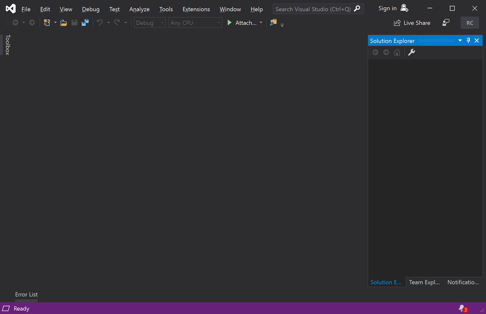

# How to: Personalize the Visual Studio IDE and the editor

In this how-to article, we'll customize the Visual Studio color theme by selecting the dark theme. We'll also customize the colors for two different types of text in the code editor.

::: moniker range="vs-2017"

If you haven't already installed Visual Studio, go to the [Visual Studio downloads](https://visualstudio.microsoft.com/vs/older-downloads/?utm_medium=microsoft&utm_source=docs.microsoft.com&utm_campaign=vs+2017+download) page to install it for free.

::: moniker-end

::: moniker range=">=vs-2019"

If you haven't already installed Visual Studio, go to the [Visual Studio downloads](https://visualstudio.microsoft.com/downloads) page to install it for free.

::: moniker-end

## Set the color theme for the IDE

The default color theme for Visual Studio's user interface is called **Blue**. Let's change it to **Dark**.

1. On the menu bar, which is the row of menus such as **File** and **Edit**, choose **Tools** > **Options**.

1. On the **Environment** > **General** options page, change the **Color theme** selection to **Dark**, and then choose **OK**.

   The color theme for the entire Visual Studio development environment (IDE) changes to **Dark**.

   ::: moniker range="vs-2017"

   

   ::: moniker-end

   ::: moniker range="vs-2019"

   

   ::: moniker-end

::: moniker range="vs-2017"

> [!TIP]
> You can install additional predefined themes by installing the **Visual Studio Color Theme Editor** from the [Visual Studio Marketplace](https://marketplace.visualstudio.com/items?itemName=VisualStudioPlatformTeam.VisualStudio2017ColorThemeEditor). After you install this tool, additional color themes appear in the **Color theme** drop-down list.

::: moniker-end

::: moniker range="vs-2019"

> [!TIP]
> You can create your own themes by installing the **Visual Studio Color Theme Designer** from the [Visual Studio Marketplace](https://marketplace.visualstudio.com/items?itemName=ms-madsk.ColorThemeDesigner).

::: moniker-end

## Change text colors in the editor

Now we'll customize some text colors for the editor. First, let's create a new XML file to see the default colors.

1. From the menu bar, choose **File** > **New** > **File**.

1. In the **New File** dialog box, under the **General** category, choose **XML File**, and then choose **Open**.

1. Paste the following XML below the line that contains `<?xml version="1.0" encoding="utf-8"?>`.

   ```xml
   <Catalog>
     <Book id="bk101">
     <Author>Garghentini, Davide</Author>
     <Title>XML Developer's Guide</Title>
     <Genre>Computer</Genre>
     <Price>44.95</Price>
     <PublishDate>2000-10-01</PublishDate>
     <Description>
       An in-depth look at creating applications with XML.
     </Description>
   </Book>
   <Book id="bk102">
     <Author>Garcia, Debra</Author>
     <Title>Midnight Rain</Title>
     <Genre>Fantasy</Genre>
     <Price>5.95</Price>
     <PublishDate>2000-12-16</PublishDate>
     <Description>
       A former architect battles corporate zombies, an evil
       sorceress, and her own childhood to become queen of the world.
     </Description>
   </Book>
   </Catalog>
   ```

   Notice that the line numbers are a turquoise-blue color, and the XML attributes (such as `id="bk101"`) are a light blue color. We're going to change the text color for these items.

   

1. To open the **Options** dialog box, choose **Tools** > **Options** from the menu bar.

1. Under **Environment**, choose the **Fonts and Colors** category.

   Notice that the text under **Show settings for** says **Text Editor**&mdash;this is what we want. Expand the drop-down list just to see the extensive list of places where you can customize fonts and text color.

1. To change the color of the line numbers text, in the **Display items** list, choose **Line Number**. In the **Item foreground** box, choose **Olive**.

   

   Some languages have their own specific fonts and colors settings. If you are a C++ developer and you want to change the color used for functions, for example, you can look for **C++ Functions** in the **Display items** list.

1. Before we exit out of the dialog box, let's also change the color of XML attributes. In the **Display items** list, scroll down to **XML Attribute** and select it. In the **Item foreground** box, choose **Lime**. Choose **OK** to save our selections and close the dialog box.

   The line numbers are now an olive color, and the XML attributes are a bright, lime green. If you open another file type, such as a C++ or C# code file, you'll see that the line numbers also appear in the olive color.

   

We explored just a couple ways of customizing the colors in Visual Studio. We hope that you'll explore the other customization options in the [**Options**](../ide/reference/fonts-and-colors-environment-options-dialog-box.md) dialog box, to truly make Visual Studio your own.

## See also

- [Change fonts, colors, and high-contrast options in Visual Studio](../ide/how-to-change-fonts-and-colors-in-visual-studio.md)
- [Customize the editor](../ide/how-to-change-text-case-in-the-editor.md)
- [Visual Studio IDE overview](../get-started/visual-studio-ide.md)
