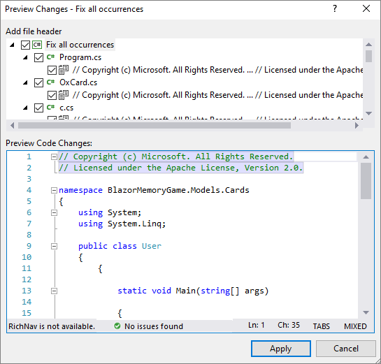

# Add File Header

This code generation applies to:

- C#

- Visual Basic

**What:** Add file headers to existing files, projects, and solutions using an [EditorConfig](https://docs.microsoft.com/visualstudio/ide/create-portable-custom-editor-options#add-an-editorconfig-file-to-a-project).

**When:** You want to easily add a file header to files, projects, and solutions.

**Why:** Your team requires you to include a file header for copyright purposes. 

## How-to

1. Add an [EditorConfig](https://docs.microsoft.com/visualstudio/ide/create-portable-custom-editor-options#add-an-editorconfig-file-to-a-project) to a project or solution if you do not already have one.

2. Add the following rule to your EditorConfig file: *file_header_template*.

3. Set the value of the rule to equal the header text you would like applied.

    

> [!NOTE]
> You cannot have explicit multilines in an EditorConfig and will need to use the Unix newline character to insert new lines.

4. Place your caret on the first line of any C# or Visual Basic file.

5. Press **Ctrl**+**.** to trigger the **Quick Actions and Refactorings** menu.

6. Select **Add file header**. 

    

7. To apply the file header to an entire project or solution, select **Project** or **Solution** under the **Fix all occurrences in:** option.

8. The **Fix all occurrences** dialog will open where you can preview the changes.

    

8. Select **Apply** to apply the changes.

## See also

- [Code Generation](../code-generation-in-visual-studio.md)
- [Preview Changes](../../ide/preview-changes.md)
