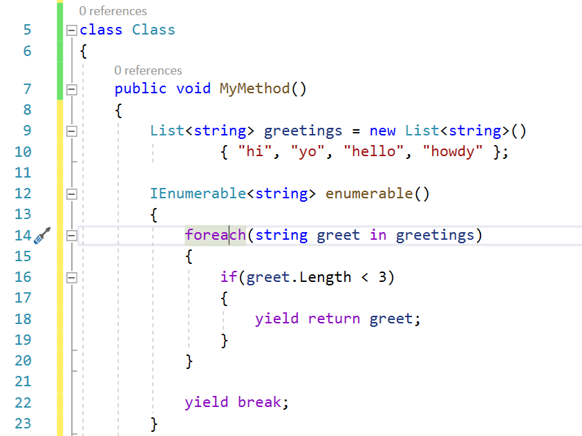
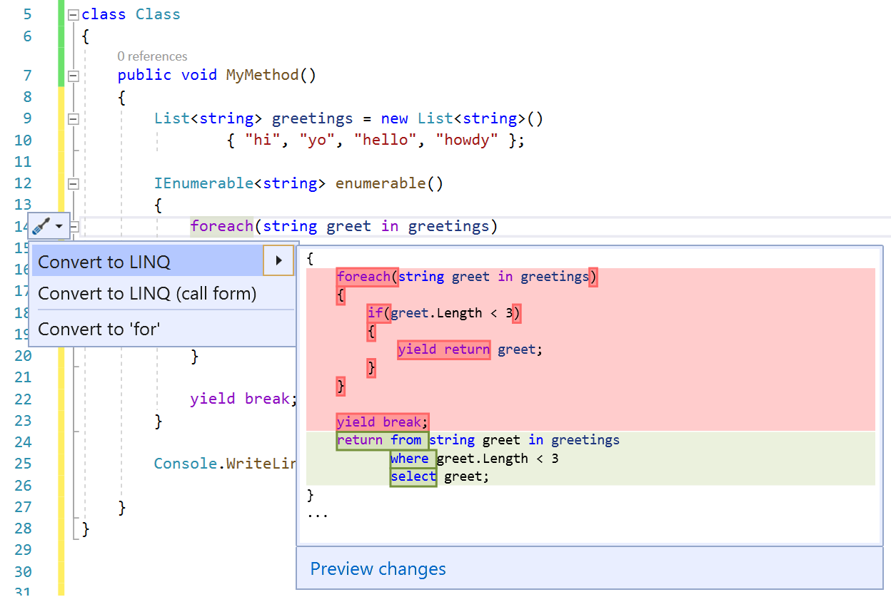
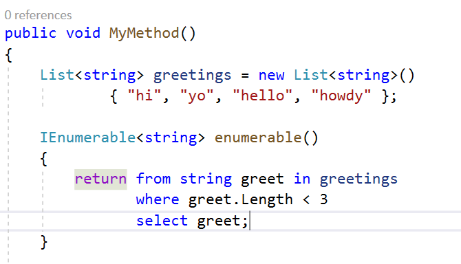

# Convert foreach loops into LINQ

This refactoring applies to:

- C#

**What:** Lets you easily convert your *foreach* loop into a LINQ query or a LINQ call form (also known as a LINQ method) by using IEnumerables.

**When:** You have a foreach loop that uses an IEnumerable that you want to read as a LINQ query.

**Why:** You prefer using LINQ syntax rather than a foreach loop. [LINQ](/dotnet/csharp/programming-guide/concepts/linq/introduction-to-linq) makes a query into a first-class language construct in C#. LINQ can reduce the amount of code in a file, make it easier to read, and allow different data sources to have similar query expression patterns.

> [!NOTE]
> LINQ syntax is typically less efficient than foreach loops. It's good to be aware of any performance tradeoff that might occur when you use LINQ to improve the readability of your code.

## Convert a foreach loop into LINQ refactoring

1. Place your cursor in the `foreach` keyword.

    

2. Press **Ctrl**+**.** to trigger the **Quick Actions and Refactorings** menu.

   

3. Select **Convert to LINQ** or **Convert to Linq (call form)**

   
   
   
   
### Sample code

```csharp
using System.Collections.Generic;

public class Class1
{
    public void MyMethod()
    {
        var greetings = new List<string>()
            { "hi", "yo", "hello", "howdy" };

        IEnumerable<string> enumerable()
        {
            foreach (var greet in greetings)
            {
                if (greet.Length < 3)
                {
                    yield return greet;
                }
            }

            yield break;
        }
    }
}
```

## See also

- [Refactoring](../refactoring-in-visual-studio.md)
- [Preview Changes window](../../ide/preview-changes.md)
- [Tips for .NET Developers](../../ide/visual-studio-2017-for-dotnet-developers.md)
