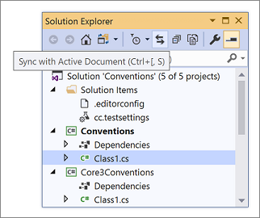

# Options dialog box: Projects and Solutions \> General

Use this page to define Visual Studio's behavior related to projects and solutions. To access these options, select **Tools** > **Options**, expand **Projects and Solutions**, and then select **General**.

The following options are available on the **General** page.

## Always show Error List if build finishes with errors

Opens the **Error List** window on build completion, only if a project failed to build. Errors that occur during the build process are displayed. When this option is cleared, the errors still occur but the window does not open when the build is complete. This option is enabled by default.

## Track active item in Solution Explorer

When selected, **Solution Explorer** automatically opens and the active item is selected. The selected item changes as you work with different files in a project or solution, or different components in a designer. When this option is cleared, the selection in **Solution Explorer** does not change automatically. This option is enabled by default.

## Show advanced build configurations

When selected, the build configuration options appear on the **Project Property Pages** dialog box and the **Solution Property Pages** dialog box. When cleared, the build configuration options do not appear on the **Project Property Pages** dialog box and the **Solution Property Pages** dialog box for Visual Basic and C# projects that contain one configuration or the two configurations debug and release. If a project has a user-defined configuration, the build configuration options are shown.

When unselected, the commands on the **Build** menu, such as **Build Solution**, **Rebuild Solution**, and **Clean Solution**, are performed on the Release configuration and the commands on the **Debug** menu, such as **Start Debugging** and **Start Without Debugging**, are performed on the Debug configuration.

## Always show solution

When selected, the solution and all commands that act on solutions are always shown in the IDE. When cleared, all projects are created as stand-alone projects and you do not see the solution in Solution Explorer or commands that act on solutions in the IDE if the solution contains only one project.

::: moniker range="vs-2017"

## Save new projects when created

When selected, you can specify a location for your project in the **New Project** dialog box. When cleared, all new projects are created as temporary projects. When you are working with temporary projects, you can create and experiment with a project without having to specify a disk location.

::: moniker-end

## Warn user when the project location is not trusted

If you attempt to create a new project or open an existing project in a location that is not fully trusted (for example, on a UNC path or an HTTP path), a message is displayed. Use this option to specify whether the message is displayed each time that you attempt to create or open a project in a location that is not fully trusted.

## Show Output window when build starts

Automatically displays the [Output window](../../ide/reference/output-window.md) in the IDE at the outset of solution builds.

## Prompt for symbolic renaming when renaming files

When selected, Visual Studio displays a message box asking whether or not it should also rename all references in the project to the code element.

## Prompt before moving files to a new location

When selected, Visual Studio displays a confirmation message box before the locations of files are changed by actions in **Solution Explorer**.

## Reopen documents on solution load

When selected, documents that were left open the previous time the solution was closed are automatically opened when the solution is opened.

Reopening certain types of files or designers can delay solution load. Uncheck this option to [improve solution load performance](../../ide/visual-studio-performance-tips-and-tricks.md#disable-automatic-file-restore) if you don't want to restore the solution's previous context.

::: moniker range=">=vs-2019"

## Restore Solution Explorer project hierarchy state on solution load

When selected, restores the state of nodes in Solution Explorer with respect to whether they were expanded or collapsed the last time the solution was open. Deselect this option to decrease solution load time for large solutions.

> [!TIP]
> If you disable this option, an easy way to navigate to the active document in Solution Explorer is by selecting **Sync with Active Document** on the **Solution Explorer** toolbar.
>
> 

## Open SDK-style project files with double-click or the Enter key

When this option is selected and you double-click on an SDK-style project node in Solution Explorer or select it and then press **Enter**, the project file (for example, \*.csproj file) opens as XML in the editor. When deselected, double-clicking an SDK-style project node in Solution Explorer or selecting it and pressing **Enter** has the effect of expanding or collapsing the node only.

If you don't have this option selected and you want to edit an SDK-style project file, right-click on the project node in Solution Explorer and select **Edit Project File**. For other project types, you must first unload the project before editing it in Visual Studio.

> [!TIP]
> An *SDK-style project*, or [project SDK](../../msbuild/how-to-use-project-sdk.md) has a newer, more streamlined project file format that was introduced with MSBuild 15.0. An SDK-style project contains an `Sdk` attribute on the `Project` element, for example `<Project Sdk="Microsoft.NET.Sdk">`. Visual Studio creates an SDK-style project when you create a new .NET Core project from one of the Visual Studio templates, for example.

::: moniker-end

## See also

- [Options dialog box: Projects and Solutions \> Locations](projects-solutions-locations-options.md)
- [Options Dialog Box, Projects and Solutions, Build and Run](../../ide/reference/options-dialog-box-projects-and-solutions-build-and-run.md)
- [Options Dialog Box, Projects and Solutions, Web Projects](../../ide/reference/options-dialog-box-projects-and-solutions-web-projects.md)
