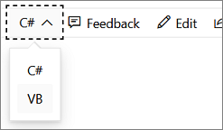

# Step 10: Write code for additional buttons and a check box

Now you're ready to complete the other four methods. You could copy and paste this code, but if you want to learn the most from this tutorial, type the code and use IntelliSense.

This code adds functionality to the buttons you added earlier. Without this code, the buttons don't do anything. The buttons use code in their <xref:System.Windows.Forms.Control.Click> events (and the check box uses the <xref:System.Windows.Forms.CheckBox.CheckedChanged> event) to do different things when you activate the controls. For example, the `clearButton_Click` (or `ClearButton_Click`) event, which activates when you choose the **Clear the picture** button, erases the current image by setting its **Image** property to **null** (or, **nothing**). Each event in the code includes comments that explain what the code does.

> [!TIP]
> As a best practice: Always comment your code. Comments are information for a person to read, and it's worth the time to make your code understandable. Everything on a comment line is ignored by the app. In C#, you comment a line by typing two forward slashes at the beginning (//), and in Visual Basic you comment a line by starting with a single quotation mark (').

## How to write code for additional buttons and a check box

Add the following code to your **Form1** code file (*Form1.cs* or *Form1.vb*).
> [!IMPORTANT]
> Use the programming language control at the top right of this page to view either the C# code snippet or the Visual Basic code snippet.  

  [!code-csharp[VbExpressTutorial1Step9_10#2](../ide/codesnippet/CSharp/step-10-write-code-for-additional-buttons-and-a-check-box_1.cs)]

  [!code-vb[VbExpressTutorial1Step9_10#2](../ide/codesnippet/VisualBasic/step-10-write-code-for-additional-buttons-and-a-check-box_1.vb)]

## Next steps

* To go to the next tutorial step, see **[Step 11: Run your app and try other features](../ide/step-11-run-your-program-and-try-other-features.md)**.

* To return to the previous tutorial step, see [Step 9: Review, comment, and test your code](../ide/step-9-review-comment-and-test-your-code.md).

## See also

* [Tutorial 2: Create a timed math quiz](tutorial-2-create-a-timed-math-quiz.md)
* [Tutorial 3: Create a matching game](tutorial-3-create-a-matching-game.md)
