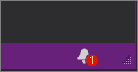

# Control updates to network-based Visual Studio deployments

Enterprise administrators often create a layout and host it on a network file share to deploy to their end-users.

## Controlling where Visual Studio looks for updates

By default, Visual Studio continues to look online for updates even if the installation was deployed from a network share. If an update is available, the user can install it. Any updated content that is not found in the offline layout is downloaded from the web.

If you want direct control over where Visual Studio looks for updates, you can modify the location where it looks. You can also control the version your users are updated to. To do so, follow these steps:

1. Create an offline layout:

   ```cmd
   vs_enterprise.exe --layout C:\vsoffline --lang en-US
   ```

2. Copy it to the file share where you want to host it:

   ```cmd
   xcopy /e C:\vsoffline \\server\share\VS
   ```

3. Modify the response.json file in the layout and change the `channelUri` value to point to a copy of the channelManifest.json that the admin controls.

   Be sure to escape backslashes in the value, as in the following example:

   ```json
   "channelUri":"\\\\server\\share\\VS\\ChannelManifest.json"
   ```

   Now end-users can run setup from this share to install Visual Studio.

   ```cmd
   \\server\share\VS\vs_enterprise.exe
   ```

When an enterprise administrator determines it is time for their users to update to a newer version of Visual Studio, they can [update the layout location](update-a-network-installation-of-visual-studio.md) to incorporate the updated files, as follows.

1. Use a command that is similar to the following command:

   ```cmd
   vs_enterprise.exe --layout \\server\share\VS --lang en-US
   ```

2. Ensure that the response.json file in the updated layout still contains your customizations, specifically the channelUri modification, as follows:

   ```json
   "channelUri":"\\\\server\\share\\VS\\ChannelManifest.json"
   ```

   Existing Visual Studio installs from this layout look for updates at `\\server\share\VS\ChannelManifest.json`. If the channelManifest.json is newer than what the user has installed, Visual Studio notifies the user that an update is available.

   New installs automatically install the updated version of Visual Studio directly from the layout.

## Controlling notifications in the Visual Studio IDE

::: moniker range="vs-2017"

As described earlier, Visual Studio checks the location from which it has been installed, such as a network share or the internet, to see whether any updates are available. When an update is available, Visual Studio notifies the user with a notification flag in the top right-hand corner of the window.

   

::: moniker-end

::: moniker range="vs-2019"

As described earlier, Visual Studio checks the location from which it has been installed, such as a network share or the internet, to see whether any updates are available. When an update is available, Visual Studio notifies the user with a notification icon in the lower right-hand corner of the window.

   

::: moniker-end

You can disable the notifications if you don't want end-users to be notified of updates. (For example, you might want to disable notifications if you deliver updates through a central software distribution mechanism.)

::: moniker range="vs-2017"

Because Visual Studio 2017 [stores registry entries in a private registry](tools-for-managing-visual-studio-instances.md#editing-the-registry-for-a-visual-studio-instance), you can't directly edit the registry in the typical way. However, Visual Studio includes a `vsregedit.exe` utility that you can use to change Visual Studio settings. You can turn off notifications with the following command:

```cmd
vsregedit.exe set "C:\Program Files (x86)\Microsoft Visual Studio\2017\Enterprise" HKCU ExtensionManager AutomaticallyCheckForUpdates2Override dword 0
```

::: moniker-end

::: moniker range="vs-2019"

Because Visual Studio 2019 [stores registry entries in a private registry](tools-for-managing-visual-studio-instances.md#editing-the-registry-for-a-visual-studio-instance), you can't directly edit the registry in the typical way. However, Visual Studio includes a `vsregedit.exe` utility that you can use to change Visual Studio settings. You can turn off notifications with the following command:

```cmd
vsregedit.exe set "C:\Program Files (x86)\Microsoft Visual Studio\2019\Enterprise" HKCU ExtensionManager AutomaticallyCheckForUpdates2Override dword 0
```

::: moniker-end

(Make sure to replace the directory to match the installed instance that you want to edit.)

> [!TIP]
> Use [vswhere.exe](tools-for-managing-visual-studio-instances.md#detecting-existing-visual-studio-instances) to find a specific instance of Visual Studio on a client workstation.

[!INCLUDE[install_get_support_md](includes/install_get_support_md.md)]

## See also

* [Install Visual Studio](install-visual-studio.md)
* [Visual Studio administrator guide](visual-studio-administrator-guide.md)
* [Use command-line parameters to install Visual Studio](use-command-line-parameters-to-install-visual-studio.md)
* [Tools for managing Visual Studio instances](tools-for-managing-visual-studio-instances.md)
