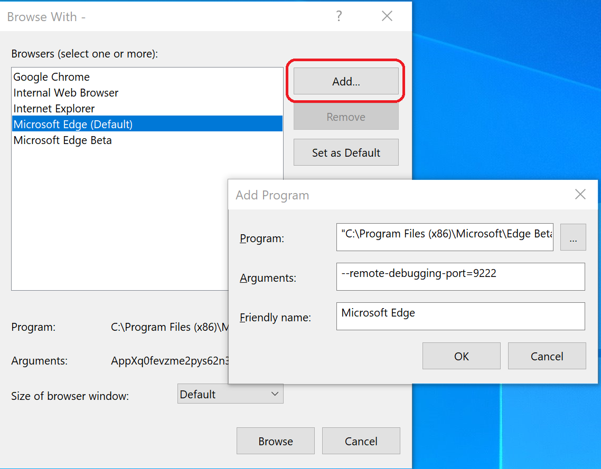
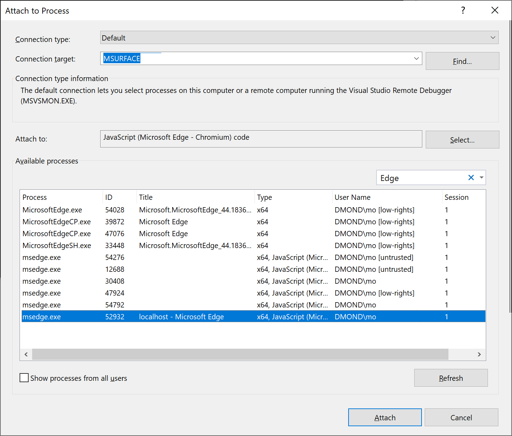
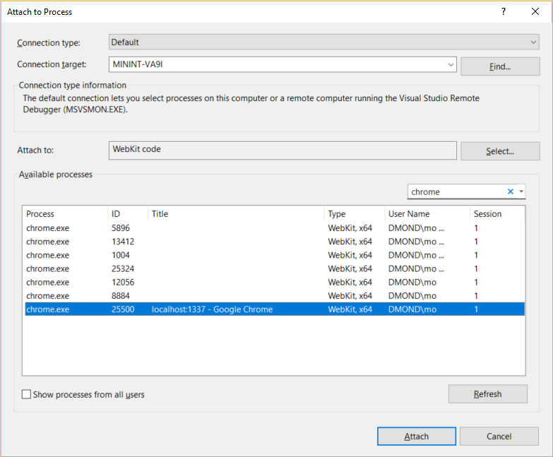

# Debug a JavaScript or TypeScript app in Visual Studio

You can debug JavaScript and TypeScript code using Visual Studio. You can set and hit breakpoints, attach the debugger, inspect variables, view the call stack, and use other debugging features.

> [!TIP]
> If you haven't already installed Visual Studio, go to the [Visual Studio downloads](https://visualstudio.microsoft.com/downloads/) page to install it for free. Depending on the type of app development you're doing, you may need to install the **Node.js development workload** with Visual Studio.

## Debug server-side script

1. With your project open in Visual Studio, open a server-side JavaScript file (such as *server.js*), click in the gutter to the left gutter to set a breakpoint:

    

    Breakpoints are the most basic and essential feature of reliable debugging. A breakpoint indicates where Visual Studio should suspend your running code so you can take a look at the values of variables, or the behavior of memory, or whether or not a branch of code is getting run.

1. To run your app, press **F5** (**Debug** > **Start Debugging**).

    The debugger pauses at the breakpoint you set (the current statement is marked in yellow). Now, you can inspect your app state by hovering over variables that are currently in scope, using debugger windows like the **Locals** and **Watch** windows.

1. Press **F5** to continue the app.

1. If you want to use the Chrome Developer Tools or F12 Tools, press **F12**. You can use these tools to examine the DOM and interact with the app using the JavaScript Console.

## Debug client-side script

::: moniker range=">=vs-2019"
Visual Studio provides client-side debugging support for Chrome and Microsoft Edge (Chromium) only. In some scenarios, the debugger automatically hits breakpoints in JavaScript and TypeScript code and in embedded scripts on HTML files. For debugging client-side script in ASP.NET apps, see the blog post [Debug JavaScript in Microsoft Edge](https://devblogs.microsoft.com/visualstudio/debug-javascript-in-microsoft-edge-from-visual-studio/) and this [post for Google Chrome](https://devblogs.microsoft.com/aspnet/client-side-debugging-of-asp-net-projects-in-google-chrome).
::: moniker-end
::: moniker range="vs-2017"
Visual Studio provides client-side debugging support for Chrome and Internet Explorer only. In some scenarios, the debugger automatically hits breakpoints in JavaScript and TypeScript code and in embedded scripts on HTML files. For debugging client-side script in ASP.NET apps, see the blog post [Client-side debugging of ASP.NET projects in Google Chrome](https://devblogs.microsoft.com/aspnet/client-side-debugging-of-asp-net-projects-in-google-chrome/).
::: moniker-end

### Prepare your app for debugging

If your source is minified or created by a transpiler like TypeScript or Babel, the use of [source maps](#generate_sourcemaps) is required for the best debugging experience. Without source maps, you can still attach the debugger to a running client-side script. However, you may only be able to set and hit breakpoints in the minified or transpiled file, not in the original source file. For example, in a Vue.js app, minified script gets passed as a string to an `eval` statement, and there is no way to step through this code effectively using the Visual Studio debugger, unless you use source maps. In complex debugging scenarios, you might instead use Chrome Developer Tools or F12 Tools for Microsoft Edge.

For help to generate source maps, see [Generate source maps for debugging](#generate_sourcemaps).

### Prepare the browser for debugging

::: moniker range=">=vs-2019"
For this scenario, use either Microsoft Edge (Chromium), currently named **Microsoft Edge Beta** in the IDE, or Chrome.
::: moniker-end
::: moniker range="vs-2017"
For this scenario, use Chrome.
::: moniker-end

1. Close all windows for the target browser.

   Other browser instances can prevent the browser from opening with debugging enabled. (Browser extensions may be running and preventing full debug mode, so you may need to open Task Manager to find unexpected instances of Chrome.)

   ::: moniker range=">=vs-2019"
   For Microsoft Edge (Chromium), also shut down all instances of Chrome. Because both browsers use the chromium code base, this gives the best results.
   ::: moniker-end

2. Start your browser with debugging enabled.

    ::: moniker range=">=vs-2019"
    > [!TIP]
    > Starting in Visual Studio 2019, you can set the `--remote-debugging-port` flag at browser launch by selecting **Browse With...** > from the **Debug** toolbar, then choosing **Add**, and then setting the flag in the **Arguments** field. Use a different friendly name for the browser such as **Edge with Debugging** or **Chrome with Debugging**. For details, see the [Release Notes](/visualstudio/releases/2019/release-notes-v16.2).

    

    Alternatively, open the **Run** command from the Windows **Start** button (right-click and choose **Run**), and enter the following command:

    `msedge --remote-debugging-port=9222`
    or,
    `chrome.exe --remote-debugging-port=9222`
    ::: moniker-end

    ::: moniker range="vs-2017"
    Open the **Run** command from the Windows **Start** button (right-click and choose **Run**), and enter the following command:

    `chrome.exe --remote-debugging-port=9222`
    ::: moniker-end

    This starts your browser with debugging enabled.

    The app is not yet running, so you get an empty browser page.

### Attach the debugger to client-side script

To attach the debugger from Visual Studio and hit breakpoints in client-side code, the debugger needs help to identify the correct process. Here is one way to enable this.

1. Switch to Visual Studio and then set a breakpoint in your source code, which might be a JavaScript file, TypeScript file, or a JSX file. (Set the breakpoint in a line of code that allows breakpoints, such as a return statement or a var declaration.)

    

    To find the specific code in a transpiled file, use **Ctrl**+**F** (**Edit** > **Find and Replace** > **Quick Find**).

    For client-side code, to hit a breakpoint in a TypeScript file or JSX file typically requires the use of [source maps](#generate_sourcemaps). A source map must be configured correctly to support debugging in Visual Studio.

2. Select your target browser as the debug target in Visual Studio, then press **Ctrl**+**F5** (**Debug** > **Start Without Debugging**) to run the app in the browser.

    The app opens in a new browser tab.

3. Choose **Debug** > **Attach to Process**.

4. In the **Attach to Process** dialog box, get a filtered list of browser instances that you can attach to.

    ::: moniker range=">=vs-2019"
    In Visual Studio 2019, choose the correct target browser, **JavaScript (Chrome)** or **JavaScript (Microsoft Edge - Chromium)** in the **Attach to** field, type **chrome** or **edge** in the filter box to filter the search results. If you created a browser configuration with a friendly name, choose that instead.
    ::: moniker-end
    ::: moniker range="vs-2017"
    In Visual Studio 2017, choose **Webkit code** in the **Attach to** field, type **chrome** in the filter box to filter the search results.
    ::: moniker-end

5. Select the browser process with the correct host port (localhost in this example), and select **Attach**.

    The port (for example, 1337) may also appear in the **Title** field to help you select the correct browser instance.

    ::: moniker range=">=vs-2019"
    The following example shows how this looks for the Microsoft Edge (Chromium) browser.

    
    ::: moniker-end
    ::: moniker range="vs-2017"
    

    You know the debugger has attached correctly when the DOM Explorer and the JavaScript Console open in Visual Studio. These debugging tools are similar to Chrome Developer Tools and F12 Tools for Microsoft Edge.
    ::: moniker-end

    > [!TIP]
    > If the debugger does not attach and you see the message "Failed to launch debug adapter" or "Unable to attach to the process. An operation is not legal in the current state.", use the Windows Task Manager to close all instances of the target browser before starting the browser in debugging mode. Browser extensions may be running and preventing full debug mode.

6. Because the code with the breakpoint may have already executed, refresh your browser page. If necessary, take action to cause the code with the breakpoint to execute.

    While paused in the debugger, you can examine your app state by hovering over variables and using debugger windows. You can advance the debugger by stepping through code (**F5**, **F10**, and **F11**).

    You may hit the breakpoint in either the transpiled *.js* file or the source file, depending on which steps you followed previously, along with your environment and browser state. Either way, you can step through code and examine variables.

   * If you need to break into code in a TypeScript or JSX source file and are unable to do it, use **Attach to Process** as described in the previous steps to attach the debugger. Make sure you that your environment is set up correctly, as described in the [Troubleshooting](#troubleshooting_breakpoints_and_source_maps) section.

   * If you need to break into code in a transpiled JavaScript file (for example, *app-bundle.js*) and are unable to do it, remove the source map file, *filename.js.map*.

     > [!TIP]
     > Once you attach to the process the first time by following these steps, you can quickly reattach to the same process in Visual Studio 2017 by choosing **Debug** > **Reattach to Process**.

### Troubleshooting breakpoints and source maps

If you need to break into code in a TypeScript or JSX source file and are unable to do it, use **Attach to Process** as described in the previous steps to attach the debugger. Make sure you that your environment is set up correctly:

* You closed all browser instances, including Chrome extensions (using the Task Manager), so that you can run the browser in debug mode.
      
* Make sure you [start the browser in debug mode](#prepare_the_browser_for_debugging).

* Make sure that your source map file includes a reference to to your source file that doesn't include unsupported prefixes such as *webpack:///*, which prevents the Visual Studio debugger from locating *app.tsx*. For example, this reference might be corrected to *./app.tsx*. You can do this manually in the source map file or through a custom build configuration. For more information, see [Generate source maps for debugging](#generate_sourcemaps).

Alternatively, if you need to break into code in a source file (for example, *app.tsx) and are unable to do it, try using the `debugger;` statement in the source file, or set breakpoints in the Chrome Developer Tools (or F12 Tools for Microsoft Edge) instead.

## <a name="generate_sourcemaps"></a> Generate source maps for debugging

Visual Studio has the capability to use and generate source maps on JavaScript source files. This is often required if your source is minified or created by a transpiler like TypeScript or Babel. The options available depend on the project type.

* A TypeScript project in Visual Studio generates source maps for you by default. For more information, see [Configure source maps using a tsconfig.json file](#Configure_source_maps_using_a_tsconfig.json_file).

* In a JavaScript project, you can generate source maps using a bundler like webpack and a compiler like the TypeScript compiler (or Babel), which you can add to your project. For the TypeScript compiler, you must also add a *tsconfig.json* file and set the `sourceMap` compiler option. For an example that shows how to do this using a basic webpack configuration, see [Create a Node.js app with React](../javascript/tutorial-nodejs-with-react-and-jsx.md).

> [!NOTE]
> If you are new to source maps, please read [Introduction to JavaScript Source Maps](https://www.html5rocks.com/en/tutorials/developertools/sourcemaps/) before continuing. 

To configure advanced settings for source maps, use either a *tsconfig.json* or the project settings in a TypeScript project, but not both.

To enable debugging using Visual Studio, you need to make sure that the reference(s) to your source file in the generated source map are correct (this may require testing). For example, if you are using webpack, references in the source map file include the *webpack:///* prefix, which prevents Visual Studio from finding a TypeScript or JSX source file. Specifically, when you correct this for debugging purposes, the reference to the source file (such as *app.tsx*), must be changed from something like *webpack:///./app.tsx* to something like *./app.tsx*, which enables debugging (the path is relative to your source file). The following example shows how you can correct source maps with webpack, which is one of the most common bundlers.

(Webpack only) If you are setting the breakpoint in a TypeScript of JSX file (rather than a transpiled JavaScript file), you need to update your webpack configuration. For example, in *webpack-config.js*, you might need to replace the following code:

```javascript
  output: {
    filename: "./app-bundle.js", // This is an example of the filename in your project
  },
```

with this code:

```javascript
  output: {
    filename: "./app-bundle.js", // Replace with the filename in your project
    devtoolModuleFilenameTemplate: '[resource-path]'  // Removes the webpack:/// prefix
  },
```

This is a development-only setting to enable debugging of client-side code in Visual Studio.

For complicated scenarios, the browser tools (**F12**) may work best for debugging, and don't require changes to custom prefixes.

### Configure source maps using a tsconfig.json file

If you add a *tsconfig.json* file to your project, Visual Studio treats the directory root as a TypeScript project. To add the file, right-click your project in Solution Explorer, and then choose **Add > New Item > TypeScript JSON Configuration File**. A *tsconfig.json* file like the following gets added to your project.

```json
{
  "compilerOptions": {
    "noImplicitAny": false,
    "noEmitOnError": true,
    "removeComments": false,
    "sourceMap": true,
    "target": "es5"
  },
  "exclude": [
    "node_modules",
    "wwwroot"
  ]
}
```

#### Compiler options for tsconfig.json

* **inlineSourceMap**: Emit a single file with source maps instead of creating a separate source map for each source file.
* **inlineSources**: Emit the source alongside the source maps within a single file; requires *inlineSourceMap* or *sourceMap* to be set.
* **mapRoot**: Specifies the location where the debugger should find source map (*.map*) files instead of the default location. Use this flag if the run-time *.map* files need to be in a different location than the *.js* files. The location specified is embedded in the source map to direct the debugger to the location of the *.map* files.
* **sourceMap**: Generates a corresponding *.map* file.
* **sourceRoot**: Specifies the location where the debugger should find TypeScript files instead of the source locations. Use this flag if the run-time sources need to be in a different location than the location at design-time. The location specified is embedded in the source map to direct the debugger to where the source files are located.

For more details about the compiler options, check the page [Compiler Options](https://www.typescriptlang.org/docs/handbook/compiler-options.html) on the TypeScript Handbook.

### Configure source maps using project settings (TypeScript project)

You can also configure the source map settings using project properties by right-clicking the project and then choosing **Project > Properties > TypeScript Build > Debugging**.

These project settings are available.

* **Generate source maps** (equivalent to **sourceMap** in *tsconfig.json*): Generates corresponding *.map* file.
* **Specify root directory of source maps** (equivalent to **mapRoot** in *tsconfig.json*): Specifies the location where the debugger should find map files instead of the generated locations. Use this flag if the run-time *.map* files need to be located in a different location than the .js files. The location specified is embedded in the source map to direct the debugger to where the map files are located.
* **Specify root directory of TypeScript files** (equivalent to **sourceRoot** in *tsconfig.json*): Specifies the location where the debugger should find TypeScript files instead of source locations. Use this flag if the run-time source files need to be in a different location than the location at design-time. The location specified is embedded in the source map to direct the debugger to where the source files are located.

## Debug JavaScript in dynamic files using Razor (ASP.NET)

Visual Studio provides debugging support for Chrome and Internet Explorer only. It will automatically attach breakpoints to JavaScript/TypeScript and embedded scripts on HTML files.

Debugging dynamically generated files is not automatic. You cannot automatically hit breakpoints on files generated with Razor syntax (cshtml, vbhtml). There are two approaches you can use to debug this kind of file:

* **Place the `debugger;` statement where you want to break**: This causes the dynamic script to stop execution and start debugging immediately while it is being created.
* **Load the page and open the dynamic document on Visual Studio**: You'll need to open the dynamic file while debugging, set your breakpoint, and refresh the page for this method to work. Depending on whether you're using Chrome or Internet Explorer, you'll find the file using one of the following strategies:

   For Chrome, go to **Solution Explorer > Script Documents > YourPageName**.

    > [!NOTE]
    > When using Chrome, you might get a message **no source is available between \<script> tags**. This is OK, just continue debugging.

   For Internet Explorer, go to **Solution Explorer > Script Documents > Windows Internet Explorer > YourPageName**.

For more information, see [Client-side debugging of ASP.NET projects in Google Chrome](https://devblogs.microsoft.com/aspnet/client-side-debugging-of-asp-net-projects-in-google-chrome/).
