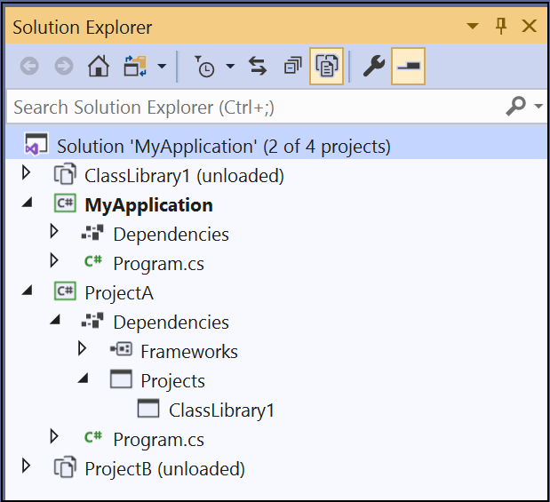

# Solution filters in MSBuild

Solution filter files are JSON files with the extension *.snlf* that indicate which projects to build or load from all the projects in a solution. Starting with MSBuild 16.7, you can invoke MSBuild with the solution filter file to build the solution with filtering enabled. See [Filtered solutions](../ide/filtered-solutions.md).

> [!NOTE]
> As the solution filter file only reduces the set of projects that will be loaded or built and simplifies the format. The solution file is still required.

## Build a solution filter from the command line

Building a solution filter file from the command line uses exactly the same syntax as building a solution file. Specify the solution filter file instead of the solution to build with filtering enabled, as follows:

```console
msbuild solutionFilterFile.slnf
```

You can also append switches and extra properties as normal.

Opening a solution filter in Visual Studio displays the unloaded projects as well as the loaded projects and gives you the option of loading more projects to select them for building. You can load all projects the initial project(s) depend on to build as well, but this is not required. When building a solution filter from the command line, MSBuild automatically follows dependencies. It builds a project if it's specified in the filter, or if it's referenced, directly or indirectly, by a project that's specified in the filter.

## Solution filter file

The filter file is in the JSON format, although it doesn't have a *.json* extension.

The solution filter doesn't have to be in the same folder as the solution. You can use absolute or relative paths. If you use relative paths, the paths are relative to the location of solution filter file. The following example demonstrates the use of relative paths:

```json
{
  "solution": {
    "path": "..\\..\\Documents\\GitHub\\msbuild\\MSBuild.sln",
    "projects": [
      "src\\Build.OM.UnitTests\\Microsoft.Build.Engine.OM.UnitTests.csproj"
    ]
  }
}
```

## Example

Here's an example of a filtered solution in Visual Studio:



In this solution, ClassLibrary1 is used by both ProjectA and ProjectB and so ClassLibrary1 is listed as a project reference.

Here's the solution filter file that Visual Studio generates:

```json
{
  "solution": {
    "path": "MyApplication.sln",
    "projects": [
      "MyApplication\\MyApplication.csproj",
      "ProjectA\\ProjectA.csproj"
    ]
  }
}
```

In this example, when you build with filtering enabled (by using the command `MSBuild [options] Myfilter.slnf`), MSBuild builds MyApplication and ProjectA because they're explicitly listed in the solution filter file, but MSBuild also builds ClassLibrary1, because ProjectA depends on it.  ProjectB is not built. (This discussion assumes a clean build. If projects were built previously, the usual rules apply for skipping projects that are already up-to-date.)

## See also

- [Filtered solutions](../ide/filtered-solutions.md)
- [MSBuild command line reference](msbuild-command-line-reference.md)
