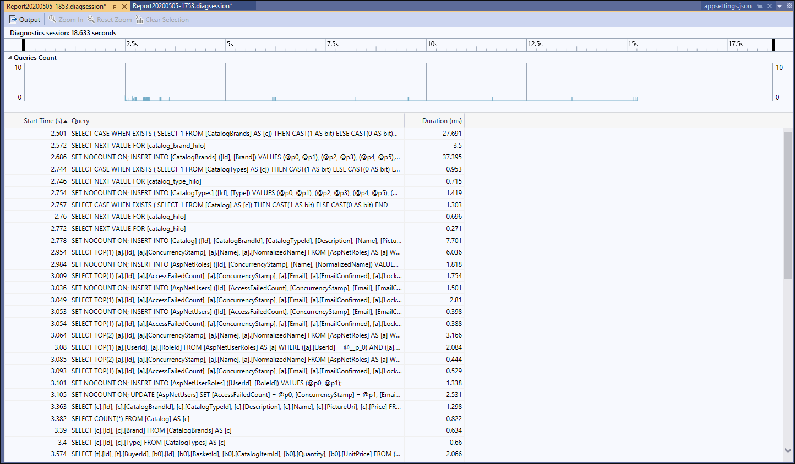
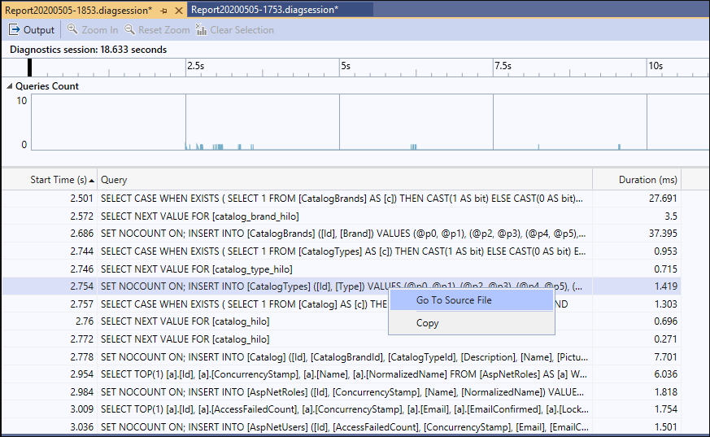

# Analyze database performance using the Database tool

The Database Tool allows you to record the database queries that your application makes during a given diagnostic session. You can then analyze information about individual queries in order to find places where your app's performance can be improved.

>[!NOTE]
> The database tool requires Visual Studio 2019 version 16.3 or higher and a .NET Core project on Windows using either [ADO.NET]( https://docs.microsoft.com/dotnet/framework/data/adonet/ado-net-overview) or [Entity Framework Core](https://docs.microsoft.com/ef/core/).

## Setup

1. Open the Performance Profiler **(Alt + F2)** in Visual Studio.
2. Select the **Database** checkbox.

>[!NOTE]
>If the tool isn't available to click, uncheck every other tool because some tools need to run by themselves. To learn more about running tools together, see "Running tools from CLI"
>If the tool still isn't available, please check that your project meets the requirements above.
Make sure your project is in Release mode to capture the most accurate data.

3. Click the **Start** button to run the tool.

4. Once the tool starts running, go through the desired scenario in your app, then press **Stop Collection** or close your app to see your data.

5. After collection is stopped, you'll see a table of the queries that ran during your profiling session.

The queries will be organized chronologically, but can be sorted by any of the columns (more columns can be enabled by right clicking the column titles). Clicking the Duration column orders the queries from the longest lasting to the shortest, and once you’ve found a query you’d like to investigate, you can right click the query and select **Go to Source File** to see what code is responsible for that query.

Selecting a time range on graph also filters the query table to show only queries that occurred during that time range. This can be especially useful when running this alongside the [CPU Usage tool](https://docs.microsoft.com/visualstudio/profiling/cpu-usage?view=vs-2019).

## See also

- [Optimizing Profiler Settings](../profiling/optimize-profiler-settings.md)
