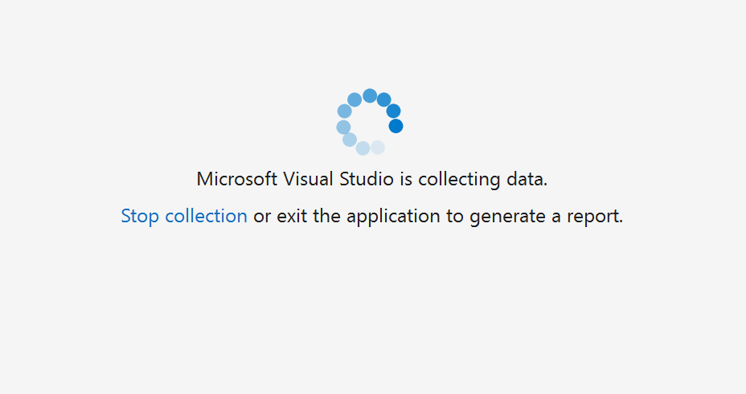
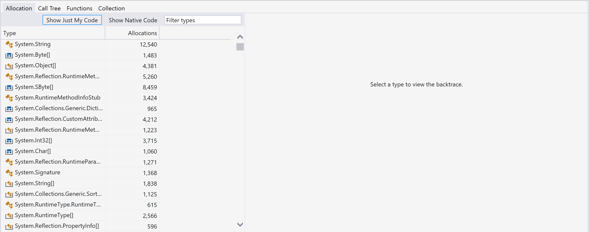
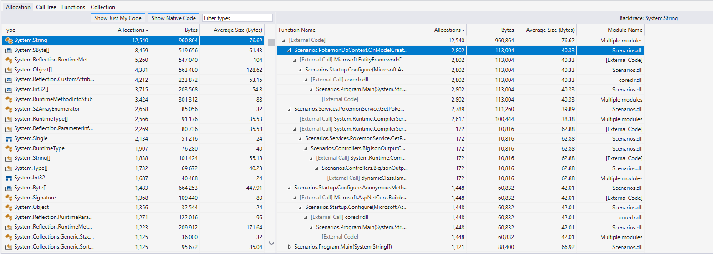
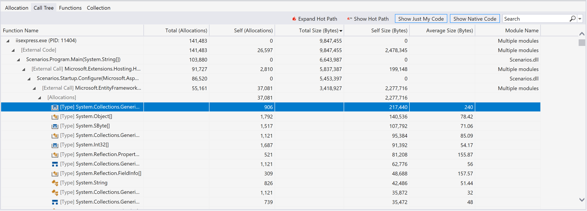
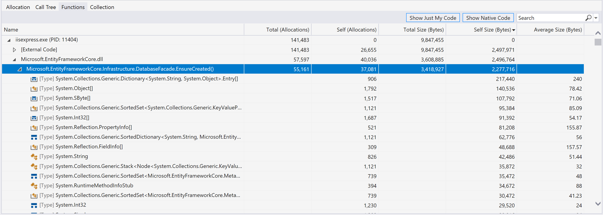

# Analyze memory usage using the .NET Object Allocation tool

You can see how much memory your app is using and what code paths allocate the most memory using the .NET Object Allocation tool.

After running the tool, you can see the function execution paths where objects are being allocated so that you can trace back to the root of the call tree that is taking up the most amount of memory.

## Setup

1. Open the Performance Profiler (**Alt + F2)** in Visual Studio.
2. Select the **.NET Object Allocation Tracking** checkbox.

3. Click the **Start** button to run the tool.

4. Once the tool starts running, go through the desired scenario in your app, then press **Stop Collection** or close your app to see your data.

5. Click on the **Allocation** tab and you should see an image similar to the one shown below.

Congrats! You can now analyze the memory allocation of the objects.

The .NET Object Allocation Tracking tool can slow down the application you are trying to profile during collection. If you find that performance of the .NET Object Allocation Tracking tool or application you are trying to profile is slow, and you don’t necessarily need to track every object, you can adjust the sampling rate to track every Nth object allocated. Click on the gear icon next to the .NET Object Allocation Tracking tool in the profiler summary page.

Adjust the sampling rate to your desired rate. This should help speed up performance of your application during collection and analysis.

For more information on how to make the tool more performant, see [Optimizing Profiler Settings](../profiling/optimizing-profiler-settings.md).

## Understand Your Data

The graphical view shows the live number of objects in your application in the top graph as well as the percentage change of objects in your application in the bottom graph. The red bars in the **Object delta** graph help you denote where garbage collection took place.

You can also select a time range on the graph to filter the tabular data to display the activity for only that specified time range. Furthermore, you can zoom in or out of the graph.

### Allocation

The allocation view allows you to see the location of objects that are allocating memory and how much memory those objects are allocating.

- The **Type** column is a list of various classes and structures that are taking up memory. Double click on a type to view its backtrace (inverted call tree) and see items within that category taking up memory. (**Allocation** view only)
- The **Allocations** column shows the number of objects within a particular allocation type or function that are taking up memory (in the **Allocation**, **Call Tree**, and **Functions View**).
- The **Bytes** and **Average Size (Bytes)** columns are not on by default. To enable them, right click on the **Type**, or **Allocations** columns and then click **Bytes** and **Average Size (Bytes)** options to add them to the chart. The two columns are similar to **Total (Allocations)** and **Self (Allocations)** except that instead of showing the number of objects taking up memory, they show the total amount of memory in bytes that those objects are taking up. (**Allocation** view only)
- The **Module name** column shows the module that contains the function or process that is calling.
- All of these columns are sortable. In the case of the **Type**  or **Modules** column, the items are sorted alphabetically (either forward or backwards). For **Allocations**, **Bytes** and **Average Size (Bytes)**, you can sort numerically (either increasingly or decreasingly).

#### Icons

The following icons are in the Allocation, Call Tree, and Functions Tab:

-  - Value Type (for example, integer)

-  - Value Type Collection (ex: array of integers)
-  - Reference Type (ex: string)
-  - Reference Type Collection (ex: array of strings)

### Call Tree

The **Call Tree** view allows you to see the function execution paths that contain objects allocating a lot of memory.
- The **Function Name** column shows the process or name of the function containing objects allocating memory based on the level of the node you are inspecting.
- The **Total (Allocations)** and **Total Size (Bytes)** columns show the total number of objects allocated and the total amount of memory taken up by a given function and any other functions it calls.
- The **Self (Allocations)** and **Self Size (Bytes)** columns show the total number of objects allocated and the total amount of memory taken up by a single selected function or allocation type.
- The **Average Size (Bytes)** column shows the same information as it did in the **Allocations View**.
- The **Module name** column shows the module that contains the function or process that is calling.

- The **Expand Hot Path** button highlights a function execution pathway that contains a lot of objects that are allocating memory. The algorithm starts at a user-selected node of interest and highlights the path of most allocations, guiding a user in their investigation.
- The **Show Hot Path** button toggles on or off the flame icons that indicate which node are a part of the **Hot Path**.

### Functions

The **Functions** view shows processes, modules, and functions that are allocating memory.

- The **Name** column shows processes as the highest-level nodes. Underneath processes are modules, and under modules are functions.
- The **Total (Allocations)**, **Self (Allocations)**, **Total Size (Bytes)**, **Self Size (Bytes)**, and **Average Size (Bytes)** columns show the same information as they did in the **Allocation** and **Call Tree** views.

### Collection

The collection view allows you to see how many objects were collected during garbage collection and how many were retained. This view also provides a few pie charts to visualize collected and survived objects by type.

- The **Collected** column shows the number of objects that the garbage collector collected.
- The **Survived** column shows the number of objects that survived after the garbage collector was run.

### Filtering Tools

The **Allocations**, **Call Tree**, and **Functions** views all contain the **Show Just My Code**, **Show Native Code**, and **Search** options:

- **Show Just My Code** collapses systems, frameworks, and other non-user code and into **[External Code]** frames so that user-code can be focused on. For more information, see [Debug user code with Just My Code](../debugger/just-my-code.md).
- **Show Native Code** shows native code within the analysis target including non-user code if selected.
- The **Filter box** allows you to filter down the **Name** or **Function name** column based on the parameter you provide. Simply type in the field and the table should filter down to show only types that contain the string provided.
