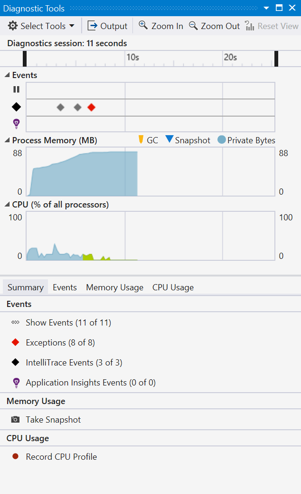
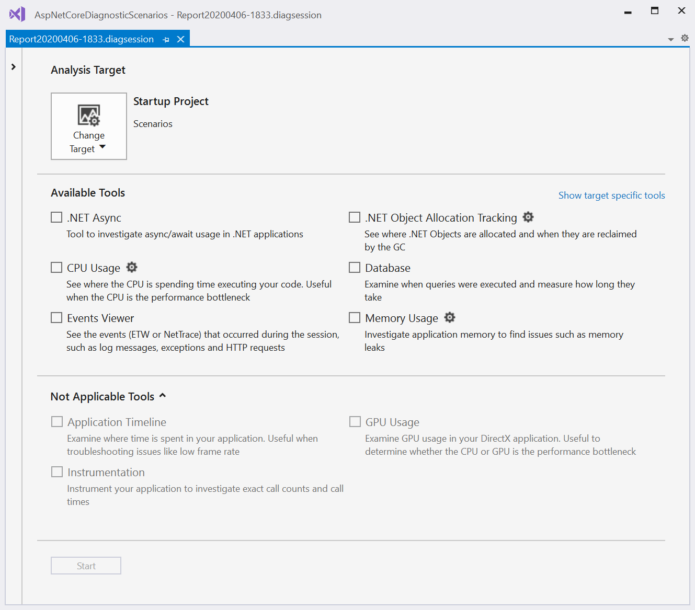

# Run profiling tools with or without the debugger

Visual Studio offers a choice of performance measurement and profiling tools. Some tools, like CPU Usage and Memory Usage, can run with or without the debugger, and on release or debug build configurations. Performance Profiler tools like Application Timeline can run on debug or release builds. Debugger-integrated tools, like the Diagnostic Tools window and Events tab, run only during debugging sessions.

>[!NOTE]
>You can use the non-debugger performance tools with Windows 7 and later. Windows 8 or later is required to run the debugger-integrated profiling tools.

The non-debugger Performance Profiler and the debugger-integrated Diagnostic Tools provide different information and experiences. Debugger-integrated tools show you breakpoints and variable values. Non-debugger tools give you results closer to the end-user experience.

To help decide which tools and results to use, consider the following:

- External performance problems, like file I/O or network responsiveness issues, won't look much different in the debugger or non-debugger tools.
- For problems caused by CPU-intensive calls, there might be considerable performance differences between release and debug builds. Check to see whether the issue exists in release builds.
- If the problem occurs only during debug builds, you probably don't need to run the non-debugger tools. For release build problems, decide whether the debugger tools will help for further investigation.
- Release builds provide optimizations like inlining function calls and constants, pruning unused code paths, and storing variables in ways that can't be used by the debugger. Performance numbers in the debugger-integrated tools are less accurate, because debug builds lack these optimizations.
- The debugger itself changes performance times, as it does necessary debugger operations like intercepting exception and module load events.
- Release build performance numbers in the Performance Profiler tools are the most precise and accurate. Debugger-integrated tool results are most useful to compare with other debugging-related measurements.

## <a name="BKMK_Quick_start__Collect_diagnostic_data"></a> Collect profiling data while debugging

When you start debugging in Visual Studio by selecting **Debug** > **Start Debugging**, or pressing **F5**, the **Diagnostic Tools** window appears by default. To open it manually, select **Debug** > **Windows** > **Show Diagnostic Tools**. The **Diagnostic Tools** window shows information about events, process memory, and CPU usage.



- Use the **Settings** icon in the toolbar to select whether to view **Memory Usage**, **UI Analysis**, and **CPU Usage**.

- Select **Settings** in the **Settings** drop-down list to open the **Diagnostic Tools Property Pages** with more options.

- If you're running Visual Studio Enterprise, you can enable or disable IntelliTrace by going to **Tools** > **Options** > **IntelliTrace**.

The diagnostic session ends when you stop debugging.

### The Events tab

During a debugging session, the Events tab of the Diagnostic Tools window lists the diagnostic events that occur. The category prefixes *Breakpoint*, *File*, and others, let you quickly scan the list for a category, or skip the categories you don't care about.

Use the **Filter** drop-down list to filter events in and out of view, by selecting or clearing specific categories of events.


Use the search box to find a specific string in the event list. Here are the results of a search for the string *name* that matched four events:


For more information, see [Searching and filtering the Events tab of the Diagnostic Tools window](https://devblogs.microsoft.com/devops/searching-and-filtering-the-events-tab-of-the-diagnostic-tools-window/).

## Collect profiling data without debugging

To collect performance data without debugging, you can run the Performance Profiler tools.

1. With a project open in Visual Studio, set the solution configuration to **Release**, and select **Local Windows Debugger** (or **Local Machine**) as the deployment target.

1. Select **Debug** > **Performance Profiler**, or press **Alt**+**F2**.

1. On the diagnostic tools launch page, select one or more tools to run. Only the tools that are applicable to the project type, operating system, and programming language are shown. Select **Show all tools** to also see tools that are disabled for this diagnostic session.

   

1. To start the diagnostic session, select **Start**.

   While the session is running, some tools show graphs of real-time data on the diagnostic tools page, as well as controls to pause and resume data collection.

    

1. To end the diagnostic session, select **Stop Collection**.

   The analyzed data appears on the **Report** page.

You can save the reports, and open them from the **Recently Opened Sessions** list on the Diagnostic Tools launch page.


## Collect profiling data from the command line

To measure performance data from the command line, you can use VSDiagnostics.exe, which is included with either Visual Studio or the Remote Tools. This is useful for capturing performance traces on systems where Visual Studio isn't installed, or for scripting the collection of performance traces. When you use VSDiagnostics.exe, you begin a diagnostic session that captures and stores profiling data until the tool is stopped. At that point, that data is exported into a .diagsession file, and you can open this file in Visual Studio to analyze results.

### Launch an application

1. Open a command prompt, and change to the directory with VSDiagnostics.exe:

```
**Visual Studio Install Folder**\Team Tools\DiagnosticsHub\Collector\
```

2. Start VSDiagnostics.exe with the following command:

```
VSDiagnostics.exe start **id** /launch:**appToLaunch** /loadConfig:**configFile**
```

You must include the following arguments:

- **id**: Identifies the collection session. The ID must be a number between 1-255.
- **appToLaunch**: The executable file to launch and profile.
- **configFile**: The configuration file for the collection agent you want to launch.

3. To stop collection and view your results, follow the steps in the "Stop collection" section later in this article.

### Attach to an existing application

1. Open an application, such as Notepad, and then open **Task Manager** to get its process ID (PID). In Task Manager, find the PID in the **Details** tab.
2. Open a command prompt, and change to the directory with the collection agent executable. Typically, it's here:

```
**Visual Studio installation folder**\2019\Preview\Team Tools\DiagnosticsHub\Collector\
```

3. Start the VSDiagnostics.exe file by typing the following command.

```
VSDiagnostics.exe start **id** /attach:**pid** /loadConfig:**configFile**
```

You must include the following arguments:

- **id**: Identifies the collection session. The ID must be a number between 1-255.
- **pid**: The PID of the process you want to profile, which in this case is the PID you found in step 1.
- **configFile**: The configuration file for the collection agent you want to launch. For more information, see [Configuration files for agents](../profiling/profile-apps-from-command-line.md).

4. To stop collection and view your results, follow the steps in the next section.

### Stop collection

1. Stop the collection session, and send output to a file, by typing the following command.

```
VSDiagnostics.exe stop <id> /output:<path to file>
```

2. Go to the file output from the previous command, and open it in Visual Studio to examine the information collected.

## Agent configuration files

Collection agents are interchangeable components that collect different types of data, depending on what you are trying to measure.
For convenience, you can store that information in an agent configuration file. The configuration file is a .json file that contains, at minimum, the name of the .dll file and its COM CLSID. Here are the example configuration files that you can find in the following folder:

```
<Visual Studio installation folder>\Team Tools\DiagnosticsHub\Collector\AgentConfigs\
```

- CpuUsage configurations (Base/High/Low), which corresponds to data collected for the [CPU Usage](../profiling/cpu-usage.md) profiling tool.
- DotNetObjectAlloc configurations (Base/Low), which corresponds to data collected for the [.NET Object Allocation tool](../profiling/dotnet-alloc-tool.md).

Base/Low/High configurations refer to the sampling rate. For example, Low is 100 samples/second and High is 4000 samples/second.
For the VSDiagnostics.exe tool to work with a collection agent, it requires both a DLL and a COM CLSID for the appropriate agent. The agent might also have additional configuration options. If you use an agent without a configuration file, use the format in the following command:

```
VSDiagnostics.exe start <id> /attach:<pid> /loadAgent:<agentCLSID>;<agentName>[;<config>]
```
