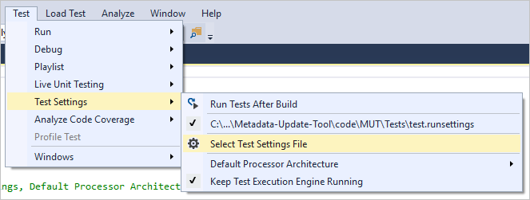
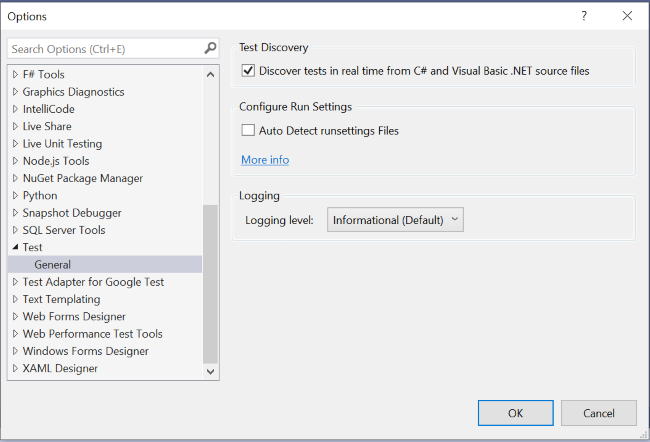
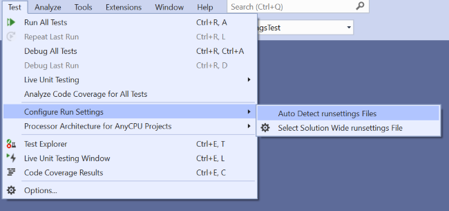
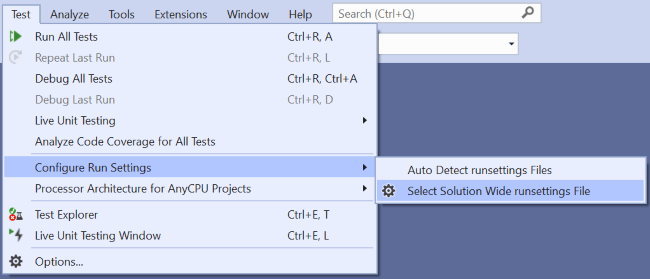

# Configure unit tests by using a *.runsettings* file

Unit tests in Visual Studio can be configured by using a *.runsettings* file. For example, you can change the .NET version on which the tests are run, the directory for the test results, or the data that's collected during a test run. A common use of a *.runsettings* file is to customize [code coverage analysis](../test/customizing-code-coverage-analysis.md).

Run settings files can be used to configure tests that are run from the [command line](vstest-console-options.md), from the IDE, or in a [build workflow](/azure/devops/pipelines/test/getting-started-with-continuous-testing?view=vsts) using Azure Test Plans or Team Foundation Server (TFS).

Run settings files are optional. If you don't require any special configuration, you don't need a *.runsettings* file.

## Create a run settings file and customize it

1. Add a run settings file to your solution. In **Solution Explorer**, on the shortcut menu of your solution, choose **Add** > **New Item**, and select **XML File**. Save the file with a name such as *test.runsettings*.

   > [!TIP]
   > The file name doesn't matter, as long as you use the extension *.runsettings*.

2. Add the content from [Example *.runsettings file](#example-runsettings-file), and then customize it to your needs as described in the sections that follow.

3. Specify the *.runsettings file that you want using one of the following methods:

   - [Visual Studio IDE](#specify-a-run-settings-file-in-the-ide)
   - [Command line](#specify-a-run-settings-file-from-the-command-line)
   - [Build workflow](/azure/devops/pipelines/test/getting-started-with-continuous-testing?view=vsts) using Azure Test Plans or Team Foundation Server (TFS).

4. Run the unit tests to use the custom run settings.

::: moniker range="vs-2017"

If you want to turn the custom settings off and on in the IDE, deselect or select the file in the **Test** > **Test Settings** menu.


::: moniker-end

::: moniker range=">=vs-2019"

If you want to turn the custom settings off and on in the IDE, deselect or select the file on the **Test** menu.

::: moniker-end

> [!TIP]
> You can create more than one *.runsettings* file in your solution and select one as the active test settings file as needed.

## Specify a run settings file in the IDE

The methods available depend on your version of Visual Studio.

::: moniker range="vs-2017"
To specify a run settings file in the IDE, select **Test** > **Test Settings** > **Select Test Settings File**, and then select the *.runsettings* file.



The file appears on the Test Settings menu, and you can select or deselect it. While selected, the run settings file applies whenever you select **Analyze Code Coverage**.
::: moniker-end

::: moniker range=">=vs-2019"

### Visual Studio 2019 version 16.4 and later

There are three ways of specifying a run settings file in Visual Studio 2019 version 16.4 and later.

- [Autodetect the run settings](#autodetect-the-run-settings-file)
- [Manually set the run settings](#manually-select-the-run-settings-file)
- [Set a build property](#set-a-build-property)

#### Autodetect the run settings file

To autodetect the run settings file, place it at the root of your solution.

If auto detection of run settings files is enabled, the settings in this file are applied across all tests run. You can turn on auto detection of runsettings files using two methods:
  
- Select **Tools** > **Options** > **Test** > **Auto Detect runsettings Files**

   
      
- Select **Test** > **Configure Run Settings** > **Auto Detect runsettings Files**
    
   

#### Manually select the run settings file

In the IDE, select **Test** > **Configure Run Settings** > **Select Solution Wide runsettings File**, and then select the *.runsettings* file.

   - This file overrides the *.runsettings* file at the root of the solution, if one is present, and is applied across all tests run.  
   - This file selection only persists locally.



#### Set a build property

Add a build property to a project through either the project file or a Directory.Build.props file. The run settings file for a project is specified by the property **RunSettingsFilePath**.

- Project-level run settings is currently supported in C#, VB, C++, and F# projects.
- A file specified for a project overrides any other run settings file specified in the solution.
- [These MSBuild properties](https://docs.microsoft.com/visualstudio/msbuild/msbuild-reserved-and-well-known-properties?view=vs-2019) can be used to specify the path to the runsettings file. 

Example of specifying a *.runsettings* file for a project:
    
```xml
<Project Sdk="Microsoft.NET.Sdk">
  <PropertyGroup>
    <RunSettingsFilePath>$(MSBuildProjectDirectory)\example.runsettings</RunSettingsFilePath>
  </PropertyGroup>
  ...
</Project>
```

### Visual Studio 2019 version 16.3 and earlier

To specify a run settings file in the IDE, select **Test** > **Select Settings File**. Browse to and select the *.runsettings* file.


The file appears on the Test menu, and you can select or deselect it. While selected, the run settings file applies whenever you select **Analyze Code Coverage**.
::: moniker-end

## Specify a run settings file from the command line

To run tests from the command line, use *vstest.console.exe*, and specify the settings file by using the **/Settings** parameter.

1. Launch the Visual Studio Developer Command Prompt:

   ::: moniker range="vs-2017"

   On the Windows **Start** menu, choose **Visual Studio 2017** > **Developer Command Prompt for VS 2017**.

   ::: moniker-end

   ::: moniker range=">=vs-2019"

   On the Windows **Start** menu, choose **Visual Studio 2019** > **Developer Command Prompt for VS 2019**.

   ::: moniker-end

2. Enter a command similar to:

   ```cmd
   vstest.console.exe MyTestAssembly.dll /EnableCodeCoverage /Settings:CodeCoverage.runsettings
   ```

   or

   ```cmd
   vstest.console.exe --settings:test.runsettings test.dll
   ```

For more information, see [VSTest.Console.exe command-line options](vstest-console-options.md).

## The *.runsettings* file

The *.runsettings file contains different configuration elements within the **RunSettings** element. The sections that follow detail the different elements.

```xml
<?xml version="1.0" encoding="utf-8"?>
<RunSettings>
  <!-- custom configuration -->
</RunSettings>
```

Each of the other elements of the file is optional because it has a default value.

## RunConfiguration element

```xml
<RunConfiguration>
    <MaxCpuCount>1</MaxCpuCount>
    <ResultsDirectory>.\TestResults</ResultsDirectory>
    <TargetPlatform>x86</TargetPlatform>
    <TargetFrameworkVersion>Framework40</TargetFrameworkVersion>
    <TestAdaptersPaths>%SystemDrive%\Temp\foo;%SystemDrive%\Temp\bar</TestAdaptersPaths>
    <TestSessionTimeout>10000</TestSessionTimeout>
</RunConfiguration>
```

The **RunConfiguration** element can include the following elements:

|Node|Default|Values|
|-|-|-|
|**MaxCpuCount**|1|This setting controls the degree of parallel test execution when running unit tests using available cores on the machine. The test execution engine starts as a distinct process on each available core, and gives each core a container with tests to run. A container can be an assembly, DLL, or relevant artifact. The test container is the scheduling unit. In each container, the tests are run according to the test framework. If there are many containers, then as processes finish executing the tests in a container, they're given the next available container.<br /><br />MaxCpuCount can be:<br /><br />n, where 1 <= n <= number of cores: up to n processes are launched<br /><br />n, where n = any other value: the number of processes launched can be up to the number of available cores. For instance, set n=0 to let the platform automatically decide the optimal number of processes to launch based on the environment.|
|**ResultsDirectory**||The directory where test results are placed. The path is relative to the directory that contains .runsettings file.|
|**TargetFrameworkVersion**|Framework40|`FrameworkCore10` for .NET Core sources, `FrameworkUap10` for UWP-based sources, `Framework45` for .NET Framework 4.5 and higher, `Framework40` for .NET Framework 4.0, and `Framework35` for .NET Framework 3.5.<br /><br />This setting specifies the version of the unit test framework used to discover and execute the tests. It can be different from the version of the .NET platform that you specify in the build properties of the unit test project.<br /><br />If you omit the `TargetFrameworkVersion` element from the *.runsettings* file, the platform automatically determines the framework version based on the built binaries.|
|**TargetPlatform**|x86|x86, x64|
|**TreatTestAdapterErrorsAsWarnings**|false|false, true|
|**TestAdaptersPaths**||One or more paths to the directory where the TestAdapters are located|
|**TestSessionTimeout**||Allows users to terminate a test session when it exceeds a given timeout. Setting a timeout ensures that resources are well consumed and test sessions are constrained to a set time. The setting is available in **Visual Studio 2017 version 15.5** and later.|
|**DotnetHostPath**||Specify a custom path to dotnet host that is used to run the testhost. This is useful when you are building your own dotnet, for example when building the dotnet/runtime repository. Specifying this option will skip looking for testhost.exe, and will always use the testhost.dll. 

## DataCollectors element (diagnostic data adapters)

The **DataCollectors** element specifies settings of diagnostic data adapters. Diagnostic data adapters gather additional information about the environment and the application under test. Each adapter has default settings, and you only have to provide settings if you don't want to use the defaults.

### CodeCoverage data collector

The code coverage data collector creates a log of which parts of the application code have been exercised in the test. For detailed information about customizing the settings for code coverage, see [Customize code coverage analysis](../test/customizing-code-coverage-analysis.md).

```xml
<DataCollector friendlyName="Code Coverage" uri="datacollector://Microsoft/CodeCoverage/2.0" assemblyQualifiedName="Microsoft.VisualStudio.Coverage.DynamicCoverageDataCollector, Microsoft.VisualStudio.TraceCollector, Version=11.0.0.0, Culture=neutral, PublicKeyToken=b03f5f7f11d50a3a">
  <Configuration>
    <CodeCoverage>
      <ModulePaths>
        <Exclude>
          <ModulePath>.*CPPUnitTestFramework.*</ModulePath>
        </Exclude>
      </ModulePaths>

      <UseVerifiableInstrumentation>True</UseVerifiableInstrumentation>
      <AllowLowIntegrityProcesses>True</AllowLowIntegrityProcesses>
      <CollectFromChildProcesses>True</CollectFromChildProcesses>
      <CollectAspDotNet>False</CollectAspDotNet>
    </CodeCoverage>
  </CodeCoverage>
</Configuration>
```

### VideoRecorder data collector

The video data collector captures a screen recording when tests are run. This recording is useful for troubleshooting UI tests. The video data collector is available in **Visual Studio 2017 version 15.5** and later. For an example of configuring this data collector, see the [Example *.runsettings file](#example-runsettings-file).

To customize any other type of diagnostic data adapters, use a [test settings file](../test/collect-diagnostic-information-using-test-settings.md).

### Blame data collector

This option can help you isolate a problematic test that causes a test host crash. Running the collector creates an output file (*Sequence.xml*) in *TestResults*, which captures the order of execution of the test before the crash. 

```xml
<DataCollector friendlyName="blame" enabled="True">
</DataCollector>
```

## TestRunParameters element

```xml
<TestRunParameters>
    <Parameter name="webAppUrl" value="http://localhost" />
    <Parameter name="docsUrl" value="https://docs.microsoft.com" />
</TestRunParameters>
```

Test run parameters provide a way to define variables and values that are available to the tests at run time. Access the parameters using the <xref:Microsoft.VisualStudio.TestTools.UnitTesting.TestContext.Properties%2A?displayProperty=nameWithType> property:

```csharp
[TestMethod]
public void HomePageTest()
{
    string appURL = TestContext.Properties["webAppUrl"];
}
```

To use test run parameters, add a private <xref:Microsoft.VisualStudio.TestTools.UnitTesting.TestContext> field and a public <xref:Microsoft.VisualStudio.TestTools.UnitTesting.TestContext> property to your test class.

## LoggerRunSettings element

The `LoggerRunSettings` section defines one or more loggers to be used for the test run. The most common loggers are console, Visual Studio Test Results File (trx), and html.

```xml
<LoggerRunSettings>
    <Loggers>        
      <Logger friendlyName="console" enabled="True">
        <Configuration>
            <Verbosity>quiet</Verbosity>
        </Configuration>
      </Logger>
      <Logger friendlyName="trx" enabled="True">
        <Configuration>
          <LogFileName>foo.trx</LogFileName>
        </Configuration>
      </Logger>
      <Logger friendlyName="html" enabled="True">
        <Configuration>
          <LogFileName>foo.html</LogFileName>
        </Configuration>
      </Logger>
    </Loggers>
  </LoggerRunSettings>
```

## MSTest element

These settings are specific to the test adapter that runs test methods that have the <xref:Microsoft.VisualStudio.TestTools.UnitTesting.TestMethodAttribute> attribute.

```xml
<MSTest>
    <MapInconclusiveToFailed>True</MapInconclusiveToFailed>
    <CaptureTraceOutput>false</CaptureTraceOutput>
    <DeleteDeploymentDirectoryAfterTestRunIsComplete>False</DeleteDeploymentDirectoryAfterTestRunIsComplete>
    <DeploymentEnabled>False</DeploymentEnabled>
    <AssemblyResolution>
      <Directory Path="D:\myfolder\bin\" includeSubDirectories="false"/>
    </AssemblyResolution>
</MSTest>
```

|Configuration|Default|Values|
|-|-|-|
|**ForcedLegacyMode**|false|In Visual Studio 2012, the MSTest adapter was optimized to make it faster and more scalable. Some behavior, such as the order in which tests are run, might not be exactly as it was in previous editions of Visual Studio. Set this value to **true** to use the older test adapter.<br /><br />For example, you might use this setting if you have an *app.config* file specified for a unit test.<br /><br />We recommend that you consider refactoring your tests to allow you to use the newer adapter.|
|**IgnoreTestImpact**|false|The test impact feature prioritizes tests that are affected by recent changes, when run in MSTest or from Microsoft Test Manager (deprecated in Visual Studio 2017). This setting deactivates the feature. For more information, see [Which tests should be run since a previous build](https://msdn.microsoft.com/library/dd286589).|
|**SettingsFile**||You can specify a test settings file to use with the MSTest adapter here. You can also specify a test settings file [from the settings menu](#specify-a-run-settings-file-in-the-ide).<br /><br />If you specify this value, you must also set the **ForcedlegacyMode** to **true**.<br /><br />`<ForcedLegacyMode>true</ForcedLegacyMode>`|
|**KeepExecutorAliveAfterLegacyRun**|false|After a test run is completed, MSTest is shut down. Any process that is launched as part of the test is also killed. If you want to keep the test executor alive, set the value to **true**. For example, you could use this setting to keep the browser running between coded UI tests.|
|**DeploymentEnabled**|true|If you set the value to **false**, deployment items that you've specified in your test method aren't copied to the deployment directory.|
|**CaptureTraceOutput**|true|You can write to the debug trace from your test method using <xref:System.Diagnostics.Trace.WriteLine%2A?displayProperty=nameWithType>.|
|**DeleteDeploymentDirectoryAfterTestRunIsComplete**|true|To retain the deployment directory after a test run, set this value to **false**.|
|**MapInconclusiveToFailed**|false|If a test completes with an inconclusive status, it is mapped to the skipped status in **Test Explorer**. If you want inconclusive tests to be shown as failed, set the value to **true**.|
|**InProcMode**|false|If you want your tests to be run in the same process as the MSTest adapter, set this value to **true**. This setting provides a minor performance gain. But if a test exits with an exception, the remaining tests don't run.|
|**AssemblyResolution**|false|You can specify paths to additional assemblies when finding and running unit tests. For example, use these paths for dependency assemblies that aren't in the same directory as the test assembly. To specify a path, use a **Directory Path** element. Paths can include environment variables.<br /><br />`<AssemblyResolution>  <Directory Path="D:\myfolder\bin\" includeSubDirectories="false"/> </AssemblyResolution>`|

## Example *.runsettings* file

The following XML shows the contents of a typical *.runsettings* file. Copy this code and edit it to suit your needs.

Each element of the file is optional because it has a default value.

```xml
<?xml version="1.0" encoding="utf-8"?>
<RunSettings>
  <!-- Configurations that affect the Test Framework -->
  <RunConfiguration>
    <MaxCpuCount>1</MaxCpuCount>
    <!-- Path relative to directory that contains .runsettings file-->
    <ResultsDirectory>.\TestResults</ResultsDirectory>

    <!-- x86 or x64 -->
    <!-- You can also change it from the Test menu; choose "Processor Architecture for AnyCPU Projects" -->
    <TargetPlatform>x86</TargetPlatform>

    <!-- Framework35 | [Framework40] | Framework45 -->
    <TargetFrameworkVersion>Framework40</TargetFrameworkVersion>

    <!-- Path to Test Adapters -->
    <TestAdaptersPaths>%SystemDrive%\Temp\foo;%SystemDrive%\Temp\bar</TestAdaptersPaths>

    <!-- TestSessionTimeout was introduced in Visual Studio 2017 version 15.5 -->
    <!-- Specify timeout in milliseconds. A valid value should be greater than 0 -->
    <TestSessionTimeout>10000</TestSessionTimeout>
  </RunConfiguration>

  <!-- Configurations for data collectors -->
  <DataCollectionRunSettings>
    <DataCollectors>
      <DataCollector friendlyName="Code Coverage" uri="datacollector://Microsoft/CodeCoverage/2.0" assemblyQualifiedName="Microsoft.VisualStudio.Coverage.DynamicCoverageDataCollector, Microsoft.VisualStudio.TraceCollector, Version=11.0.0.0, Culture=neutral, PublicKeyToken=b03f5f7f11d50a3a">
        <Configuration>
          <CodeCoverage>
            <ModulePaths>
              <Exclude>
                <ModulePath>.*CPPUnitTestFramework.*</ModulePath>
              </Exclude>
            </ModulePaths>

            <!-- We recommend you do not change the following values: -->
            <UseVerifiableInstrumentation>True</UseVerifiableInstrumentation>
            <AllowLowIntegrityProcesses>True</AllowLowIntegrityProcesses>
            <CollectFromChildProcesses>True</CollectFromChildProcesses>
            <CollectAspDotNet>False</CollectAspDotNet>

          </CodeCoverage>
        </Configuration>
      </DataCollector>

      <DataCollector uri="datacollector://microsoft/VideoRecorder/1.0" assemblyQualifiedName="Microsoft.VisualStudio.TestTools.DataCollection.VideoRecorder.VideoRecorderDataCollector, Microsoft.VisualStudio.TestTools.DataCollection.VideoRecorder, Version=15.0.0.0, Culture=neutral, PublicKeyToken=b03f5f7f11d50a3a" friendlyName="Screen and Voice Recorder">
        <!--Video data collector was introduced in Visual Studio 2017 version 15.5 -->
        <Configuration>
          <!-- Set "sendRecordedMediaForPassedTestCase" to "false" to add video attachments to failed tests only -->
          <MediaRecorder sendRecordedMediaForPassedTestCase="true"  xmlns="">           ​
            <ScreenCaptureVideo bitRate="512" frameRate="2" quality="20" />​
          </MediaRecorder>​
        </Configuration>
      </DataCollector>

      <!-- Configuration for blame data collector -->
      <DataCollector friendlyName="blame" enabled="True">
      </DataCollector>

    </DataCollectors>
  </DataCollectionRunSettings>

  <!-- Parameters used by tests at run time -->
  <TestRunParameters>
    <Parameter name="webAppUrl" value="http://localhost" />
    <Parameter name="webAppUserName" value="Admin" />
    <Parameter name="webAppPassword" value="Password" />
  </TestRunParameters>
  
  <!-- Configuration for loggers -->
  <LoggerRunSettings>
    <Loggers>      
      <Logger friendlyName="console" enabled="True">
        <Configuration>
            <Verbosity>quiet</Verbosity>
        </Configuration>
      </Logger>
      <Logger friendlyName="trx" enabled="True">
        <Configuration>
          <LogFileName>foo.trx</LogFileName>
        </Configuration>
      </Logger>
      <Logger friendlyName="html" enabled="True">
        <Configuration>
          <LogFileName>foo.html</LogFileName>
        </Configuration>
      </Logger>
      <Logger friendlyName="blame" enabled="True" />
    </Loggers>
  </LoggerRunSettings>

  <!-- Adapter Specific sections -->

  <!-- MSTest adapter -->
  <MSTest>
    <MapInconclusiveToFailed>True</MapInconclusiveToFailed>
    <CaptureTraceOutput>false</CaptureTraceOutput>
    <DeleteDeploymentDirectoryAfterTestRunIsComplete>False</DeleteDeploymentDirectoryAfterTestRunIsComplete>
    <DeploymentEnabled>False</DeploymentEnabled>
    <AssemblyResolution>
      <Directory path="D:\myfolder\bin\" includeSubDirectories="false"/>
    </AssemblyResolution>
  </MSTest>

</RunSettings>
```

## Specify environment variables in the *.runsettings* file

Environment variables can be set in the *.runsettings* file, which can directly interact with the test host. Specifying environment variables in the *.runsettings* file is necessary to support nontrivial projects that require setting environment variables like *DOTNET_ROOT*. These variables are set while spawning the test host process and they are available in the host.

### Example

The following code is a sample *.runsettings* file that passes environment variables:

```xml
<?xml version="1.0" encoding="utf-8"?>
<!-- File name extension must be .runsettings -->
<RunSettings>
  <RunConfiguration>
    <EnvironmentVariables>
      <!-- List of environment variables we want to set-->
      <DOTNET_ROOT>C:\ProgramFiles\dotnet</DOTNET_ROOT>
      <SDK_PATH>C:\Codebase\Sdk</SDK_PATH>
    </EnvironmentVariables>
  </RunConfiguration>
</RunSettings>
```

The **RunConfiguration** node should contain an **EnvironmentVariables** node. An environment variable can be specified as an element name and its value.

> [!NOTE]
> Because these environment variables should always be set when the test host is started, the tests should always run in a separate process. For this, the */InIsolation* flag will be set when there are environment variables so that the test host is always invoked.

## See also

- [Configure a test run](https://github.com/microsoft/vstest-docs/blob/master/docs/configure.md)
- [Customize code coverage analysis](../test/customizing-code-coverage-analysis.md)
- [Visual Studio test task (Azure Test Plans)](/azure/devops/pipelines/tasks/test/vstest?view=vsts)

