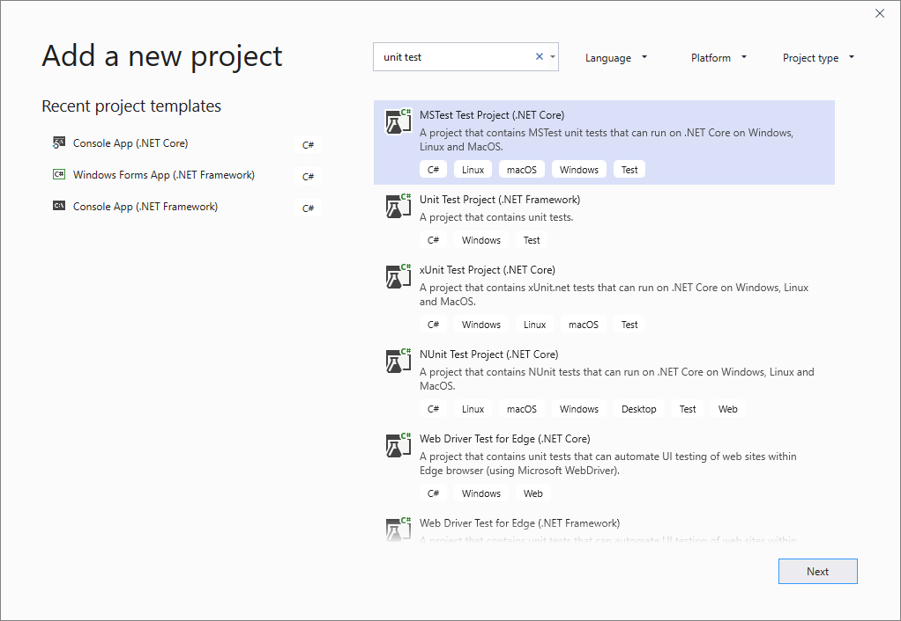
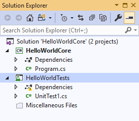
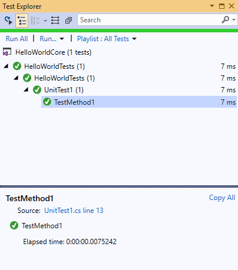
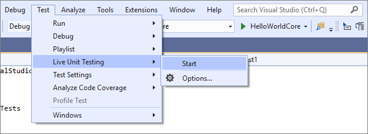

# Get started with unit testing

Use Visual Studio to define and run unit tests to maintain code health, ensure code coverage, and find errors and faults before your customers do. Run your unit tests frequently to make sure your code is working properly.

## Create unit tests

This section describes at a high level how to create a unit test project.

> [!TIP]
> The project under test, "HelloWorld", is an example project and no code for it is intended to be shown. If you want to create a "HelloWorld" project to test, see [Create your first C# console app](../ide/quickstart-csharp-console.md). For a complete walkthrough article, see [Create and run unit tests for managed code](walkthrough-creating-and-running-unit-tests-for-managed-code.md).

1. Open the project that you want to test in Visual Studio.

1. In **Solution Explorer**, select the solution node. Then, from the top menu bar, select **File** > **Add** > **New Project**.

1. Find a unit test project for the test framework you want to use and select it.

   ::: moniker range=">=vs-2019"

   

   Click **Next**, choose a name for the test project, and then click **Create**.

   ::: moniker-end

   The project is added to your solution.

   

1. In the unit test project, add a reference to the project you want to test by right-clicking on **References** or **Dependencies** and then choosing **Add Reference**.

1. Select the project that contains the code you'll test and click **OK**.

   

1. Code your unit test.

   

## Run unit tests

1. Open **Test Explorer** by choosing **Test** > **Windows** > **Test Explorer** from the top menu bar.

1. Run your unit tests by clicking **Run All**.

   

   After the test has completed, a green check mark indicates that the test passed.

   

## View live unit test results

If you are using the MSTest, xUnit, or NUnit testing framework in Visual Studio 2017 or later, you can see live results of your unit tests.

> [!NOTE]
> Live unit testing is available in Enterprise edition only.

1. Turn live unit testing from the **Test** menu by choosing **Test** > **Live Unit Testing** > **Start**.

   ::: moniker rane="vs-2017"

   

   ::: moniker-end

   ::: moniker rane=">=vs-2019"

   

   ::: moniker-end

1. View the results of the tests within the code editor window as you write and edit code.

   

1. Click a test result indicator to see more information, such as the names of the tests that cover that method.

   

For more information about live unit testing, see [Live unit testing](../test/live-unit-testing-intro.md).

## Generate unit tests with IntelliTest

When you run IntelliTest, you can see which tests are failing and add any necessary code to fix them. You can select which of the generated tests to save into a test project to provide a regression suite. As you change your code, rerun IntelliTest to keep the generated tests in sync with your code changes. To learn how, see [Generate unit tests for your code with IntelliTest](../test/generate-unit-tests-for-your-code-with-intellitest.md).

> [!TIP]
> IntelliTest is only available for C# code that targets the .NET Framework.

## Run unit tests with Test Explorer

Use **Test Explorer** to run unit tests from Visual Studio or third-party unit test projects, group tests into categories, filter the test list, and create, save, and run playlists of tests. You can also debug tests and analyze test performance and code coverage. To learn how, see [Run unit tests with Test Explorer](../test/run-unit-tests-with-test-explorer.md).

## Use code coverage to determine how much code is being tested

To determine what proportion of your project's code is actually being tested by coded tests such as unit tests, you can use the code coverage feature of Visual Studio. To guard effectively against bugs, your tests should exercise a large proportion of your code. To learn how, see [Use code coverage to determine how much code is being tested](../test/using-code-coverage-to-determine-how-much-code-is-being-tested.md).

## Use a different unit test framework

You can run unit tests in Visual Studio by using third-party test frameworks such as Boost, Google, and NUnit. Use the plug-in for the framework so that Visual Studio's test runner can work with that framework.

Following are the steps to enable a third-party test framework:

1. Create a class library project and add it to your solution. This project will contain your test code.

   

5. Install the plug-in.

   In **Solution Explorer**, select the class library project, and then choose **Manage NuGet Packages** from its right-click or context menu.

   

6. In the **NuGet Package Manager** window, search for and select the plug-in, and then choose **Install**.

   

   The framework is referenced in your project.

   

7. Add a reference from the class library (test) project to the project that contains the code you want to test.

9. Code your unit test.

   

## See also

* [Walkthrough: Create and run unit tests for managed code](walkthrough-creating-and-running-unit-tests-for-managed-code.md)
* [Create Unit Tests command](create-unit-tests-menu.md)
* [Generate tests with IntelliTest](generate-unit-tests-for-your-code-with-intellitest.md)
* [Run tests with Test Explorer](run-unit-tests-with-test-explorer.md)
* [Determine code coverage](using-code-coverage-to-determine-how-much-code-is-being-tested.md)
* [Improve code quality](improve-code-quality.md)