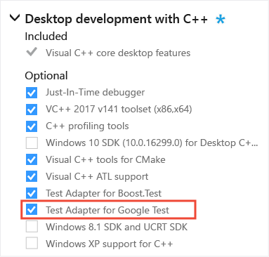
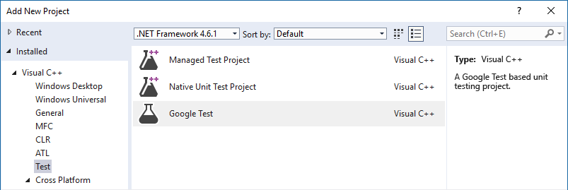
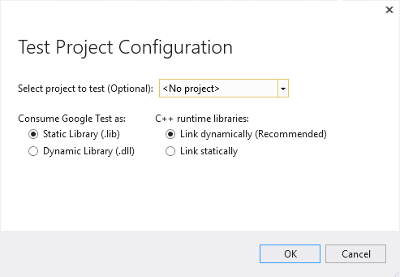
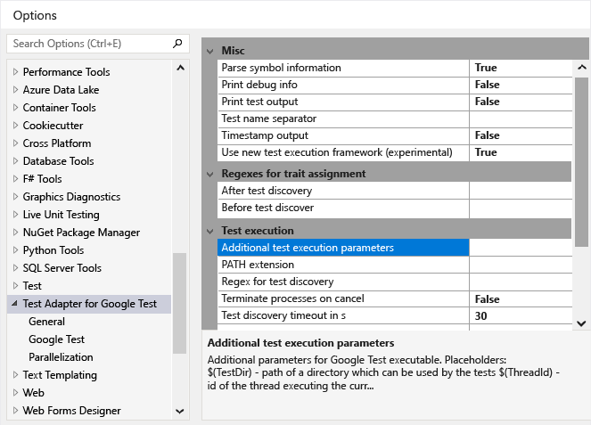

# How to use Google Test for C++ in Visual Studio
In **Visual Studio 2017 version 15.5** and later, Google Test is integrated into the Visual Studio IDE as a default component of the **Desktop Development with C++** workload. To verify that it is installed on your machine, open the Visual Studio Installer and find Google Test under the list of workload components:

## Add a Google Test project to the solution
1. In **Solution Explorer**, right-click on the solution node and choose **Add** > **New Project**.
2. In the left pane, choose **Visual C++** > **Test** and then choose **Google Test Project** in the center pane.
3. Give the test project a name and click **OK**.

## Configure the test project
In the **Test Project Configuration** dialog that appears, you can choose the project you want to test. When you choose a project, Visual Studio adds a reference to the selected project. If you choose no project, then you need to manually add references to the project(s) you want to test. When choosing between static and dynamic linking to the Google Test binaries, the considerations are the same as for any C++ program. For more information, see [DLLs in Visual C++](/cpp/build/dlls-in-visual-cpp).

 

## Set additional options
From the main menu, choose **Tools** > **Options** > **Test Adapter for Google Test** to set additional options. See the Google Test documentation for more information about these settings.

 

## Add include directives
In your test *.cpp* file, add any needed `#include` directives to make your program's types and functions visible to the test code. Typically, the program is up one level in the folder hierarchy. If you type `#include "../"`
an IntelliSense window will appear and enable you to select the full path to the header file.

## Write and run tests
You are now ready to write and run Google Tests. See the [Google Test primer](https://github.com/google/googletest/blob/master/googletest/docs/primer.md) for information about the test macros. See [Run unit tests with Test Explorer](run-unit-tests-with-test-explorer.md) for information about discovering, running, and grouping your tests by using **Test Explorer**.

## See also
[Write unit tests for C/C++](writing-unit-tests-for-c-cpp.md)
