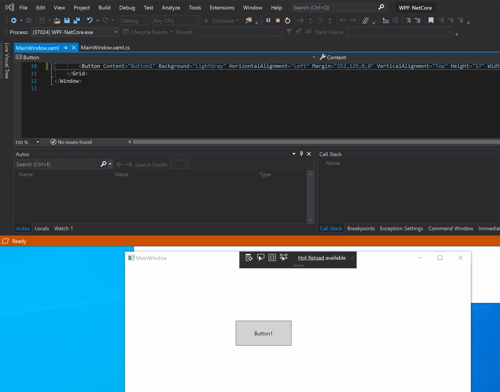

# Write and debug running XAML code with XAML Hot Reload in Visual Studio

XAML Hot Reload helps you build your WPF or UWP app user interface (UI) by letting you make changes to XAML code while your app is running. Hot Reload is available in both Visual Studio and Blend for Visual Studio. This feature enables you to incrementally build and test XAML code with the benefit of the running app's data context, authentication state, and other real-world complexity that's hard to simulate during design-time. If you need help troubleshooting XAML Hot Reload, see [Troubleshooting XAML Hot Reload](xaml-hot-reload-troubleshooting.md) instead.

> [!NOTE]
> If you are using Xamarin.Forms, see [XAML Hot Reload for Xamarin.Forms](/xamarin/xamarin-forms/xaml/hot-reload).

XAML Hot Reload is especially helpful in these scenarios:

* Fixing UI problems found in your XAML code after the app was started in debug mode.

* Building a new UI component for an app that is under development, while taking advantage of your app's runtime context.

|Supported Application Types|Operating System and Tools|
|-|-|-|
|Windows Presentation Foundation (WPF) |.NET Framework 4.6+ and .NET Core Windows 7 and above |
|Universal Windows apps (UWP)|Windows 10 and above, with the [Windows 10 SDK](https://developer.microsoft.com/windows/downloads/windows-10-sdk) 14393+ |

The following illustration shows the use of the Live Visual Tree to open your source code, and then XAML Hot Reload to change the button text and button color.

> [!NOTE]
> Visual Studio XAML Hot Reload is currently only supported when running your application in Visual Studio or Blend for Visual Studio with the debugger attached (**F5** or **Start debugging**). You can't enable this experience by using [Attach to process](../debugger/attach-to-running-processes-with-the-visual-studio-debugger.md) unless you [manually set an environment variable](xaml-hot-reload-troubleshooting.md#verify-that-you-use-start-debugging-rather-than-attach-to-process).

## Known limitations

The following are known limitations of XAML Hot Reload. To work around any limitation that you run into, just stop the debugger, and then complete the operation.

|Limitation|WPF|UWP|Notes|
|-|-|-|-|
|Wiring events to controls while the app is running|Not Supported|Not supported|See error: *Ensure Event Failed*. Note that in WPF you can reference an existing event handler. In UWP apps, referencing an existing event handler is not supported.|
|Creating resource objects in a resource dictionary such as those in your app's Page/Window or *App.xaml*|Supported starting in Visual Studio 2019 Update 2|Supported|Example: adding a `SolidColorBrush` into a resource dictionary for use as a `StaticResource`. Note: Static resources, style converters, and other elements written into a resource dictionary can be applied/used while using XAML Hot Reload. Only the creation of the resource is not supported.  Changing the resource dictionary `Source` property.|
|Adding new controls, classes, windows, or other files to your project while the app is running|Not Supported|Not Supported|None|
|Managing NuGet packages (adding/removing/updating packages)|Not Supported|Not Supported|None|
|Changing data binding that uses the {x:Bind} markup extension|N/A|Supported starting in Visual Studio 2019|This requires Windows 10 version 1809 (build 10.0.17763). Not supported in Visual Studio 2017 or previous versions.|
|Changing x:Uid directives is not supported|N/A|Not Supported|None|
|Multiple processes | Not Supported | Not Supported | Hot reload can only be used against 1 process at a time. |

## Error messages

You may come across the following errors while using XAML Hot Reload.

|Error message|Description|
|-|-|
|Ensure Event Failed|Error indicates you are attempting to wire an event to one of your controls, which isn't supported while your application is running.|
|This change is not supported by XAML Hot Reload and will not be applied during the debugging session.|Error indicates that the change you are attempting is not supported by XAML Hot Reload. Stop the debugging session, make the change, and then restart the debugging session. If you find an unsupported scenario that you'd like to see supported, use our new "Suggest a feature" option in the [Visual Studio Developer Community](https://developercommunity.visualstudio.com/spaces/8/index.html). |

## See also

* [Troubleshooting XAML Hot Reload](xaml-hot-reload-troubleshooting.md)
* [XAML Hot Reload for Xamarin.Forms](/xamarin/xamarin-forms/xaml/hot-reload)
* [Edit and Continue (Visual C#)](../debugger/edit-and-continue-visual-csharp.md)
