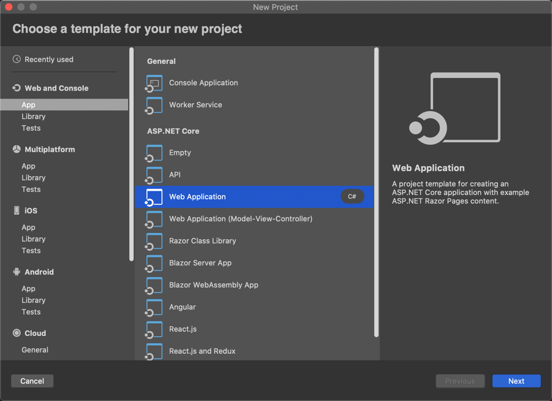
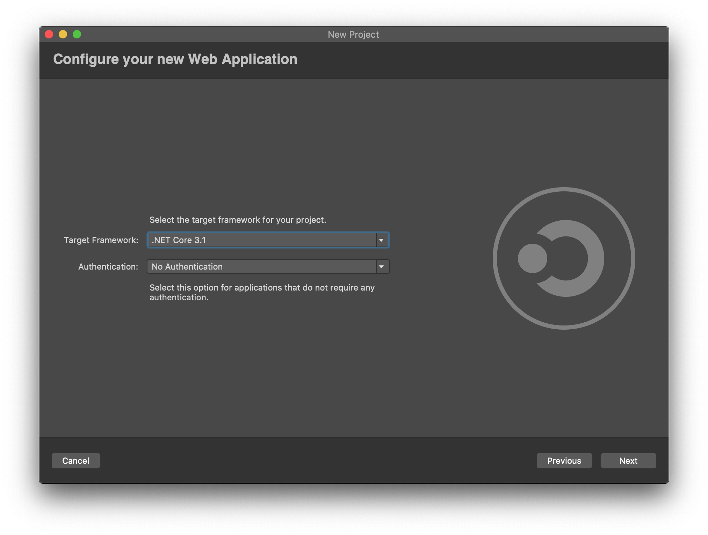
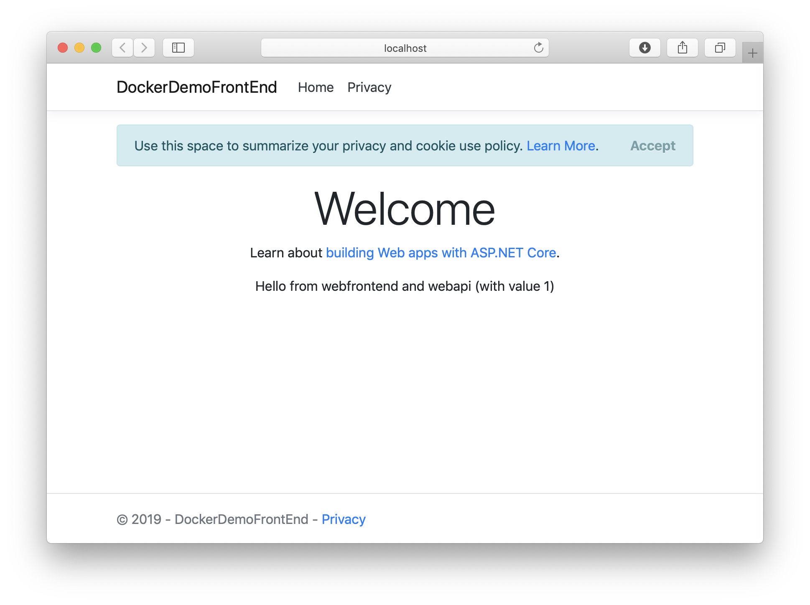

# Create a Multi-Container App with Docker Compose

In this tutorial, you'll learn how to manage more than one container and communicate between them when using Docker Compose in Visual Studio for Mac.

## Prerequisites

* [Docker Desktop](https://hub.docker.com/editions/community/docker-ce-desktop-mac)
* [Visual Studio for Mac 2019](https://visualstudio.microsoft.com/vs/mac)

## Create an ASP.NET Core Web Application and Add Docker Support

1. Create a new solution by going to **File > New Solution**.
1. Under **Web and Console > App** choose the **Web Application** template:

1. Select the target framework. In this example we will use .NET Core 3.1:

1. Enter the project details, such as Project Name (_DockerDemoFrontEnd_ in this example) and Solution Name (_DockerDemo_). The created project contains all the basics you need to build and run an ASP.NET Core web site.
1. In the Solution Pad, right click the DockerDemoFrontEnd project and select **Add > Add Docker Support**:


Visual Studio for Mac will automatically add a new project to your solution called **docker-compose** and add a **Dockerfile** to your existing project.

## Create an ASP.NET Core Web API and Add Docker Support

Next we will create a second project which will act as our backend API. The **.NET Core API** template includes a controller that allows us to handle RESTful requests.

1. Add a new project to the existing solution by right-clicking on the solution and choosing **Add > Add New Project**.
1. Under **Web and Console > App** choose the **API** template.
1. Select the target framework. In this example we will use .NET Core 3.1.
1. Enter the project details, such as Project Name (_DockerDemoAPI_ in this example).
1. Once created, go to the Solution Pad and right click the DockerDemoAPI project and select **Add > Add Docker Support**.

The **docker-compose.yml** file in the **docker-compose** project will be automatically updated to include the API project alongside the existing Web App project. When we build and run the **docker-compose** project, each of these projects will be deployed to a separate Docker container.

```
version: '3.4'

services:
  dockerdemofrontend:
    image: ${DOCKER_REGISTRY-}dockerdemofrontend
    build:
      context: .
      dockerfile: DockerDemoFrontEnd/Dockerfile

  dockerdemoapi:
    image: ${DOCKER_REGISTRY-}dockerdemoapi
    build:
      context: .
      dockerfile: DockerDemoAPI/Dockerfile
```

## Integrate The Two Containers

We now have two ASP.NET projects in our solution and both are configured with Docker support. Next we need to add some code!

1. In the `DockerDemoFrontEnd` project, open the *Pages/Index.cshtml.cs* file, and replace the `OnGet` method with the following code:

   ```csharp
    public async Task OnGet()
    {
       ViewData["Message"] = "Hello from webfrontend";

       using (var client = new System.Net.Http.HttpClient())
       {
          // Call *mywebapi*, and display its response in the page
          var request = new System.Net.Http.HttpRequestMessage();
          request.RequestUri = new Uri("http://mywebapi/WeatherForecast"); // ASP.NET 3 (VS 2019 only)
          // request.RequestUri = new Uri("http://mywebapi/api/values/1"); // ASP.NET 2.x
          var response = await client.SendAsync(request);
          ViewData["Message"] += " and " + await response.Content.ReadAsStringAsync();
       }
    }
   ```
   
    > [!NOTE]
    > In real-world code, you shouldn't dispose `HttpClient` after every request. For best practices, see [Use HttpClientFactory to implement resilient HTTP requests](https://docs.microsoft.com/dotnet/architecture/microservices/implement-resilient-applications/use-httpclientfactory-to-implement-resilient-http-requests).

   For .NET Core 3.1 in Visual Studio 2019 for Mac or later, the Web API template uses a WeatherForecast API, so uncomment that line and comment out the line for ASP.NET 2.x.

1. In the *Index.cshtml* file, add a line to display `ViewData["Message"]` so that the file looks like the following code:

      ```cshtml
      @page
      @model IndexModel
      @{
          ViewData["Title"] = "Home page";
      }

      <div class="text-center">
          <h1 class="display-4">Welcome</h1>
          <p>Learn about <a href="https://docs.microsoft.com/aspnet/core">building Web apps with ASP.NET Core</a>.</p>
          <p>@ViewData["Message"]</p>
      </div>
      ```

1. (ASP.NET 2.x only) Now in the Web API project, add code to the Values controller to customize the message returned by the API for the call you added from *webfrontend*:

      ```csharp
        // GET api/values/5
        [HttpGet("{id}")]
        public ActionResult<string> Get(int id)
        {
            return "webapi (with value " + id + ")";
        }
      ```

With .NET Core 3.1, you don't need this, because you can use the WeatherForecast API that is already there. However, you need to comment out the call to <xref:Microsoft.AspNetCore.Builder.HttpsPolicyBuilderExtensions.UseHttpsRedirection*>  in the `Configure` method in *Startup.cs*, because this code uses HTTP, not HTTPS, to call the Web API.

    ```csharp
                //app.UseHttpsRedirection();
    ```

1. Set the `docker-compose` project as the startup project and go to **Run > Start Debugging**. If everything is configured correctly, you see the message "Hello from webfrontend and webapi (with value 1).":


