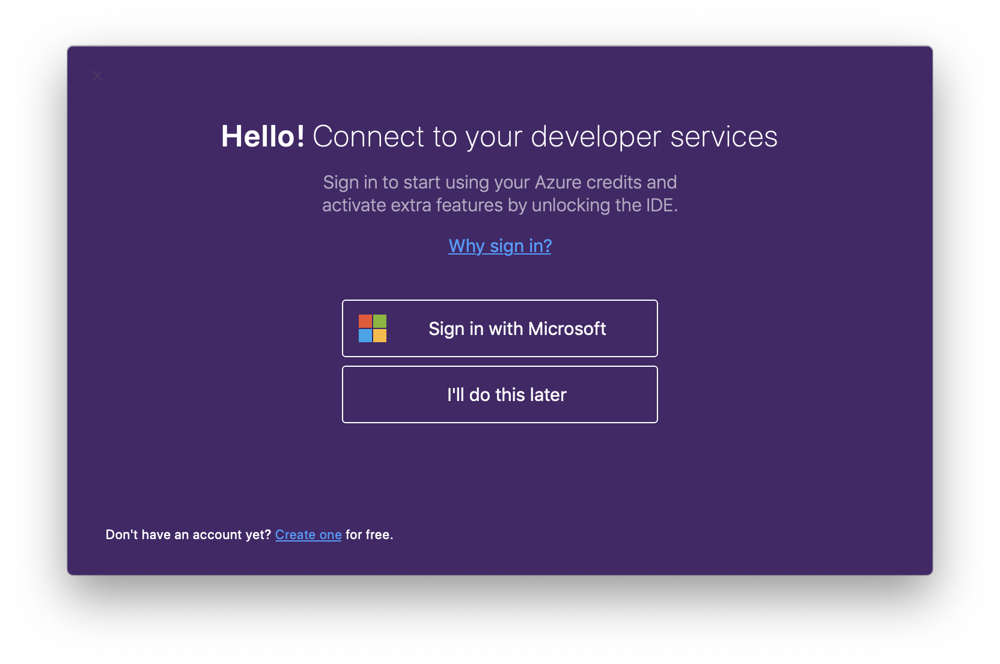
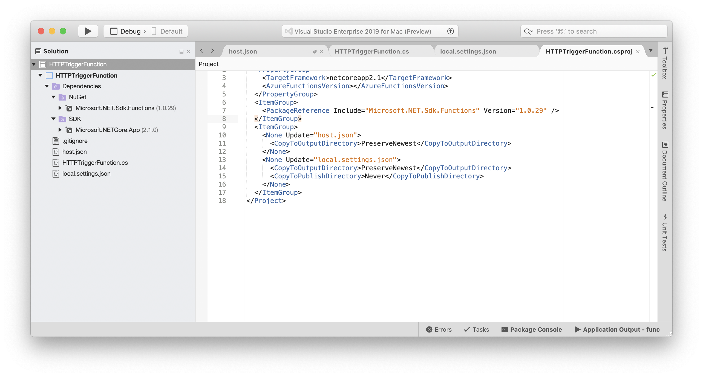
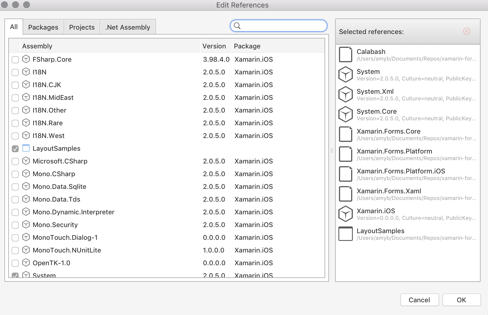

# Visual Studio 2019 for Mac tour

Visual Studio for Mac is a .NET _integrated development environment_ on the Mac that can be used to edit, debug, and build code and then publish an app. In addition to expected features, such as a standard editor and debugger, Visual Studio for Mac includes compilers, code completion tools, graphical designers, and source control to ease the software development process.

Visual Studio for Mac supports many of the same file types as its Windows counterpart, such as `.csproj`, `.fsproj`, or `.sln` files, and supports features such as EditorConfig, meaning that you can use the IDE that works best for you.
Creating, opening, and developing an app will be a familiar experience for anyone who has previously used Visual Studio on Windows. In addition, Visual Studio for Mac employs many of the powerful tools that make its Windows counterpart such a powerful IDE. The Roslyn Compiler Platform is used for refactoring and IntelliSense. Its project system and build engine use MSBuild, and its source editor uses the same foundation as Visual Studio on Windows. It uses the same debugger engines for Xamarin and .NET Core apps, and the same designers for Xamarin.iOS and Xamarin.Android.

## What can I do in Visual Studio for Mac

Visual Studio for Mac supports the following types of development:

- ASP.NET Core web applications with C#, F#, and support for Razor pages, JavaScript, and TypeScript
- .NET Core console applications with C# or F#
- Cross-platform Unity games and applications with C#
- Android, iOS, tvOS, and watchOS applications in Xamarin with C# or F# and XAML
- Cocoa desktop apps in C# or F#

This article explores various sections of Visual Studio for Mac, providing a look at some of the features that make it a powerful tool for creating these applications.

## IDE tour

Visual Studio for Mac is organized into several sections for managing application files and settings, creating application code, and debugging.

## Getting started

When you start Visual Studio 2019 for Mac, new users will see a sign-in window. Sign-in with your Microsoft account to activate a paid license (if you have one) or link to Azure subscriptions. You can press **I'll do this later** and sign in later via the **Visual Studio > Sign in** menu item:

You'll then be given the option to customize the IDE by selecting your preferred keyboard shortcuts: Visual Studio for Mac, Visual Studio, Visual Studio Code, or Xcode:

Signed-in users will see the new _start window_, which shows a list of recent projects, and buttons to open an existing project or create a new one:

## Solutions and projects

The following image shows Visual Studio for Mac with an application loaded:

The following sections provide an overview of the major areas in Visual Studio for Mac.

## Solution pad

The Solution Pad organizes the project(s) in a solution:

This is where files for the source code, resources, user interface, and dependencies are organized into platform-specific Projects.

For more information on using Projects and Solutions in Visual Studio for Mac, see the [Projects and Solutions](/visualstudio/mac/projects-and-solutions) article.

## Assembly references

Assembly references for each project are available under the References folder:

Additional references are added using the **Edit References** dialog, which is displayed by double-clicking on the References folder, or by selecting **Edit References** on its context menu actions:

For more information on using References in Visual Studio for Mac, see the [Managing References in a Project](/visualstudio/mac/managing-references-in-a-project) article.

## Dependencies / packages

All external dependencies used in your app are stored in the Dependencies or Packages folder, depending on whether you are in a .Net Core or Xamarin.iOS/Xamarin.Android project. These are usually provided in the form of a NuGet.

NuGet is the most popular package manager for .NET development. With Visual Studio's NuGet support, you can easily search for and add packages to your project to application.

To add a dependency to your application, right-click on the Dependencies / Packages folder, and select **Add Packages**:

Information on using a NuGet package in an application can be found in the [Including a NuGet project in your project](/visualstudio/mac/nuget-walkthrough) article.

## Source Editor

Regardless of if you're writing in C#, XAML, or Javascript, the code editor the shares the same core components with Visual Studio Windows, with an entirely native user interface.

This brings some of the following features:

* Native macOS (Cocoa-based) user interface (tooltips, editor surface, margin adornments, text rendering, IntelliSense)
* IntelliSense type filtering and "show import items"
* Support for native text inputs
* RTL/BiDi language support
* Roslyn 3
* Multi-caret support
* Word Wrap
* Updated IntelliSense UI
* Improved Find/Replace
* Snippet Support 
* Format Selection
* Inline Lightbulbs

For more information on using the Source Editor in Visual Studio for Mac, see the [Source Editor](/visualstudio/mac/source-editor) documentation.

To keep tabs visible at all times, you can take advantage of pinning them. This ensures that every time you launch a project, the tab you need will always appear. To pin a tab, hover over the tab and click the _pin_ icon:

## Refactoring

Visual Studio for Mac provides two useful ways to refactor your code: Context Actions, and Source Analysis. You can read more about them in the [Refactoring](/visualstudio/mac/refactoring) article.

## Debugging

Visual Studio for Mac has a native debugger allowing debugging support for Xamarin.iOS, Xamarin.Mac, and Xamarin.Android applications. Visual Studio for Mac uses the Mono Soft Debugger, which is implemented into the Mono runtime, allowing the IDE to debug managed code across all platforms. For additional information on debugging, visit the [Debugging](/visualstudio/mac/debugging) article.

The debugger contains rich visualizers for special types such as strings, colors, URLs, as well as sizes, co-ordinates, and bézier curves.

For more information on the debugger's data visualizations, visit the [Data Visualizations](/visualstudio/mac/data-visualizations) article.

## Version control

Visual Studio for Mac integrates with Git and Subversion source control systems. Projects under source control are denoted with the branch listed next to the Solution name:

Files with uncommitted changes have an annotation on their icons in the Solution Pane, as illustrated in the following image:

For more information on using version control in Visual Studio, see the [Version Control](/visualstudio/mac/version-control) article.

## Next steps

- [Install Visual Studio for Mac](installation.md)
- [Review the available workloads](workloads.md)

## Related Video

> [!Video https://channel9.msdn.com/Shows/Visual-Studio-Toolbox/Visual-Studio-for-Mac-Overview/player]

## See also

- [Visual Studio IDE (on Windows)](/visualstudio/ide/visual-studio-ide)
