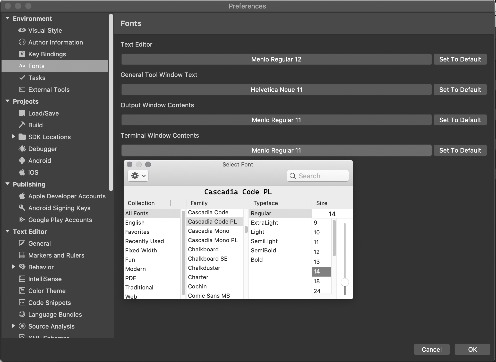

# Integrated Terminal
In Visual Studio for Mac you can open an integrated terminal window, initially starting at the root of our solution. This can be useful for a variety of tasks -- running front-end tasks (e.g. npm, ng, or vue), managing containers, running advanced git commands, scaffolding, automating builds, executing Entity Framework commands, viewing dotnet CLI output, adding NuGet packages, and more. 

To open the terminal:
- Use the **Ctrl + `** keyboard shortcut to show or hide the terminal window.
- Use the **View** \> **Pads** \> **Terminal** menu.
- Use the **terminal** command from the search bar.

Now that you've got the terminal set up, let's look at some of its features.

## Sensible defaults
By default, when the terminal is launched it will:
- Set the working directory to the path of the current solution
- Load the default system shell

## Search
To help filter through complex terminal output, developers need to be able to search the content of the terminal window. You can use the standard Search \> Find... command for this. You'll notice the Find UI is similar to the search experience in an editor window: 

## Integration with the Mac terminal
The integrated terminal uses the same defaults and configuration as your macOS system terminal. That means that your terminal customizations -- zsh, oh-my-zsh, etc. -- work the way you're used to. If you've spent some time setting up a beautiful terminal, it'll be right here for you when you open the Visual Studio for Mac Integrated Terminal. Not only that, but your command history works in sync between your system terminal and Visual Studio for Mac. When you open a new terminal pad in Visual Studio for Mac, hit the up arrow to see your previous commands from the system terminal.

## Terminal Keyboard Shortcuts
|Commands|Keyboard shortcuts|
|-|-|
|Show/Hide the terminal window|**Ctrl+ `**|
|Create new terminal instance|**Ctrl+'**|
|Scroll page up|**PageUp**|
|Scroll page down|**PageDown**|
|Show previously used command|**↑**|
|Increase font size|**⌘+**|
|Decrease font size|**⌘-**|

## Multiple instances
Multiple instances of the terminal may be running at any time. You can create a new instance by using the **Ctrl+'** keyboard shortcut. You can switch between instances by either clicking on the tab for each instance, or using the **Ctrl+tab** shortcut to bring up the window picker dialog.

 

## Configuring the Terminal Font
You'll notice a new font selector for Terminal Contents in the Preferences \> Environment \> Fonts pane. By default, the font will be the same as Output Pad Contents, using Menlo Regular, size 11. You can set it to any font, independent of your editor font.

