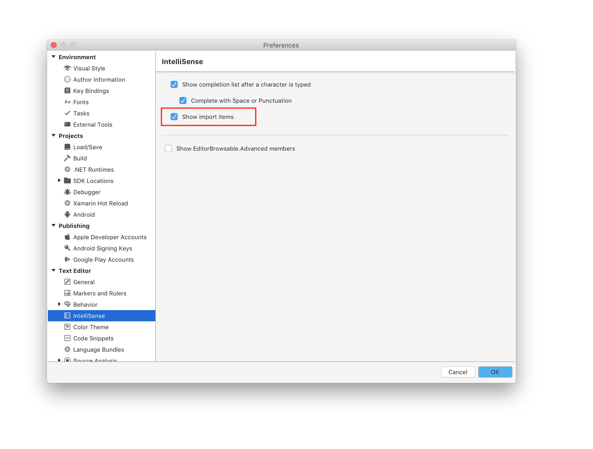
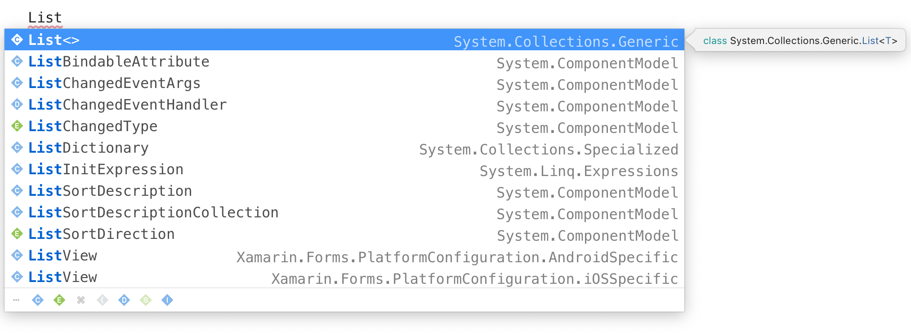

# IntelliSense

IntelliSense provides several features to help enhance the experience of writing and editing code. For example, in addition to code completion, the IntelliSense engine also provides member lists, parameter info, and quick info.

In Visual Studio for Mac, IntelliSense is provided by the core editor service, and is supported in many languages, such as C#, XAML, F#, JavaScript and more. Visual Studio for Mac also features advanced IntelliSense features, such as the ability to show completions from libraries which are not yet imported into the project.

## Code Completion

When typing within a supported file, such as a C# code file, valid completions for the string you are currently typing will be displayed in a completion list and updated as you type. Furthermore, if you delete text, the list will again auto-update to include the wider range of possibilities for completing the given string. 

The completion window also offers support for filtering the included completions by type. For example, it is possible to limit the members of the list to only represent types such as classes or delegates. This filtering processes can be enabled either through clicking on a specific icon representing the type which will be filtered or via keyboard shortcuts corresponding with a given type. The icons, which are located at the bottom of the completion window, are as follows:

| Icon                         | Name          | Keyword    | Hotkey |
| -----------------------------|---------------| -----------|--------|
|   | class         | `class`    |  ⌥C
|  | constant      | `const`    |  ⌥O
|  | delegate      | `delegate` |  ⌥D
|     | enum          | `enum`     |  ⌥E
|     | event         |            |  ⌥V
|    | field         |            |  ⌥F
| | interface     | `interface`|  ⌥I
|   | keyword       |            |  ⌥K
|    | method        |            |  ⌥M
| | namespace     | `namespace`|  ⌥N
|     | property      |            |  ⌥P
|   | snippet       | `class`    |  ⌥S
|    | structure     | `struct`   |  ⌥S
|                              |                |            |  

By clicking on any of the icons, or by pressing the corresponding hotkeys, the completion list will limit to only types as defined by the filter set.  

## Show Import Items

By default, IntelliSense completion will only display completions from libraries which you do not have imported into your project. For example, if you do not have `System.Collections.Generic` imported via `using` then you would not have a completion for `List<>`. In order to display completions from libraries which are you not imported, you must enable **Show Import Items** within the Preferences for Visual Studio for Mac. This can be found under **Preferences > Text Edtior > IntelliSense**:

Once **Show Import Items** is enabled, the completion list will include completions that you have not yet imported. Upon selecting an item which corresponds to an un-imported library, the `using` statement for that library will automatically be added to the header of the code file. The name of the library to which the completion belongs is also listed along with the completion itself.

## Parameter Window

Another feature of IntelliSense is the ability to provide a parameter list where appropriate. The parameter list provides details of the method signatures for the code being called. By clicking on the up/down arrows within the signature, you can cycle through each of the available parameter signatures to determine the most appropriate for your needs. In addition to the details of the types of data allowed, there may also be a description as defined in the target method via XML comments.

As you fill in the parameters, the parameter that you are currently editing will be bolded, while the inactive parameters will have the standard weight. 

## Triggering Completion Window and Parameter Window

The completion window will be triggered automatically as you type within your source file. However, you can also trigger the completion window by using the shortcut `control-space`. This will cause the completion list to appear at the current position of your caret. 

You can also manually trigger the appearance of the parameter window by typing `control-shift-space`. When your caret is in the position that is valid for a parameter list, the parameter list will appear near the caret position.

## See also

- [Quick Actions (Visual Studio on Windows)](/visualstudio/ide/quick-actions)
- [Refactor code (Visual Studio on Windows)](/visualstudio/ide/refactoring-in-visual-studio)