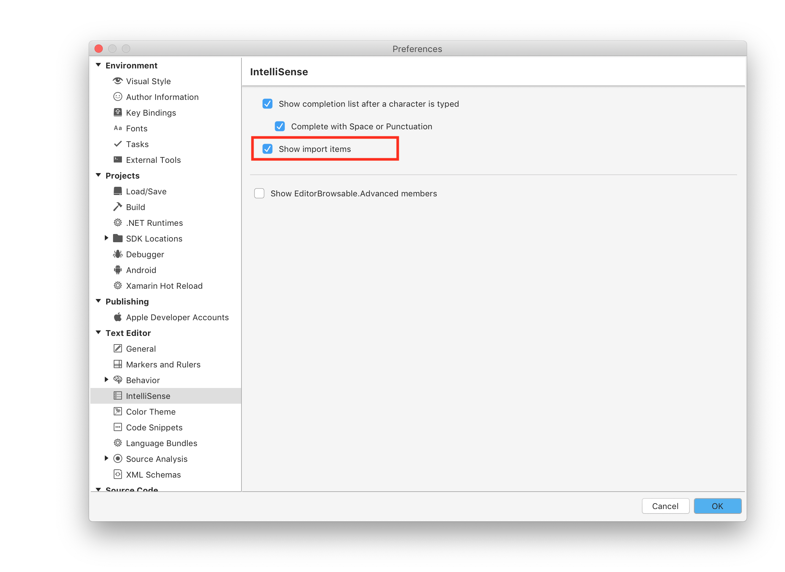
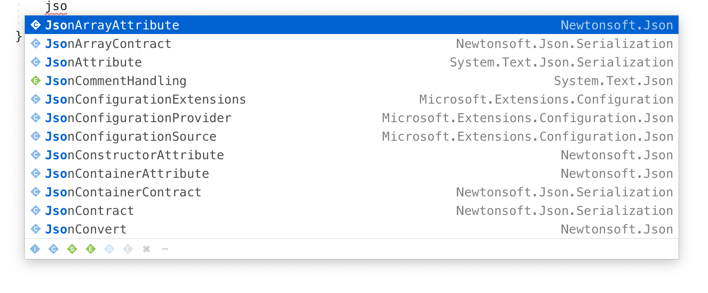

# Show Import Items

Visual Studio for Mac can show all available types, even if they are not imported to your project, in your IntelliSense completion list. By selecting an item which is not yet imported, the correct using statement will be added to your source file.

## How to Enable

To enable this feature, open Preferences via Visual Studio > Preferences and navigate to Text Editor > Intellisense. Within the IntelliSense preferences, check the box for "Show import items"

## Usage

Once you enable Show Import Items, the process of using the feature to import an item is similar to the normal actions within IntelliSense. As you type code, items that are valid will populate the completion list. This includes items that have not been imported yet. The items that aren't imported will show their full namespace to the right of the item, allowing you to see which imports you are pulling in to your project.

For example, if you have a NuGet package added to your project, but not yet imported into your code file, the namespace for the package will be listed along with packages provided by the framework. However, if the NuGet package is not added to the project, the import will not be available or listed within your completion list.

## See also

- [Quick Actions (Visual Studio on Windows)](/visualstudio/ide/quick-actions)
- [Refactor code (Visual Studio on Windows)](/visualstudio/ide/refactoring-in-visual-studio)