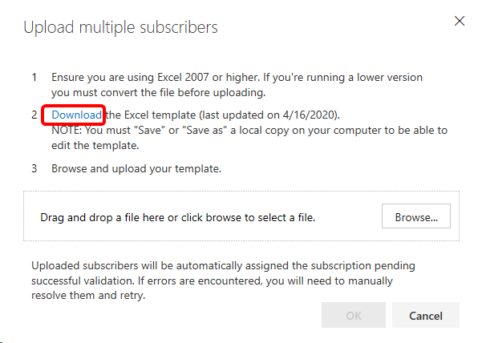
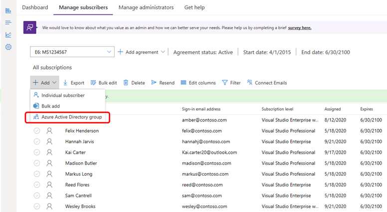
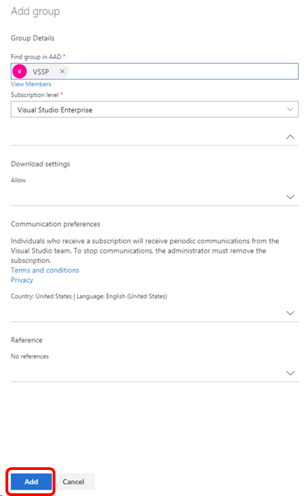

# Assign subscriptions to multiple users
The Subscriptions Administration Portal lets you add users one-at-a-time, or in large groups.  To add individual users, see [Add single users](assign-license.md).

To add large groups of users, you can use the bulk add feature, or if your organization is using Microsoft Azure Active Directory (Azure AD), you can use Azure AD groups. This article will explain the process for both options. 

## Use Bulk add to assign subscriptions
1. Sign into the Visual Studio Subscriptions Administration Portal at https://manage.visualstudio.com.

2. To add multiple subscribers at one time, navigate to the **Manage Subscribers** tab. Choose the **Add** tab, then choose **Bulk add** in the drop-down.  

2. Bulk add uses a Microsoft Excel template to upload subscriber information. In the Upload Multiple Subscribers dialog box, click **Download** to download the template.
   > [!div class="mx-imgBorder"]
   > 
   >
   > [!NOTE]
   > Always download the latest version of this template. If you use an older version, your bulk upload may fail.

3. In the Excel spreadsheet, fill out the fields with the information for the individuals that you want to assign subscriptions to. (*Reference* is an optional field.) Save the file locally after you're done.

   To help ensure a smooth upload, observe the following best practices:

    - Ensure that none of the form fields contain commas.
    - Remove spaces before and after form fields.
    - Make sure user's names do not contain extra spaces between two-part first or last names (for example, if a person has a two-part first name such as "Maggie May", it should be typed as "MaggieMay" because the system won't trim the extra space.)
    - Make sure all required fields are completed. 
    - Check the **Error message** column.  If any errors are listed, resolve those before attempting to upload the file. 

4. Return to the Visual Studio Subscriptions Administration portal. In the **Upload Multiple Subscribers** dialog box, click **Browse**.
   > [!div class="mx-imgBorder"]
   > 

5. Navigate to the Excel file that you saved, and then click **OK**.
   > [!div class="mx-imgBorder"]
   > 

    An upload progress dialog appears.

    If the template contains errors, the upload will fail, and you will be shown the errors so that you can correct the template and attempt the bulk upload again.
   > [!div class="mx-imgBorder"]
   > 

    When the upload is successful, you'll see the list of subscribers and a confirmation message.
   > [!div class="mx-imgBorder"]
   > 

## Use Azure AD groups to assign subscriptions 
Using this feature makes it easy to stay on top of your subscription assignments. You can add Azure AD Security Groups in the Subscriptions Administration Portal which will ensure that all individuals in the group are assigned a subscription. And to make it easier, when individuals leave your organization and are removed from Azure AD, their access to subscriptions is also removed.

> [!NOTE]
> This capability is being deployed in phases, so it may not be availability immediately for your organization.   

> [!IMPORTANT]
> The following limitations apply to the use of Azure AD groups for adding subscribers:
> - Groups must contain at least one member.  Empty groups are not supported.
> - Groups must have less than 1,000 users.
> - All users must be in the top level of the group.  Nested groups are not supported.
> - Only trusted agreements are supported.
> - All members of the group must have an email address associated with their Azure AD account.

1. Sign in to the Visual Studio Subscriptions Administration Portal at [https://manage.visualstudio.com](https://manage.visualstudio.com).

2. To add multiple subscribers at one time, navigate to the **Manage subscribers** tab.

3. Choose the **Add** tab, then select **Azure Active Directory group** in the drop-down.  

   > [!div class="mx-imgBorder"]
   > 

4. Begin to enter the name of the Azure AD group that you’d like to add into the form field. This will search the available Azure AD groups within your organization. 

5. When you select the group, the field will automatically populate with the group name. You will have the option to view the users in that group before you add them. Next, you can choose the subscription level, download rights, and communication preferences for the group. You can add details into the reference field if you wish. 

   > [!div class="mx-imgBorder"]
   > 

6. Click **Add** and then **Confirm**. 

7. To see the added group, scroll to the bottom of your list of users.  

8. Select **View subscribers** to display the members of the group. You can view details about the subscribers in the group, but you cannot make any edits to the subscribers or the subscriptions that they are assigned.    

## Frequently asked questions
### Q: Can I choose multiple subscription levels to be assigned within an Azure AD group? 
A: No -- everyone in the group receives the same subscription. 

### Q: Can I edit subscriber details of individuals added in an Azure AD group?  
A: No – To modify information for an individual subscriber, you will need to remove them from the Azure AD security group and assign them a subscription individually.  

### Q: I added someone to my Azure AD security group, but I don’t see them add in the Subscriptions Administration Portal, and they don’t have a subscription. Why not?  
A: Depending on how your organization has configured Azure AD, you may see delays of up to 24 hours before the user is added. If it’s been longer than 24 hours, [contact support](https://visualstudio.microsoft.com/support/support-overview-vs).  

## See also
- [Visual Studio documentation](https://docs.microsoft.com/visualstudio/)
- [Azure DevOps documentation](https://docs.microsoft.com/azure/devops/)
- [Azure documentation](https://docs.microsoft.com/azure/)
- [Microsoft 365 documentation](https://docs.microsoft.com/microsoft-365/)

## Next steps
- Have just one or two subscribers to add?  Check out [Add single users](assign-license.md)
- Need help? Contact [Visual Studio Administration and Subscriptions Support](https://visualstudio.microsoft.com/support/support-overview-vs).

