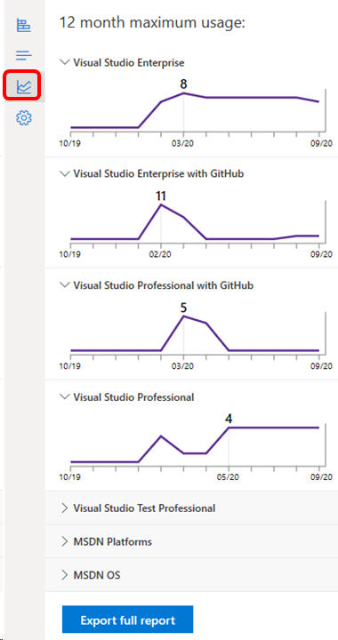
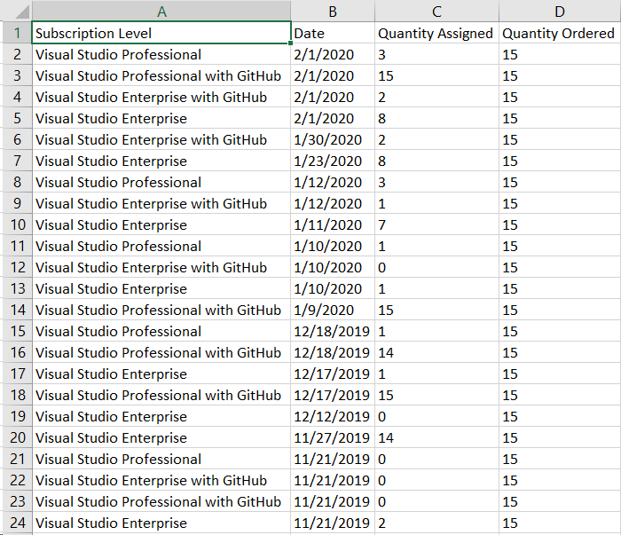

# Use the maximum usage feature to track the number of assigned subscriptions
A new feature in the Visual Studio subscriptions administration portal helps you track how many subscriptions you've purchased and assigned, and identifies the peak number of subscriptions of each level you've assigned, both within the past year and throughout the duration of your agreement(s). 

## Maximum usage overview
> [!VIDEO https://www.microsoft.com/videoplayer/embed/RE4tdQK] 

## View your maximum usage
To see the peak number of subscriptions assigned for any agreement and subscription level:
1. Select the agreement you wish to view in the drop-down at the top left of the portal. (If you only have one agreement, it will already be selected.)
2. Click on the **maximum usage** icon which is the third icon from the top on the left side of the subscriber grid.  
> [!div class="mx-imgBorder"]
> 
3. The "12-month maximum usage" will appear, and the maximum number of subscriptions you've assigned within the past year for each level will be displayed, along with the month in which you reached that peak.    

## View your assignment history
In addition to seeing the peak assignments for each subscription level, you can see a running account of the activity on the agreement, including purchases and assignments, by clicking the **Export full report** button.  (You may need to scroll down to see the button.)  

> [!div class="mx-imgBorder"]
> 

For each subscription level, the report shows the date you reached a new maximum assignment level and the number of subscriptions you had purchased as of that date, allowing you to easily see any dates where you had overallocations.  

## Frequently asked questions
### Q: How is the information in the maximum usage different from the assignment information available in the "Overview" section on the left side of the portal?
A:  The information in the overview shows the *current* assignments and available subscriptions for each subscription level.  This may be very different from the maximum number of subscriptions assigned for the agreement during the current year or the life of the agreement.  The maximum usage feature allows you to see when the maximum assignment levels were reached and what the levels were.  This is an important distinction, since billing for subscriptions during true-up is based on the maximum number of subscriptions assigned at any point throughout the year. 

## Resources
- [Visual Studio licensing white paper](https://visualstudio.microsoft.com/wp-content/uploads/2019/06/Visual-Studio-Licensing-Whitepaper-May-2019.pdf)
- [Visual Studio Administration and Subscriptions Support](https://visualstudio.microsoft.com/support/support-overview-vs)
- [Volume Licensing terms](https://www.microsoft.com/licensing/product-licensing/products.aspx)

## See also
- [Visual Studio documentation](https://docs.microsoft.com/visualstudio/)
- [Azure DevOps documentation](https://docs.microsoft.com/azure/devops/)
- [Azure documentation](https://docs.microsoft.com/azure/)
- [Microsoft 365 documentation](https://docs.microsoft.com/microsoft-365/)

## Next steps
- If you have any questions about subscription assignments or other aspects of the administration portal, please contact https://visualstudio.microsoft.com/subscriptions/support/ for assistance. 
- Learn more about what to do if you assign more subscriptions that you purchased, referred to as [overallocations](handle-overclaimed-license.md).

