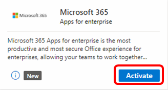
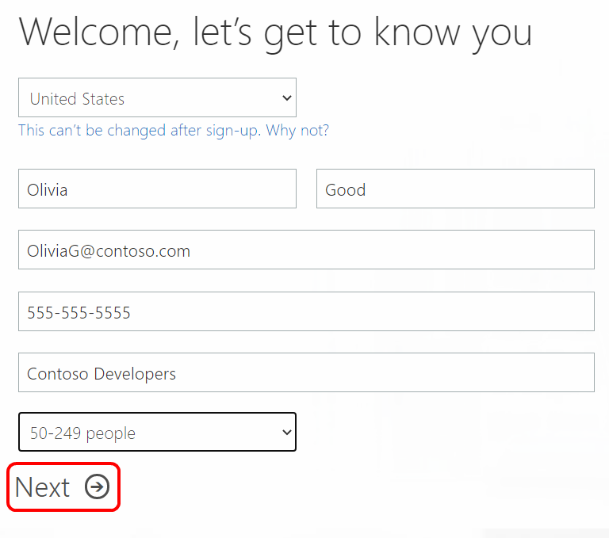
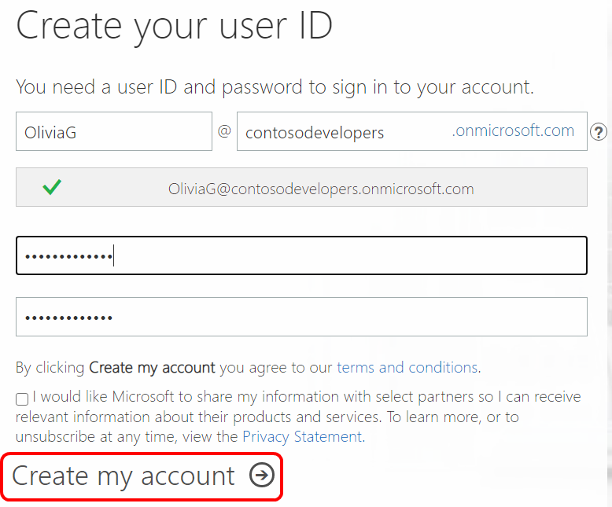
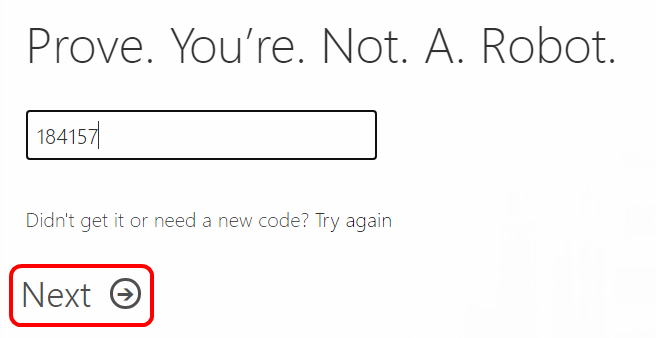
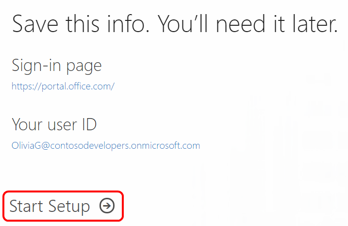
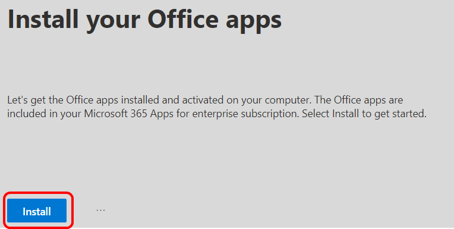

# Microsoft 365 apps for enterprise in Visual Studio subscriptions
Microsoft 365 apps for enterprise (formerly Office 365 Pro Plus) is available in selected Visual Studio subscriptions. 

Create your best work. Work anywhere with apps that are always updated. Office 365 Pro Plus is a subscription that comes with premium apps like Word, Excel, PowerPoint, OneNote, Outlook, Publisher, and Access (Publisher and Access available on PC only). The apps can be installed on multiple devices, including PCs, Macs, iPads, iPhones, Android tablets, and Android phones. With a subscription, you get the latest versions of the apps and automatically receive updates when they happen.

> [!NOTE]
> When included in your Visual Studio subscription, you are licensed to use Microsoft 365 apps for enterprise for production use.  

## Activation steps
The process for activating your Microsoft 365 apps for enterprise subscription is simple.  Follow these steps to activate your subscription and install your applications:

1. Sign in to your Visual Studio subscription at [https://my.visualstudio.com](https://my.visualstudio.com/benefits?wt.mc_id=o~msft~docs)
1. Locate the Microsoft 365 apps for enterprise tile and click **Activate**.
   > [!div class="mx-imgBorder"]
   > 

1. In the "Welcome, let's get to know you" dialog, provide the requested personal contact information and then click **Next**.
   > [!div class="mx-imgBorder"]
   > 

1. In the "Create your user ID" dialog, create your username and password for your tenant, then click **Create my acccount**.
   > [!div class="mx-imgBorder"]
   > 

1. Next, you'll be asked to provide a code to prove you're not a robot.  You can have the code sent to you as a text message.  Enter the code and click **Next**. 
   > [!div class="mx-imgBorder"]
   > 

1. After your account has been successfully created, you'll see a dialog displaying the sign-in page for the Office portal, and your new user ID.  Make note of this information for your later use, and click **Start Setup** to begin installing your Microsoft 365 apps.
   > [!div class="mx-imgBorder"]
   > 

1. You'll automatically be logged into the Office portal, and you're now ready to install your applications.  Click the **Install** button to get started.
   > [!div class="mx-imgBorder"]
   > 
1. Follow the prompts to install your selected apps.  

## Eligibility

| Subscription Level                                                 |     Channels                                            | Benefit                                                          | Renewable?    |
|--------------------------------------------------------------------|---------------------------------------------------------|------------------------------------------------------------------|---------------|
| Visual Studio Enterprise (Standard)   | VL, Azure, Retail| Available       |  Yes          |
| Visual Studio Enterprise with GitHub Enterprise  | VL | Available       |  Yes          |
| Visual Studio Enterprise (Standard)   | NFR1 | Not available       |  N/A          |
| Visual Studio Professional (Standard) | VL, Azure, Retail                                       | Not available                                                            |  N/A          |
| Visual Studio Professional with GitHub Enterprise | VL | Not available         |  N/A          |
| Visual Studio Test Professional (Standard)                         | VL, Retail                                              | Not available                                             |  N/A          |
| MSDN Platforms (Standard)                                          | VL, Retail                                              | Not available                                              |  N/A          |
| Visual Studio Enterprise, Visual Studio Professional (monthly cloud) | Azure | Not available | N/A |
|  |

1  *Includes:  Not for Resale (NFR), Visual Studio Industry Partner (VSIP), Microsoft Partner Network (MPN), FTE, MCT Software & Services Developer, BizSpark, Most Valuable Professional (MVP), Regional Director (RD), MCT Software & Services, Imagine, Microsoft Partner Network.*

> [!NOTE]
> Microsoft no longer offers Visual Studio Professional Annual subscriptions and Visual Studio Enterprise Annual subscriptions in Cloud Subscriptions. There will be no change to existing customers experience and ability to renew, increase, decrease, or cancel their subscriptions. New customers are encouraged to go to [https://visualstudio.microsoft.com/vs/pricing/](https://visualstudio.microsoft.com/vs/pricing/) to explore different options to purchase Visual Studio.

Not sure which subscription you're using?  Connect to [https://my.visualstudio.com/subscriptions](https://my.visualstudio.com/subscriptions?wt.mc_id=o~msft~docs) to see all the subscriptions assigned to your email address. If you don't see all your subscriptions, you may have one or more assigned to a different email address.  You'll need to sign in with that email address to see those subscriptions.

## Support resources
- For technical support with any component of Microsoft 365 apps for enterprise, please visit https://support.microsoft.com/allproducts and select the product.
- For assistance with sales, subscriptions, accounts and billing for Visual Studio Subscriptions, contact Visual Studio [Subscriptions Support](https://visualstudio.microsoft.com/subscriptions/support/).
- Have a question about Visual Studio IDE, Azure DevOps or other Visual Studio products or services?  Visit [Visual Studio Support](https://visualstudio.microsoft.com/support/).

## See also
- [Visual Studio documentation](https://docs.microsoft.com/visualstudio/)
- [Azure DevOps documentation](https://docs.microsoft.com/azure/devops/)
- [Azure documentation](https://docs.microsoft.com/azure/)
- [Microsoft 365 documentation](https://docs.microsoft.com/microsoft-365/)

## Next steps
Be sure to activate these great benefits to make the most of your Visual Studio subscription:
- [Visual Studio](vs-ide-benefit.md)
- [Azure DevOps](vs-azure-devops.md)
- [Azure DevTest individual credit](vs-azure.md)
If you're planning to develop applications for Office, you'll want to activate your [Office Developer Subscription](vs-office-dev.md)