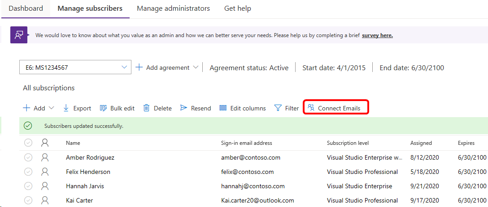
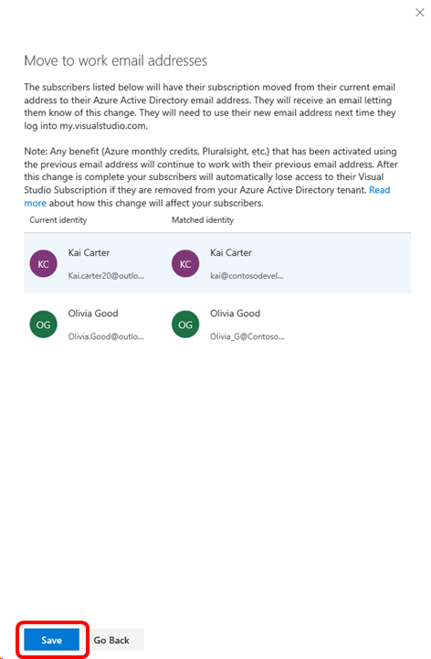

# Visual Studio subscriptions – Why do I see personal accounts for my subscribers?
After companies migrated from the Volume Licensing Service Center (VLSC) to the new Visual Studio [Subscriptions Administration Portal](https://manage.visualstudio.com), administrators were surprised to find that the “Sign-in Email Address” for some subscribers shows a personal email address like Hotmail or Outlook.  

## Cause
This scenario occurs due to sign-in processes that were associated with the legacy MSDN subscriber experience. Users were migrated from the Volume License Service Center (VLSC) to the Visual Studio Subscriptions Administration Portal without modifications. Administrators may not have been aware that users had been using personal accounts to access their subscription benefits. Prior to the Visual Studio subscriber migrations, which were completed in 2016, there were two actions required to successfully use a Visual Studio Subscription:
1. The administrator “assigned” the subscription to an individual subscriber, using their work or school email address.
2. The subscriber “activated” the subscription.

During the subscriber activation process:
A Microsoft Account (MSA) was required to sign-in. If the subscriber didn’t attempt to make their work or school account (e.g. tasha@contoso.com) an MSA, they could create a new MSA or leverage an existing one. This resulted in their “Sign-in Email Address” being different than their “Assigned to Email Address”.

> [!NOTE]
> The modern subscriber experience on [https://my.visualstudio.com](https://my.visualstudio.com?wt.mc_id=o~msft~docs) supports both Work/School and Microsoft Account (MSA) identity types.

## Solution
To correct the problem, simply select the **Connect Emails** button and the system will attempt to match the accounts with MSAs to existing users in your organization’s Azure Active Directory (Azure AD) based on matching the first and last name. If there is an error, you can remove any match by clicking on the **X** to the right of the match.  

Watch this video or keep reading to learn how to fix this. 

> [!VIDEO https://www.microsoft.com/videoplayer/embed/RE4th6B]

> [!div class="mx-imgBorder"]
> 

You can also use the **Search Directory** to correct the errors or fill in missing information from your Azure AD. If the all the matches look correct, you can choose the **Current identity** button to select all matched entries rather than selecting them one at a time.  

> [!div class="mx-imgBorder"]
> 

Next click on **Continue** which will take you to a list of the changes to take place. If you agree, click **Save** and the changes will be made. Your subscriber will also get a message informing them of the change the next time they sign in to their subscription.  Notice that only the two subscribers that were matched in the Azure Active Directory appear in this list.  In our example, since Frederick did not have a corresponding address in the Azure AD, his Microsoft account (MSA) was not matched to a work account. 

> [!div class="mx-imgBorder"]
>  

> [!NOTE]
> When you edit the sign in email address this only updates the email used by the subscriber to sign in to their subscription on https://my.visualstudio.com. If the subscriber has already activated benefits such as Azure or Pluralsight using the other email address, they will need to continue to use those email addresses to access them. For any new benefits that they access, they should use the new email address. 

## See also
- [Visual Studio documentation](https://docs.microsoft.com/visualstudio/)
- [Azure DevOps documentation](https://docs.microsoft.com/azure/devops/)
- [Azure documentation](https://docs.microsoft.com/azure/)
- [Microsoft 365 documentation](https://docs.microsoft.com/microsoft-365/)

##  Next steps
- If you have updated the subscriber(s) email address(es), you may want to notify them that their sign-in information has changed.  They will also receive an email with the updated information.
- It may be useful to [filter the list of subscribers](search-license.md) in your organization to look for any sign in email addresses that may need to be changed.  
