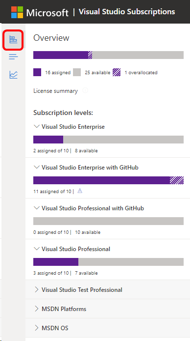

# Get started with the Visual Studio Subscriptions Administration Portal
Keep this in mind when you use the Visual Studio Subscriptions Administration Portal:
- **Visual Studio subscriptions are licensed per user.** Each subscriber can use the software on as many computers as needed for development and testing.
- **Assign only one subscription level for each subscriber**, corresponding to the Visual Studio subscription your organization purchased. If you have subscribers with more than one subscription level assigned to them, edit their settings so that they only have one.
- **A subscriber’s subscription level will need to be updated** when the subscription is upgraded (after the purchase of a “step-up” license) or renewed at a lower level.
- **Do not share subscriptions between subscribers.** Subscriptions must be assigned to named individuals.  Assignment of subscriptions to teams is not permitted.  You must assign a subscription to anyone who uses all or part of the subscription benefits (software for development and testing, Microsoft Azure, e-learning, etc.).

## Access to the portal
If you are the primary or notices contact on your organization’s agreement, you will be automatically provisioned access to the portal upon setting up your Volume Licensing agreement. You’ll receive a system-triggered welcome email and it will indicate which email address to use to sign into the portal. Once you’re signed in, you will be automatically set up as a super admin and can begin managing subscriptions and other administrators. 

## Administrator roles
There are two different roles that exist in the new Visual Studio Subscriptions Administration Portal for Volume Licensing customers. These roles are like the Primary/Notices Contact role and the Subscriptions Manager role in the VLSC today.

**Super admins:** Upon first setting up an organization, the Primary or Notices Contact becomes a super admin by default. The Primary or Notices Contact can choose to assign additional super admins or administrators. A super admin can add and remove other administrators as well as subscribers. If there are more than two super admins in the system, a super-admin can delete all but the last two for security.

**Administrators:** An administrator can only be set up by a super admin. An administrator can manage subscribers in the agreements that the super admin assigns to them.

## The Subscribers page
Once you’ve assigned subscriptions, the Subscribers tab provides detailed information about your subscribers, including:
- The first and last name of each subscriber.
- The email address for this user.
- The subscription level that has been assigned to them.
- The date that their subscription was assigned to them.
- The expiration date for their subscription.
- An optional text description.
- An indication of whether subscriber downloads has been enabled or disabled.
- The country in which they are located.
- Their language preference for the assignment communication email from the administration portal.
- An optional field for a different email address used for communications than sign-in.

On the left-hand side of this page you can see additional information about the number of subscription licenses purchased, assigned, and still available in your organization for each agreement.
> [!div class="mx-imgBorder"]
> 

## The Details page
For more information about the agreement you are viewing, select the Details tab. It shows the agreement status, purchase account, org details, super-admins and other pertinent information.
> [!div class="mx-imgBorder"]
> 

## Next steps
Learn more about responsibilities for administrators:
- [Overview of admin responsibilities](admin-responsibilities.md)
- [Inventory of pre-production environment](admin-inventory.md)
- [Manage large teams and external contractors](manage-teams.md)
- [Track user assignments and process orders](assignments-orders.md)
- Use [Maximum Usage](maximum-usage.md) to track purchase commitments
