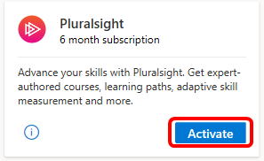
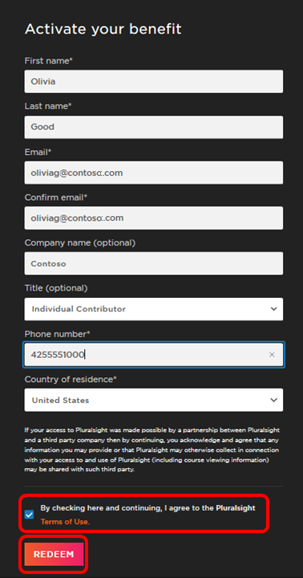
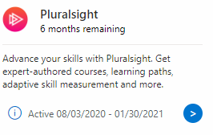

# Pluralsight training benefits in Visual Studio subscriptions

Advance your skills with expert-authored courses, learning paths, adaptive skill measurement, and more!  Depending on which Visual Studio subscription or program membership you have, you may be eligible for up to six months of free, unlimited access to the entire Pluralsight catalog.

The table below details what Pluralsight subscription benefits are available to each Visual Studio subscription type.  Some subscribers will also be able to take advantage of limited courses after their full catalog access subscription expires. Pluralsight will guide you through that process when your full catalog subscription expires.

 Depending on the type of subscription they have, not all subscribers who have previously used a Pluralsight subscription provided through a Visual Studio subscription will be able to redeem new Pluralsight benefit offers. If you are not eligible to redeem additional Pluralsight training benefits, you'll receive a notification when you attempt to activate the benefit on the Pluralsight website.

## Activation steps
1. To activate your subscription, connect to [https://my.visualstudio.com/benefits](https://my.visualstudio.com/benefits?wt.mc_id=o~msft~docs) and click on the **Activate** link on the Pluralsight benefit tile.  To narrow the list of tiles displayed, you can choose a group filter.  Pluralsight is located in the Professional Development benefits group.
   > [!div class="mx-imgBorder"]
   > 

1. You'll be redirected to the Pluralsight page for the benefit that's included with your Visual Studio subscription.
   - Provide the contact information requested on the form
   - Click the checkbox to accept the terms of use
   - Click **REDEEM**.
   > [!div class="mx-imgBorder"]
   > 

   > [!NOTE]
   > The registration page expires after a few minutes.  If you don't complete the registration process before the page expires, return to the Pluralsight tile on the <https://my.visualstudio.com/benefits> page and click **Activate** again. 

1. It may take a moment to set up your account.  After that's complete, you'll see a confirmation on the page, and will receive an email with your login information.  The email will be sent to the alias you specified when you created the account.  Be sure to check your junk or spam mail folders if you have trouble finding the message.

   > [!NOTE]
   > If your account is not eligible to redeem new offers, the email you receive will explain that there was a problem creating your account because it's not eligible.  It will also contain information to help you contact Pluralsight's support team, who can answer any questions you may have about your account.
   
1. After your account has been successfully created, you'll see a message saying **"Thank you! You're all set."** and a note saying that a confirmation has been sent to the email address you provided.  

1. Click **SET PASSWORD**.

1. Enter your desired password in the **New password** field, enter it again in the **Confirm password** field, and click **Save**.

1. That's it!  You're now ready to start learning with thousands of Pluralsight courses!

## Status of your Pluralsight subscription
After you activate your Pluralsight benefit, the appearance of the tile in the Visual Studio subscriptions portal will change.  Instead of the "Activate" button, you'll now see a small circle button that, if clicked, will take you directly to the Pluralsight portal so you can sign in and continue with your training.  

Under the Pluralsight title at the top of the tile, you'll see text displaying how much time is remaining on your Pluralsight subscription.  When your subscription is within 60 days of expiring, the text will switch to displaying the number of days remaining rather than months.  

At the bottom of the tile, you'll see text showing both the activation date and expiration date of your Pluralsight subscription.

   > [!div class="mx-imgBorder"]
   > 

When your Pluralsight subscription expires, the status will change to "0 days remaining" and the link to the Pluralsight portal will be removed. You will still be able to see the date that you activated the subscription, as well as the date it expired.  

## Eligibility

|                          Subscription Level                          |     Channels      |    Benefit    |   Renewable?   |
|----------------------------------------------------------------------|-------------------|---------------|----------------|
|          Visual Studio Enterprise (Standard)           | VL, Azure, Retail |   6 months    | Yes2 |
|          Visual Studio Enterprise with GitHub Enterprise          | VL  |   6 months    | Yes2 |
|         Visual Studio Professional (Standard)          | VL, Azure, Retail |   3 months    | Yes2 |
|         Visual Studio Professional with GitHub Enterprise          | VL  |   3 months    | Yes2 |
|              Visual Studio Test Professional (Standard)              |    VL, Retail     |   Not available    | NA  |
|                      MSDN Platforms (Standard)                       |    VL, Retail     |   Not available    | NA  |
| Visual Studio Enterprise, Visual Studio Professional (monthly cloud) |       Azure       | Not available |       NA       |
|             Visual Studio Enterprise (NFR1 )              |      Program      | Not available |       NA       |
||

1  *Includes:  Not for Resale (NFR), Visual Studio Industry Partner (VSIP), BizSpark, MCT Software & Services Developer, MCT Software & Service, Most Valuable Professional (MVP), Regional Director (RD), Microsoft Partner Network (MPN), FTE, Imagine.*

2  *The Pluralsight benefit in selected Visual Studio subscriptions renews when your subscription renews. For example, if you have an annual subscription that you renew each year, the benefit is available to you each year when you renew. If you have a multi-year subscription, the Pluralsight benefit is available to you once during the term of the subscription.  If you renew a multi-year subscription, the benefit will be available again following the renewal.*

> [!NOTE]
> Microsoft no longer offers Visual Studio Professional Annual subscriptions and Visual Studio Enterprise Annual subscriptions in Cloud Subscriptions. There will be no change to existing customers experience and ability to renew, increase, decrease, or cancel their subscriptions. New customers are encouraged to go to [https://visualstudio.microsoft.com/vs/pricing/](https://visualstudio.microsoft.com/vs/pricing/) to explore different options to purchase Visual Studio.

Not sure which subscription you're using?  Connect to [https://my.visualstudio.com/subscriptions](https://my.visualstudio.com/subscriptions?wt.mc_id=o~msft~docs) to see all the subscriptions assigned to your email address. If you don't see all your subscriptions, you may have one or more assigned to a different email address.  You'll need to sign in with that email address to see those subscriptions.

## Frequently asked questions

### Q: I have a Visual Studio Enterprise subscription, but I don't see the Pluralsight tile on the Benefits page. What's wrong?
A: Not all Visual Studio Enterprise subscriptions include the Pluralsight benefit.  Check the [eligibility table](#eligibility) to see whether your subscription is eligible.

### Q: Do I have access to any customized learning  playlists or channels?
A: Yes. As a Visual Studio subscriber you get access to featured roles, learning paths, and custom channels (playlists) as part of your Pluralsight training benefit. Featured content has been specially curated by Microsoft and Pluralsight, and is geared towards learning in key areas of interest. Activate your Pluralsight benefit through your Visual Studio subscription portal <https://my.visualstudio.com/benefits> to get access to this and other content on your Pluralsight home page.

### Q: The Pluralsight tile doesn't have an "Activate" link. How can I activate the benefit?
A:  If you have already activated your Pluralsight benefit, the "Activate" link will be replaced by a link that takes you to the sign-in page for Pluralsight.  You will also see the date you activated the benefit as well as information about how much time remains on your subscription.  If you've already used a subscription, you won't be able to activate another one.

### Q: What happens when my Pluralsight subscription runs out?
A:  At the end of your free Pluralsight subscription, you may choose to purchase a subscription directly from Pluralsight.  Please contact [Pluralsight](https://www.pluralsight.com) for full details.

## Support resources
- [Pluralsight Help Center](https://help.pluralsight.com/help) provides assistance with taking Pluralsight courses or using the Pluralsight website.
- For assistance with sales, subscriptions, accounts and billing for Visual Studio Subscriptions, contact Visual Studio [Subscriptions Support](https://visualstudio.microsoft.com/subscriptions/support/).
- Have a question about Visual Studio IDE, Azure DevOps Services or other Visual Studio products or services?  Visit [Visual Studio Support](https://visualstudio.microsoft.com/support/).

## See also
- [Visual Studio documentation](https://docs.microsoft.com/visualstudio/)
- [Azure DevOps documentation](https://docs.microsoft.com/azure/devops/)
- [Azure documentation](https://docs.microsoft.com/azure/)
- [Microsoft 365 documentation](https://docs.microsoft.com/microsoft-365/)

## Next steps
Once you've created your account, you're ready to start training.  Visit [https://www.pluralsight.com](https://www.pluralsight.com) and tap **log in** at the top right corner of the page to start a new course, or return to a course already in progress.

Take advantage of your own development sandbox by activating your [Azure DevTest individual credit](vs-azure.md). 